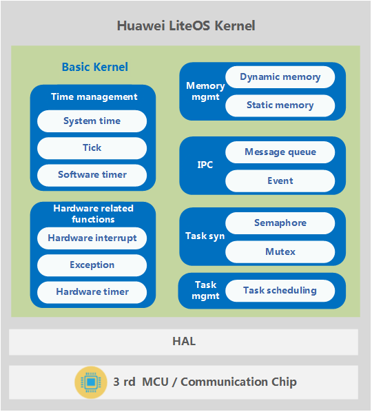

# Overview  

Huawei LiteOS is a real-time kernel–based lightweight operating system developed by Huawei for the IoT. The basic kernel of Huawei LiteOS is compatible with basic operating system components, such as task, memory, time, interrupt, queue, and event management components, communication mechanisms, and timers, to better support low power consumption scenarios. In addition, the basic kernel enables time alignment of timers using the tickless mechanism.  

Focusing on the NB-IoT market, Huawei LiteOS has helped partners build open source IoT ecosystems in technology, ecosystem, solution, commercial use, and other aspects. Currently, Huawei LiteOS has cooperated with more than 30 MCU and solution partners to launch a series of open source development kits and industry solutions, which help customers quickly launch IoT terminals and services. Such customers are involved in multiple industries, such as meter reading, parking, street lamp, environmental protection, bicycle sharing, and logistics. Moreover, Huawei LiteOS provides developers with a one-stop software platform, lowering development requirements and improving development efficiency.  

## Highlights of Huawei LiteOS Kernel

Huawei LiteOS is a lightweight real-time operating system.  

  

Basic kernel of Huawei LiteOS is the most tidy code of operating system. It contains operating system components based task management, memory management, time management, communication mechanism, interrupt management, queue management, event management, timer, etc. It can run independently.  

- Highlight real-time and stable

- Ultra-small kernel, basic kernel size of less than 10 KB

- Low power consumption

- Capable of Static function compaction

## Module Introduction

### Task

Creates, deletes, delays, suspends, and resumes tasks, and can lock or unlock [task](./task.md) scheduling. High priority tasks preempt resources from low priority ones. Tasks of the same priority share resources in a round robin setup using time slicing.  

### Task Synchronization

- **Semaphore**: creates, deletes, pends on, and releases [semaphores](./semaphore.md).  

- **Mutex**: creates, deletes, pends on, and releases [mutexes](./mutex.md).  

### Hardware Related Functions

Provides the following functions:

- **Interrupt**: Creates, deletes, enables, and disables [interrupts](./interrupt.md); clears interrupt request flags.  

- **Timer**: Creates, deletes, starts, and stops [timers](./swtmr.md).  

### Inter-Process Communication (IPC)

Provides the following functions:

- **Event**: Reads and writes [events](./event.md).  

- **Message queue**: Creates, deletes, reads from, and writes into message [queues](./queue.md).  

### Time Management

- **System time**: generated when an output pulse of a timer/counter triggers an interrupt.  

- **Tick time**: the basic time unit used in OS scheduling. The tick length is user configurable. Typically, it is determined by the system clock speed and represented in the form of ticks per second.  

- **Software timer**: The timer length is measured in ticks. The Timer_Callback function (a function used to process timer expiry) is called when a soft tick interrupt is generated.  

### Memory Management

- Provide two algorithms of **dynamic memory** and **static memory**. Allocates or frees [memory](./memory.md) statically using the Membox algorithm or dynamically using the SLAB algorithm and DLINK algorithm.  

- Provides memory statistics, cross-border detection memory.  

## Huawei LiteOS Kernel Supported Cores

Cores supported by Huawei LiteOS

| Core | Chip |  
| - | :- |  
| Cortex-A7 | STM32L053R8Tx ATSAMD21G18A ATSAMD21J18A ATSAMR21G18A EFM32HG322F64 MKL26Z128 MKW41Z512 LPC824M201JHI33 MM32L073PF nRF51822 NANO130KE3BN |  
| Cortex-M3 | K3V3 and K3V3+STM32F103RB ATSAM4SD32C EFM32GG990F1024 GD32F103VCT6 GD32150R8 GD32F190R8 GD32F207VC MM32F103CBT6 MM32L373PS |
| Cortex-M4 | STM32F411, STM32F412, STM32L476, STM32F429, and STM476STM32F411RE STM32F412ZG STM32F429ZI STM32F429IG STM32L476RG EFM32PG1B200F256GM48 GD32F450IK CC3220SF LPC54114j256BD64 nRF52840 nRF52832 NUC472HI8AE ATSAMG55J19 ADuCM4050LF |
| Cortex-M7 | K3V5 and STM32F746STM32F746ZG ATSAME70Q21 |

## Constraints

- Both Huawei LiteOS interfaces and CMSIS interfaces are supported, but hybrid use of them may lead to unpredictable results. (For example, a CMSIS interface is used for requesting semaphores while a Huawei LiteOS interface is used for releasing semaphores.)  

- Use only Huawei LiteOS interfaces for driver development. CMSIS interfaces are recommended for app development.
