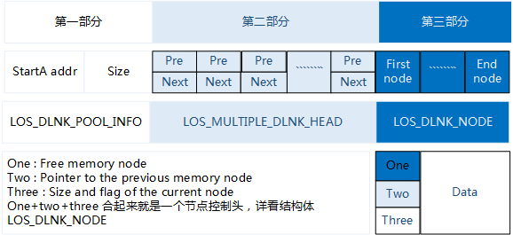

# Memory  

## Overview

### Basic Concept

The memory management module is one of the core modules of an operating system. Memory management primarily involves initializing, allocating, and freeing up memory.  

While the operating system is running, the memory management module manages memory usage of users and the operating system by allocating and freeing up memory. This helps reduce memory fragments as much as possible.  

Memory management is classified into static and dynamic memory management.  

- **Dynamic memory**: a memory block of user-defined size  

  -  Advantage: on-demand memory allocation

  -  Disadvantage: risk of memory fragments

- **Static memory**: a memory block whose size is predefined at the time of initialization

  -  Advantages: no memory fragments; efficient memory allocation and freeing

  -  Disadvantage: memory cannot be allocated on demand

### Dynamic Memory Operation Mechanism

Dynamic memory management means taking a memory block of the required size out of the large pool of continuous memory whenever a user needs it, and reclaiming the memory block when the user no longer needs it.  

Comparing with static memory, the advantage is to allocate a memory block of the required size, and the disadvantage is that memory pool prone to fragmentation.  

The LiteOS dynamic memory supports two standard algorithms: DLINK and BEST LITTLE.  

### 1. DLINK

Figure the dynamic memory management structure in Huawei LiteOS:  



**Part one:** indicates the start address and size of the heap memory (memory pool).  

**Part two:** is an array of which each element is a doubly linked list. Control  headers of all free nodes are categorized and mounted to the doubly linked lists in this array.  

If the smallest node allowed by the memory is 2<sup>min</sup> bytes, the first doubly linked list in the array stores free nodes of the size that is bigger than 2<sup>min</sup> and smaller than 2<sup>min+1</sup>. The second doubly linked list in the array stores free nodes of the size that is bigger than 2<sup>min+1</sup> and smaller than 2<sup>min+2</sup>. The nth doubly linked list in the array stores free nodes of the size that is bigger than 2<sup>min+n-1</sup> and smaller than 2<sup>min+n</sup>. When memory is allocated, a free node of appropriate size (the size of the node being created) is located and memory is allocated to the free node. When memory is freed up, the freed memory is stored to the array as free nodes for later use.  

**Part three:** uses most space in the memory pool and is the actual area that stores nodes. The `LOS_MEM_DYN_NODE` node structure is described as follows:  

```c  
typedef struct tagLOS_MEM_DYN_NODE
{
LOS_DL_LIST stFreeNodeInfo;
struct tagLOS_MEM_DYN_NODE *pstPreNode;
UINT32 uwSizeAndFlag;
}LOS_MEM_DYN_NODE;
```    

  
 
### 2. BEST LITTLE

The dynamic memory allocation of LiteOS supports the best adaptation algorithm, that is, BEST LITTLE. Each time the allocation is performed, the smallest and most suitable memory block in the memory pool is selected for allocation. Based on BEST LITTLE, LiteOS dynamic memory management uses the SLAB mechanism to allocate memory blocks of a fixed size to reduce the possibility of generating memory fragments.  

The SLAB mechanism in LiteOS memory management supports the configurable number of SLAB CLASSes and the maximum space of each CLASS. In this example, the number of SLAB CLASSes is four and the maximum space of each CLASS is 512 bytes. There are four SLAB CLASSes in the memory pool. The total assignable size of each SLAB CLASS is 512 bytes. The first SLAB CLASS is divided into 32 16-byte SLAB blocks, and the second SLAB CLASS is divided into 16 32-byte SLAB blocks. The third SLAB CLASS is divided into eight 64-byte SLAB blocks, and the fourth SLAB CLASS is divided into four 128-byte SLAB blocks. The four SLAB CLASSes are allocated from the memory pool based on BEST LITTLE.  

When initializing the memory management, initialize the memory pool first, apply for four SLAB CLASSes according to BEST LITTLE in the initialized memory pool, and initialize the four SLAB CLASS according to the SLAB mechanism one by one.  

Each time applying for the memory, apply for the best SLAB CLASS that meets the requested size. For example, if the user applies for a 20-byte memory, apply for the SLAB CLASS with the size of 32 bytes. If the application succeeds, the entire SLAB memory block is returned to the user. When the memory block is released, the entire block is recycled. If no memory block that can be allocated exists in the SLAB CLASS that meets the condition, continue to apply to the memory pool according to BEST LITTLE. Note that if there is no available SLAB block in the current SLAB CLASS, apply to the memory pool directly instead of applying to the SLAB CLASS with larger SLAB blocks.  

When the memory is released, the system checks whether the released memory block belongs to a SLAB CLASS. If the memory block belongs to a SLAB CLASS, the memory block is returned to the SLAB CLASS. Otherwise, the memory block is returned to the memory pool.  


### Static Memory Operation Mechanism

Static memory is in essence a static array. The size of a static memory block is defined at the time of initialization and cannot be changed since then.  

A static memory pool consists of a control block and several memory blocks of same size. The control block is placed at the head of the static memory pool to manage memory blocks. Then allocate and free up of memory block according to the size of the blocks.  

Static memory Schematic  


## Dynamic Memory

### Development Guidelines

#### Usage Scenarios

The main task of memory management is to dynamically partition and manage user allocated memory intervals.  

Dynamic memory management is used when users have different demands on memory blocks.  

When a user allocates a memory block of specified size, the operating system calls the LOS_AllocMem API to allocate the requested amount of memory. When the user no longer needs the memory block, the operating system calls the LOS_FreeMem API to free up the memory block.  

#### Functions

The memory management module in Huawei LiteOS System provides the following functions. For details about the APIs, see the API reference.  

| Function Category                                                       | API                      | Description                                                              |
|-------------------------------------------------------------------------|--------------------------|--------------------------------------------------------------------------|
| Memory initialization                                                   | `LOS_MemInit`            | Initializes a specific dynamic memory pool                               |
| Dynamic memory allocation                                               | `LOS_MemAlloc`           | Allocates a specific dynamic memory pool block of specified size         |
| Dynamic memory free up                                                  | `LOS_MemFree`            | Frees up the allocated dynamic memory block                              |
| Memory reallocation                                                     | `LOS_MemRealloc`         | Reallocates memory block according to the size, and retains data in the previously allocated memory area.                                                                                     |
| Aligned memory allocation                                               | `LOS_MemAllocAlign`      | Takes the memory block of requested specific size out of the specific dynamic memory pool and aligns the head or tail of the memory address with a base address on the predefined boundary. |
| Analyzing memory pool status                                            | `LOS_MemStatisticsGet`   | Obtains the statistics of a specified memory pool.                       |
| Querying the maximum number of available idle blocks in the memory pool | `LOS_MemGetMaxFreeBlkSize`| Obtains the maximum number of available idle blocks in a specified memory pool.                                                                                                          |

#### Development Process

1. Configuration:  

`OS_SYS_MEM_ADDR`: start address of the dynamic memory pool. In most cases, retain the default value.  

`OS_SYS_MEM_SIZE`: size (in bytes) of the dynamic memory pool. By default, the dynamic memory pool is the memory space that is left unused after DDR is allocated.  

`LOSCFG_BASE_MEM_NODE_INTEGRITY_CHECK`: a switch to enable or disable memory overwriting check. Default value: disabled. If enabled, the operating system carries out the memory overwriting check when a dynamic memory block is allocated or a static memory block is freed.  

2. `LOS_MemInit` initialization

The result of initializing a dynamic memory pool is shown as the figure bellow, generating a EndNode, and all the memory left signed to be FreeNode.   

::: tip Notice
EndNode as the last node in memory pool with size 0.   
:::  


3. `LOS_MemAlloc` for allocating a dynamic memory block of any sizes

Determines whether the required amount of memory is available. If available, it takes a dynamic memory block of requested size out of the large continuous memory and returns the pointer of the dynamic memory block to the user. If unavailable, it returns NULL to the user.  

Call the `LOS_MemAlloc` API three times to create three nodes. Assumes that their names are UsedA, UsedB, and UsedC. Their sizes are sizeA, sizeB, and sizfeC. Because there is only one large FreeNode in the memory pool when the pool is just initialized, these memory blocks cut from the FreeNode.  


If `malloc` occurred when there are many FreeNodes in the memory pool, memory block will be created with the FreNode that malloced with the most benefited size to reduce memory fragmentation. If the size of the new one is not equal to the used one, the redundant memory block will be signed as a new FreeNode after creating a new memory block.  

4. `LOS_MemFree` for free up dynamic memory

Reclaims the dynamic memory block for using next time.  

Suppose that calling the `LOS_MemFree` to free up memory block UsedB, the memory block UsedB will be reclaimed and signed as FreeNode.  


#### BEST LITTLE Development Process

1. Configure the SLAB CLASS.

`OS_SYS_MEM_ADDR`: Indicates the start address of the dynamic memory pool of LiteOS, which is user-defined.  

`OS_SYS_MEM_SIZE`: Indicates the size of the dynamic memory pool in the unit of byte, which is user-defined.  

`LOSCFG_MEMORY_BESTFIT`: Set this parameter to **YES**, indicating that the BESTFIT algorithm selected.  

`LOSCFG_KERNEL_MEM_SLAB`: Set this parameter to **YES**, indicating that the SLAB mechanism is enabled.  

`SLAB_MEM_COUNT`: This parameter is in the kernel and does not need to be modified. It indicates the number of SLAB CLASSes. Currently, this parameter is set to **4**.  

`SLAB_MEM_ALLOCATOR_SIZE`: This parameter is in the kernel and does not need to be modified. It indicates the maximum block size to be allocated of each SLAB CLASS.  

`SLAB_BASIC_NEED_SIZE`: This parameter is in the kernel and does not need to be modified. It indicates the minimum stack space required for initializing the SLAB mechanism. If the `SLAB_MEM_COUNT` and `SLAB_MEM_ALLOCATOR_SIZE` parameters are modified, this parameter needs to be modified synchronously.  

2. Initialize the SLAB CLASS.

Call the `LOS_MemInit` function to initialize the specified dynamic memory pool. If the SLAB mechanism is enabled and the available memory in the memory pool is greater than the minimum memory required by the SLAB, the SLAB CLASS is initialized.  

3. Apply for a dynamic memory of any size.

Call the `LOS_MemAlloc` function to apply for a memory block of a specified size from the specified memory pool. The memory management module first applies for a
memory block from the SLAB CLASS. If the application fails, the memory management module applies to the stack memory space and returns the application result to the user. When applying to the stack memory space, a memory block may be split.  

4. Release the dynamic memory.

Call the `LOS_MemFree` function to release the specified memory block from the specified dynamic memory pool. When releasing the memory block, the system checks whether the memory block belongs to a SLAB CLASS. If the memory block belongs to a SLAB CLASS, the system returns the memory block to the SLAB CLASS. Otherwise, the memory block is released to the stack memory space. When releasing the memory block to the stack memory space, a memory block may be split.  

### Precautions

- Dynamic memory management consumes the memory of the management control block structure. Therefore, the memory space available to users is smaller than the `OS_SYS_MEM_SIZE` defined in the `los_config.h` file.

- Calls to the `LOS_MemAllocAlign` API may consume a certain amount of memory and result in memory fragments. When the memory used for alignment is freed up, the resulting memory fragments will be reclaimed.

- During memory reallocation to a user by using the `LOS_MemRealloc` API, the operating system determines whether sufficient continuous memory is adjacent to the memory area that has been allocated to the user. If adjacent memory is insufficient, the operating system frees up the previously allocated memory area and finds a new memory area for the user. The user does not need to manually free up the previously allocated memory area.

- If the same memory block is repeatedly freed using the `LOS_MemFree` API, the first free-up operation receives an operation succeed message. However, subsequent free-up attempts lead to invalid operations on the pointer of the memory block and ultimately unpredictable results.

### Programming Example

#### Example Description

Memory is a scarce resource. If memory is frequently used while the operating system is running, program the memory management module to allocate and free up memory efficiently.  

In the programming example, the following steps will be performed:  

1. Initialize a dynamic memory pool.

2. Take a memory block out of the initialized memory pool and allocate it to a user.

3. Store data in the memory block.

4. Print the data in the memory block.

5. Free up the memory block.

#### Example Code

```c  
UINT32 Example_Dyn_Mem(VOID)
{
    UINT32 *p_num = NULL;
    UINT32 uwRet;
    uwRet = LOS_MemInit(m_aucSysMem0, OS_SYS_MEM_SIZE);
    if (LOS_OK == uwRet)
    {
        dprintf("mempool init ok!\n");//initialize memory success!
    }
    else
    {
        dprintf("mempool init failed!\n");//initialize memory fail!
        return LOS_NOK;
    }
    /* memory allocation */
    p_num = (UINT32*)LOS_MemAlloc(m_aucSysMem0, 4);
    if (NULL == p_num)
    {
        dprintf("mem alloc failed!\n");//memory allocation failed!
        return LOS_NOK;
    }
    dprintf("mem alloc ok\n");//memory allocation success!
    /* assignment memory*/
    *p_num = 828;
    dprintf("*p_num = %d\n", *p_num);
    /* free up memory */
    uwRet = LOS_MemFree(m_aucSysMem0, p_num);
    if (LOS_OK == uwRet)
    {
        dprintf("mem free ok!\n");//memory free up succes!
        uwRet = LOS_InspectStatusSetByID(LOS_INSPECT_DMEM,LOS_INSPECT_STU_SUCCESS);
  if (LOS_OK != uwRet)  
  {
   dprintf("Set Inspect Status Err\n");
  }
    }
    else
    {
        dprintf("mem free failed!\n");//memory free up fail!
        uwRet = LOS_InspectStatusSetByID(LOS_INSPECT_DMEM,LOS_INSPECT_STU_ERROR);
  if (LOS_OK != uwRet)  
  {
   dprintf("Set Inspect Status Err\n");
  }
        return LOS_NOK;
    }
    return LOS_OK;
}
```  

#### Verification

Verification result


## Static Memory

### Development Guidelines

#### Usage Scenarios

Static memory management is used when users demand memory of fixed size. When a user requests memory, the operating system calls the LOS_AllocBox API to allocate a static memory block. When the user no longer needs the memory, the operating system calls the LOS_FreeBox API to free up the memory block.  

#### Functions

Static memory management of Huawei LiteOS provides the following functions:  

| Function Category                  | API                     | Description                                                                                    |
|------------------------------------|-------------------------|------------------------------------------------------------------------------------------------|
| Static memory initialization       | `LOS_MemboxInit`          | Initializes a static memory pool; defines the start address and total size of the static memory pool, as well as the size of each memory block. |
| Static memory clearing             | `LOS_MemboxClr`           | Clears data in a memory block of fixed size.                                                   |
| Static memory allocation           | `LOS_MemboxAlloc`         | Allocates a static memory block.                                                               |
| Memory free-up                     | `LOS_MemboxFree`          | Frees up a static memory block.                                                                |
| Static memory pool status analysis | `LOS_MemboxStatisticsGet` | Obtains the statistics of a specified static memory pool.                                      |

#### Development Process

This section introduces the typical scenario development process using static memory:  

1. Allocate continuous memory as a static memory pool.

2. Call the `LOS_MemboxInit` API

Initializes the static memory pool; divides the memory pool that matches the input parameters into N memory blocks, where N depends on the total size of static memory pool and the size of each static memory block); adds all static memory blocks into a linked list of idle memory blocks; places a control header at the beginning of static memory pool.  

3. Call the `LOS_MemboxAlloc` API

Takes an idle memory block out of the linked list and returns the user space
address of the memory block.  

4. Call the `LOS_MemboxFree` API

Adds the static memory block that has been freed up to the linked list.  

5. Call the `LOS_MemboxClr` API

Clears data in the static memory block that matches the input parameters.  

### Precautions

- The range of static memory pool can be acquired by using either a global variable array or the LOS_AllocMem API. In the latter case, to avoid memory leaks, free up a static memory block when the block is no longer in use.

### Programming Example

#### Example Description

Memory is a scarce resource. If memory is frequently used while the operating system is running, program the memory management module to allocate and free up memory efficiently.  

In the programming example, the following steps will be performed:  

1. Initialize a static memory pool.

2. Take a static memory block out of the static memory pool.

3. Store data in the memory block.

4. Print the data in the memory block.

5. Clear the data in the memory block.

6. Free up the memory block.

#### Example Code

```c  
UINT32 Example_StaticMem(VOID)
{
    UINT32 *p_num = NULL;
    UINT32 uwBlkSize = 3, uwBoxSize = 48;
    UINT32 uwRet;

    uwRet = LOS_MemboxInit(&pBoxMem[0], uwBoxSize, uwBlkSize);
    if (uwRet != LOS_OK)
    {
        dprintf("Mem box init failed\n");
        return LOS_NOK;
    }
    else
    {
        dprintf("Mem box init ok!\n");
    }

    /* membox alloc */
    p_num = (UINT32*)LOS_MemboxAlloc(pBoxMem);
    if (NULL == p_num)
    {
        dprintf("Mem box alloc failed!\n");
        return LOS_NOK;
    }
    dprintf("Mem box alloc ok\n");
    /* assignment */
    *p_num = 828;
    dprintf("*p_num = %d\n", *p_num);
    /* clear mem context */
    LOS_MemboxClr(pBoxMem, p_num);
    dprintf("clear data ok\n *p_num = %d\n", *p_num);
    /* membox free */
    uwRet = LOS_MemboxFree(pBoxMem, p_num);
    if (LOS_OK == uwRet)
    {
        dprintf("Mem box free ok!\n");
        uwRet = LOS_InspectStatusSetByID(LOS_INSPECT_SMEM, LOS_INSPECT_STU_SUCCESS);
        if (LOS_OK != uwRet)
        {
            dprintf("Set Inspect Status Err\n");
        }
    }
    else
    {
        dprintf("Mem box free failed!\n");
        uwRet = LOS_InspectStatusSetByID(LOS_INSPECT_SMEM, LOS_INSPECT_STU_ERROR);
        if (LOS_OK != uwRet)
        {
            dprintf("Set Inspect Status Err\n");
        }
    }

    return LOS_OK;
}  
```  

#### Verification

Verification result  

  
