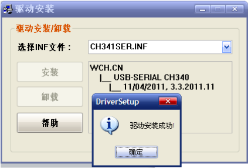
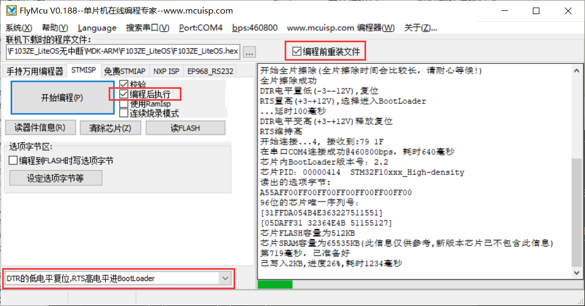
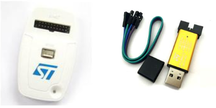
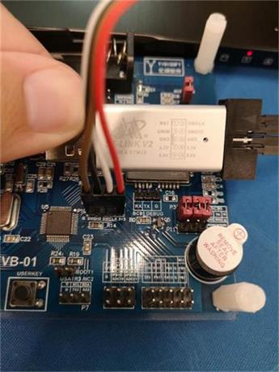
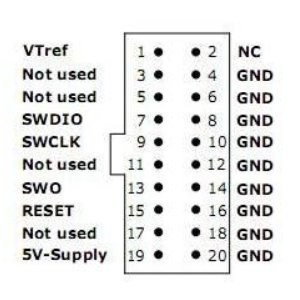
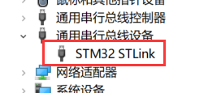

# 程序下载与调试工具

要想学好 RTOS，首先需要准备一套嵌入式开发实验平台，即开发板（也叫评估板，测试板，学习板等等）。如果开发者手头上有华为官方推荐的[开发板](https://github.com/LiteOS/LiteOS_Partner_Development_Kits)，则可以直接使用移植好的编译工程。如果您手头上开发板没有对应的编译工程，则需要进行 OS 移植。

我们这里将手把手指导开发者进行 Huawei LiteOS 移植，如果大家在移植过程中遇到问题可以前往 [华为开发者论坛](http://developer.huawei.com/ict/forum/forum.php?mod=forumdisplay&fid=400045) 中发帖，我们的工程师 GG 们会尽力帮助大家解决。

## 硬件准备

### 开发板（支持 ARM Cortex-M 内核的各类开发板）

Huawei LiteOS 目前已经成功适配了数十款基于 ARM Cortex 内核的开发板，包括市面上常见的 STM32F0、STM32F1、STM32F3、STM32F4、STM32F7、STM32L1、STM32L4 全系列产品，NXP i.MAX RT10XX 系列等多种主流芯片。开发者需要先准备好开发板和配套数据手册，然后对照我们的教程进行移植。

我们这里选择的参考开发板是目前淘宝上卖的比较多的 **正点原子 战舰V3**，其主控 MCU 芯片为 **STM32F103ZET6**，内存 **64KB**，Flash **512KB**，如下图所示。

::: tip 提示
此套 Huawei LiteOS 移植教程是兼容全系列 STM32 芯片的，不要求读者选择同款开发板。您只需要有一套类似开发板（内存不小于 8K，Flash 不小于 20K）都可以进行 OS 移植。

选择该板的原因也是因为它并不在我们默认支持的[合作伙伴开发板列表](https://github.com/LiteOS/LiteOS_Partner_Development_Kits)中。
:::

### 下载器/仿真器

在进行 RTOS 移植之前，您需要先准备好以下工具。

- **STM32 串口程序下载**

STM32 的程序下载有多种方法：USB、串口、JTAG、SWD 等，这几种方式都可以用来给 STM32 下载代码。这其中最经济，最简单的方式，就是通过串口给 STM32 下载代码。STM32 串口下载的标准方法是 2 个步骤：

1. 把 Boot0 接 V3.3（保持 Boot1 接 GND）。
2. 按一下复位按键。

通过串口下载代码后，还需要把 Boot0 接回 GND，然后再按一次复位，才会运行下载的代码。由于我们当前使用的正点原子开发板内置了 **一键下载电路**，可以无需跳线，配合上位机软件（flymcu）完成下载自动控制。

::: warning 警告
目前有些系列 STM32 已不支持串口下载，比如 STM32L152XX，这时就只能使用 ST-Link/J-Link 调试器进行下载程序。
:::

由于目前电脑很少有配置串口的，通常都是利用 USB 转串口的方式连接到开发板。这就需要提前安装好相应的驱动。目前市场上常见的 USB 转串口驱动有：CH340，FT232 和 PL2303等。其驱动安装也都大同小异，我们这里演示一下 CH340 的安装过程。

如果之前没有安装 CH340 驱动，设备插入电脑，系统会提示找到新硬件。

不理会这个提示，取消自动安装软件。直接双击 CH340 驱动安装软件，即可以看到驱动安装界面。在驱动安装成功之后，拔掉 USB 线，然后重新插入电脑，此时电脑会自动给其安装驱动。

打开 **设备管理器**，可以看到端口下有如下信息，则说明串口驱动已经安装成功。需要注意的是：不同电脑显示可能会不一样，我这里是 **COM4**，你的可能是 COM5、COM6 或其它。

如果没有找到 USB 串口，请检查开发板电源是否忘记打开。如何还是找不到，则有可能是驱动安装有误，或者系统不兼容了。请换一台 PC 或操作系统再试一试。

安装好 USB 串口驱动后，我们就可以开始串口下载代码了。在国内用的比较多的串口下载软件叫做 flymcu，可以在 [www.mcuisp.com](www.mcuisp.com) 免费下载。

选择我们要下载的 Hex 文件，按照上图红色标注的配置，点击“开始编程”即可完成下载。下载成功后，会有 `共写入 xxxx KB，进度 100%，耗时 xxxx 毫秒` 的提示。

- **JTAG/SWD 程序下载与调试**

串口只能下载代码，并不能实时跟踪调试，而利用调试工具，比如 J-Link，U-Link，ST-Link 等就可以实时跟踪程序，并从中找到程序中的 bug。这里我们以市面上用得最广泛的 ST-Link 为例讲解如何使用 JTAG/SWD 程序下载与调试。

目前在国内市面上常见的 ST-Link v2 有以下两种：

左图是 ST 官方提供的 ST-Link v2 调试器，不仅支持 STM32，还支持 STM8。同时兼容 JTAG 和 SWD 两种调试接口。右图的 ST-Link Mini 版目前用得更加广泛。因为成本较低，开发板销售商通常都会配套提供。请注意：它只支持 SWD 接口调试方式，使用起来和官方版没有什么差别。

如果您的开发板上有 20pin JTAG 插口（比如我们当前使用的 **战舰V3**），直接 PIN-to-PIN 连接即可。如果您的开发板上只提供了 SWD 插口，则需要开发者按照开发板上的丝印编号进行连接，如下图所示。

::: tip 提示
一般情况只需要连接 **GND，SWDIO，SWCLK** 三根即可，3V3 一般可以不接。如果您手头上的开发板是 JTAG 插口，你也可以对照下图方式进行连接。连接好 SWDIO、SWCLK 和 GND 即可。

:::

ST-Link 调试器接入到 PC 机同样需要提前安装驱动，可以访问 ST 官方网站 [https://www.st.com/en/development-tools/st-link-v2.html](https://www.st.com/en/development-tools/st-link-v2.html) 免费下载。该驱动安装较为简单，这里就不再赘述。驱动装好后，需重新插入 ST-Link 到 PC 电脑，可以在 **设备管理器** 中发现系统已经识别出该设备。

至此，ST-Link 工具就准备好了。接下来我们只需要按照如下步骤，就可以使用 ST-Link 进行下载和调试程序。

1. 给开发板供电，插上 ST-Link 下载器；
2. 点击 MDK 工具栏上的 Load 按钮就可以将编译好的程序下载到开发板的 Flash 中
3. 下载成功后，程序就会自动运行。

由于我们当前还没有准备好配套的编译工程，这里就不再继续讲解了。等我们完成系统移植后，再继续演示如何使用 ST-Link 下载和调试程序。

## 软件准备

### STM32 交叉编译工具介绍

**1. Keil（也叫 MDK-ARM）**

MDK-ARM 来自德国的 KEIL 公司，是 RealView MDK 的简称。在全球有超过 10 万的嵌入式开发工程师使用。目前最新版本为：MDK5.25，该版本使用 uVision5 IDE 集成开发环境，是目前针对 ARM 处理器，尤其是 Cortex M 内核处理器的最佳开发工具。

MDK5 安装包可以在：[http://www2.keil.com/mdk5](https://www.keil.com/demo/eval/arm.htm) 下载到。详细安装指导请参考[这里](./keil.md)。

**2. IAR for ARM（也叫 IAR EWARM）**

IAR for ARM（IAR Embedded Workbench for ARM）是一款微处理器开发的一个集成开发环境软件，该集成开发环境中包含了 IAR 的 C/C++ 编译器、 汇编工具、链接器、库管理器、文本编辑器、工程管理器和 C-SPY 调试器，支持 ARM，AVR，MSP430 等芯片内核平台。

IAR EWARM 安装包可以在：[https://www.iar.com/iar-embedded-workbench](https://www.iar.com/iar-embedded-workbench/#!?currentTab=free-trials) 下载到。详细安装指导请参考[这里](./iar.md)。

**3. GCC (SW4STM32)**

SW4STM32（System Workbench for Stm32）是 ST 官方推出的开发工具，支持全系列 STM32，可以运行在 Windows，Linux 和 MacOS 多种系统上。最令人欣喜的是它还是完全免费的。

SW4STM32 安装包可以在：[http://www.ac6-tools.com/downloads/SW4STM32](http://www.ac6-tools.com/downloads/SW4STM32/) 下载到。详细安装指导请参考[这里](./gcc-sw4stm32.md)。

::: warning 警告
SW4STM32 实质上就是基于 Eclipse 框架开发的 IDE 工具，内置的交叉编译器其实是 **GCC for ARM**。使用前需要安装好 Java 运行环境， 请到 [这里](http://www.oracle.com/technetwork/java/javase/downloads/jre8-downloads-2133155.html)下载最新版本 JRE。
:::
