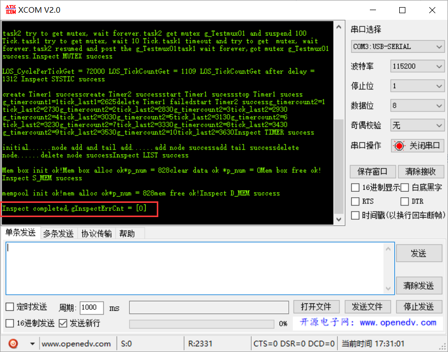

# 验证测试结果

## 连接USB转串口线到 PC 电脑，打开串口工具

我们在准备阶段已经将驱动安装好，接上串口线和ST-Link线，不会报任何错误

## 连接 ST-Link v2 调试器，配置相关参数

把测试工程打开，找到 **调试器** 配置选项，如下图所示选择 `ST-Link Debugger`。

如果 ST-Link 调试器被识别，可以看到下图。

如果希望烧写程序后，自动运行，还需要勾选 `Reset and Run` 选项。

## 烧写代码到开发板，并在串口工具中查看输出结果

在 MDK-ARM 中点击烧录按钮，如果没有遇到问题可以看到烧写成功提示。

最后打开串口工具，如果能看到如下所示，说明 Huawei LiteOS 已经成功在你的开发板上运行。

