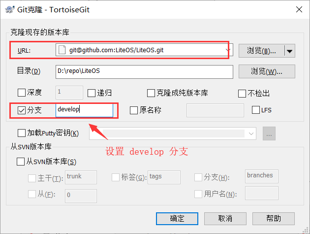

# Huawei LiteOS 源码下载

## 获取 develop 分支源码

LiteOS 开源代码路径：[https://github.com/LiteOS/LiteOS](https://github.com/LiteOS/LiteOS)，复制 git 地址。

::: tip 注意
Huawei LiteOS 最新特性都存放在 develop 分支中，建议取该分支代码进行学习。
:::


可以使用 [TortosieGit](https://tortoisegit.org/) 工具将代码 **克隆** 到本地




也可以安装 [Git for Windows](https://gitforwindows.org/)，执行下面命令

```bash
git clone -b develop git@github.com:LiteOS/LiteOS.git
```
::: warning 警告
如果是直接从 LiteOS 仓库 Checkout 出来的源码，是无法推送修改代码的。这时您需要维护一套自己的源代码，建议将 LiteOS 源码 Fork 到自己的本地仓库，然后进行维护。如果需要合入到 LiteOS 仓库，可以提交 Pull Request。LiteOS 仓库管理员审核后即会合入到主仓库。


:::

## 源码移植目录和文件

我们这里只展现当前基于正点原子的战舰V3对应的目录

```
├─ arch                /* 与 cpu 相关 */
│  └─ arm
│     ├─ arm-m         /* M 核中断、调度、Tick 相关代码。 */
│     │  ├─ cortex-m3
│     │  │  └─ keil    /* LiteOS 提供的 CMSIS OS 接口实现 */
│     │  ├─ include
│     │  └─ src
│     └─ common        /* ARM 核共用的的 CMSIS 接口 */
├─ components
│  └─ cmsis            /* LiteOS 提供的 CMSIS OS 接口实现 */
│     ├─ 1.0
│     └─ 2.0
├─ examples
│  ├─ api              /* 供开发者测试 LiteOS 内核的 demo 示例。 */
│  └─ include          /* api 功能头文件存放目录 */
├─ kernel
│  ├─ base
│  │  ├─ core          /* LiteOS 基础内核代码，包括队列、任务调度、软件定时器、时间片计算等功能 */
│  │  ├─ include       /* LiteOS 内核内部使用的头文件 */
│  │  ├─ ipc           /* LiteOS 中任务间通讯的相关接口，包括事件、信号量、消息队列、互斥锁等 */
│  │  ├─ mem           /* LiteOS 中的内核内存管理的相关代码 */
│  │  ├─ misc          /* 内存对齐功能以及毫秒级休眠 sleep 功能 */
│  │  └─ om            /* 与错误处理相关的文件 */
│  ├─ extended
│  │  ├─ include       /* 低功耗框架代码头文件 */
│  │  └─ tickless      /* 低功耗框架代码 */
│  └─ include          /* LiteOS 内核头文件 */
└─ targets
```