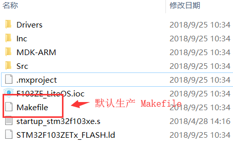
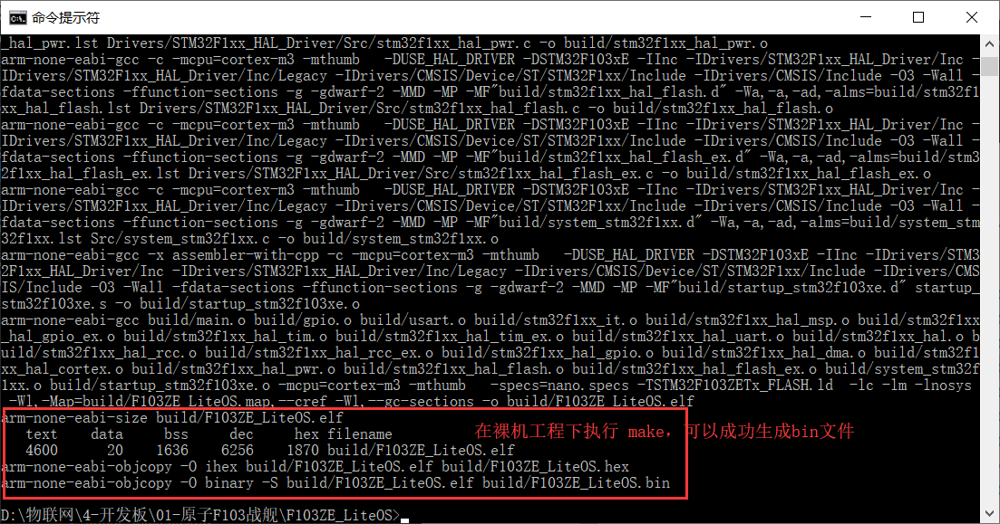
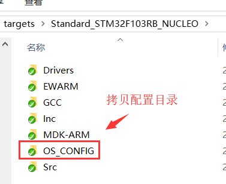
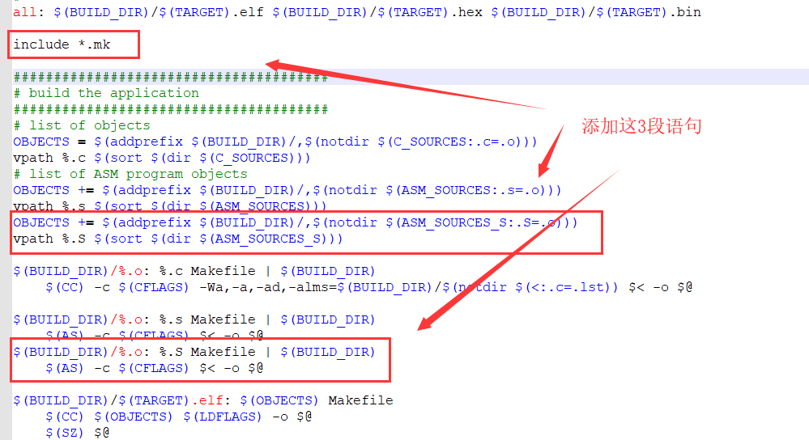
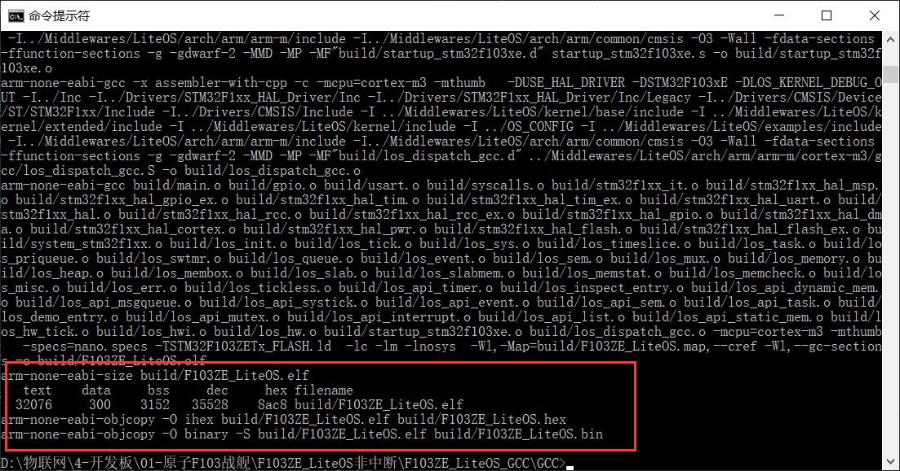
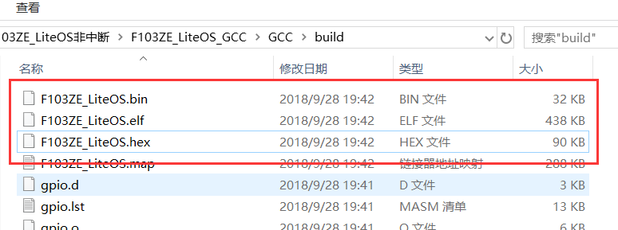

# STM32 系列（Makefile/GCC）

[移植工程下载](/porting/F103ZE_LiteOS_gcc.rar)

## 编译 STM32Cube 生成的裸机工程

默认的裸机工程如下图所示，会按照代码功能组织好。我们可以执行编译检查工程是否 OK。



::: tip 提示
请务必提前安装好 **GNU Tools ARM Embedded** 工具链环境，在 STM32Cube 导出的裸机工程下执行 make 命令。如果能看到下图所示结果，证明您的环境已经部署好。
:::



## 拷贝 LiteOS Kernel 相关目录到裸机工程




在 STM32Cube 生产的裸机工程中创建 **Middlewares** 目录，直接拷贝 LiteOS Kernel 相关目录。

```
├─ Middlewares
│  └─ LiteOS
│     ├─ arch
│     ├─ examples
│     └─ kernel
├─ OS_CONFIG
```
## 创建 LiteOS Kernel 相关 makefile 文件

创建 `arch.mk` 文件，添加 `arch` 目录下相关的源文件和头文件路径
```makefile
######################################
# source
######################################
# C sources
ARCH_SRC =  \
        ${wildcard ../Middlewares/LiteOS/arch/arm/arm-m/src/*.c}
        C_SOURCES += $(ARCH_SRC)

# ASM sources
ASM_SOURCES_S +=  \
../Middlewares/LiteOS/arch/arm/arm-m/cortex-m3/gcc/los_dispatch_gcc.S 

# C includes
ARCH_INC = \
        -I../Middlewares/LiteOS/arch/arm/arm-m/include \
        -I../Middlewares/LiteOS/arch/arm/common/cmsis
        C_INCLUDES += $(ARCH_INC)
```

创建 `kernel.mk` 文件，添加 `kernel` 目录下相关的源文件和头文件路径
```makefile
######################################
# C sources
KERNEL_SRC =  \
        ${wildcard ../Middlewares/LiteOS/kernel/*.c} \
        ${wildcard ../Middlewares/LiteOS/kernel/base/core/*.c} \
        ${wildcard ../Middlewares/LiteOS/kernel/base/ipc/*.c} \
        ${wildcard ../Middlewares/LiteOS/kernel/base/mem/bestfit_little/*.c} \
        ${wildcard ../Middlewares/LiteOS/kernel/base/mem/membox/*.c} \
        ${wildcard ../Middlewares/LiteOS/kernel/base/mem/common/*.c} \
        ${wildcard ../Middlewares/LiteOS/kernel/base/misc/*.c} \
        ${wildcard ../Middlewares/LiteOS/kernel/base/om/*.c} \
        ${wildcard ../Middlewares/LiteOS/kernel/extended/tickless/*.c}
        C_SOURCES += $(KERNEL_SRC)

# C includes
KERNEL_INC = \
        -I ../Middlewares/LiteOS/kernel/base/include  \
        -I ../Middlewares/LiteOS/kernel/extended/include  \
        -I ../Middlewares/LiteOS/kernel/include
        C_INCLUDES += $(KERNEL_INC)

```

最后修改 Makefile 文件，将刚刚创建好的 arch.mk 和 kernel.mk 包含进来。



```makefile
OBJECTS += $(addprefix $(BUILD_DIR)/,$(notdir $(ASM_SOURCES_S:.S=.o)))
vpath %.S $(sort $(dir $(ASM_SOURCES_S)))

$(BUILD_DIR)/%.o: %.S Makefile | $(BUILD_DIR)
	$(AS) -c $(CFLAGS) $< -o $@
```

### 编译无误，OS 移植大功告成



可以在 `build` 目录下找到编译好的 bin 文件

