# STM32 系列（SW4STM32）

[移植工程下载](/porting/F103ZE_LiteOS_SW4STM32.rar)

## 编译并验证裸机工程

默认的裸机工程如下图所示，会按照代码功能组织好。我们可以执行编译检查工程是否 OK。


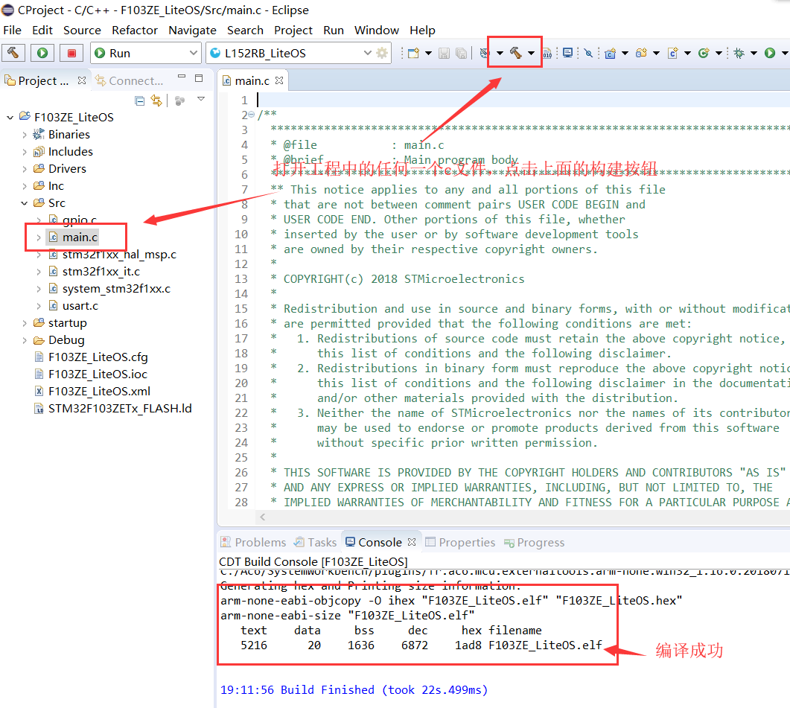

编译成功后，还需要创建 **编译配置项**，否则无法烧写固件到开发板。如下图所示

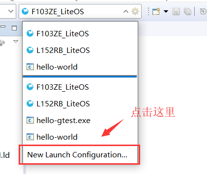

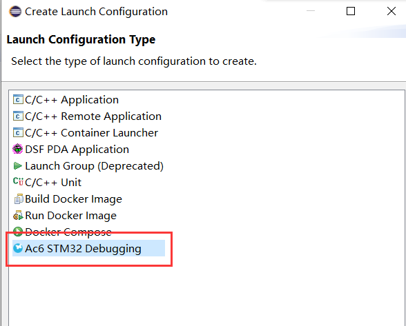

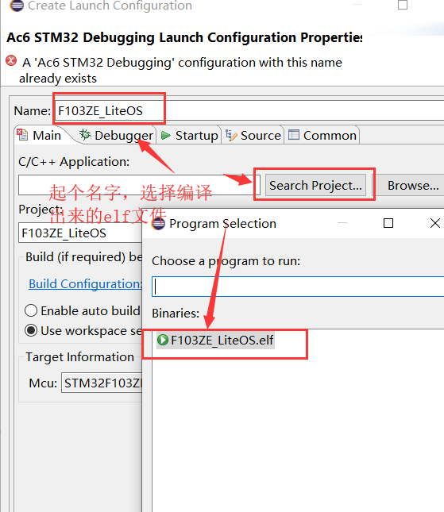

## 拷贝 LiteOS 内核源码及测试相关代码

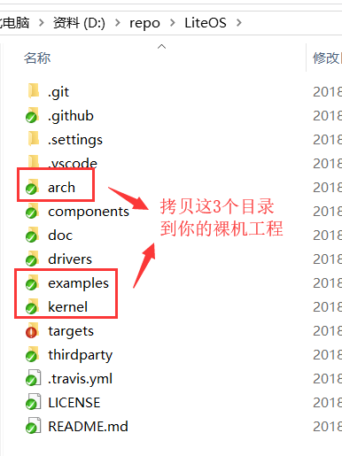

在 STM32Cube 裸机工程中创建 `Middlewares/LiteOS` 目录，拷贝上图中源码目录到该目录下。

```
├─ Middlewares
│  └─ LiteOS
│     ├─ arch
│     ├─ examples
│     └─ kernel
```

## 创建 LiteOS 分组并添加 .c 源文件

如下图增加 LiteOS 源代码：

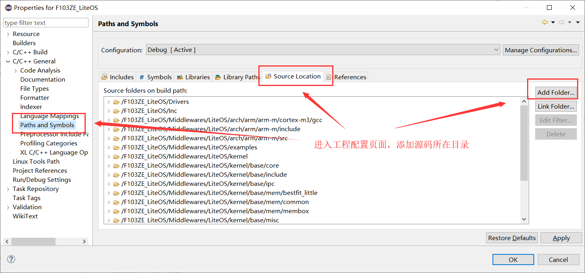

arch 需要添加 `los_dispatch_keil.S`，`los_hw.c`，`los_hw_tick.c` 和 `los_hwi.c`，这 4 个文件。

kernel 需要添加的文件比较多：

::: tip 注意
添加 `los_init.c` 有些特殊，需要按照如下图设置

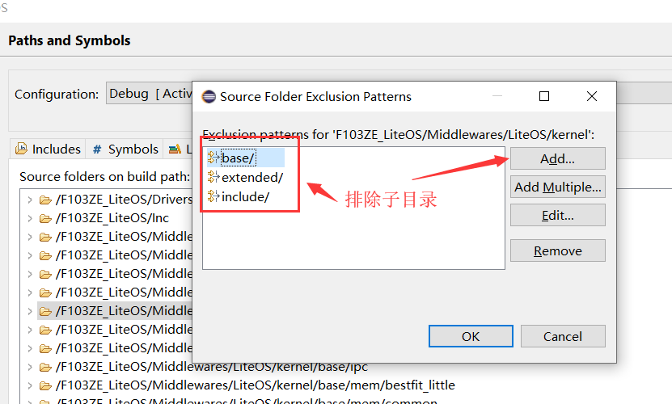
:::

- `los_init.c`
- `base/core` 下面全部 .c 文件
- `base/ipc` 下面全部 .c 文件
- `base/mem/bestfit_little` 下面全部 .c 文件
- `base/mem/common` 下面全部 .c 文件
- `base/mem/membox` 下面全部 .c 文件
- `base/misc` 下面全部 .c 文件
- `base/om` 下面全部 .c 文件
- `extended/tickless` 下面全部 .c 文件（如果没有使用 tickless，可以不必添加）

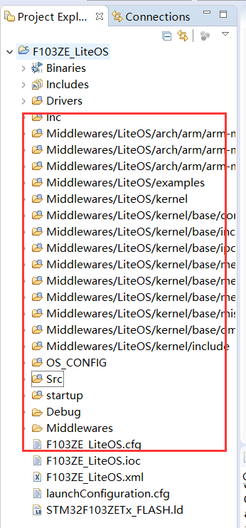

::: warning 警告
需要注意的是，LiteOS 提供了 3 套动态内存分配算法，位于 `LiteOS\kernel\base\mem` 目录下，分别是 `bestfit`、`bestfit_little`、`tlsf` 这三套动态内存算法只需要添加其中一套就行了，对于资源有限的芯片，建议选择 `bestfit_little`，上面的示例也是添加了这一套动态分配算法；另外 `LiteOS\kernel\base\mem\membox` 目录下是 LiteOS 提供的静态内存算法，与动态内存算法不冲突，需要添加；`LiteOS\kernel\base\mem\common` 目录的内容需要全部添加
:::

## 配置 C/C++ 源码 .h 头文件路径

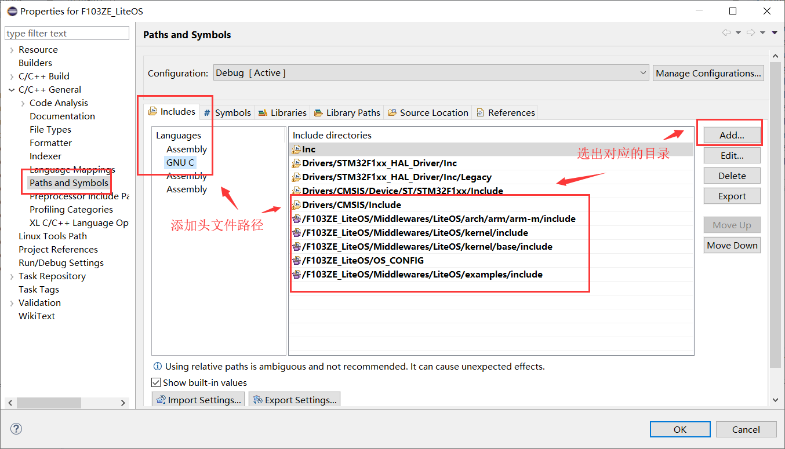

## 编译代码并处理移植中的编译错误

编译会发现如下错误，提示缺少 `los_builddef.h` 文件，这个文件没有包含在源码中，需要从其他示例工程中过来。


我们在 STM32F103RB_NUCLED 发现 `OS_CONFIG` 目录，将该目录拷贝到本地工程中。

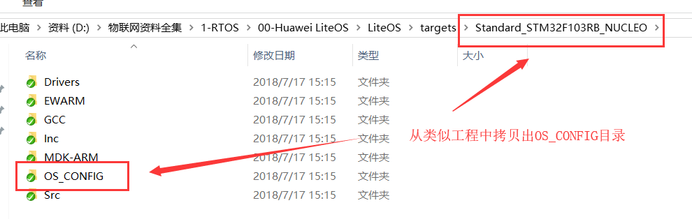

也别忘记把 OS_CONFIG 目录配置到头文件路径中。

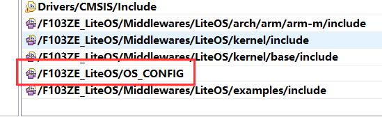

::: warning 警告
 `OS_CONFIG/target_config.h` 文件有两处需要适配您的开发环境进行调整：

1. 正确修改导入 ST 官方驱动文件，如果是 M4 系列芯片是 `stm32f4xx.h` 文件

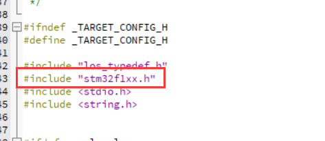

2. 将内存设置为匹配当前芯片 SRAM 大小，查找数据手册可以了解芯片内存大小


:::

再次编译代码，之前的大量报错应该就清理得差不多了。

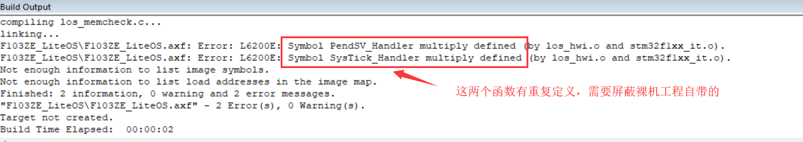

如果编译后还发现上图中的两个错误，显示有两个函数重复定义。您可以直接注释掉这两个函数，但为了保证 STM32Cube 生成工程不会再次覆盖修改后代码，建议按下图所示操作，在 STM32Cube 中屏蔽这两个函数生成。

::: tip 注意
`PendSV_Handler` 和 `SysTick_Handler` 这两个函数只有在 LiteOS Kernel 有对应实现才能够屏蔽，如果不进行 OS，不可屏蔽盖函数，否则会导致芯片跑不起来。
:::

### 编译无误，OS 移植大功告成

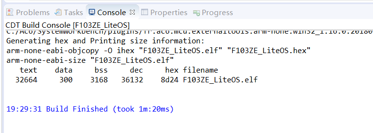