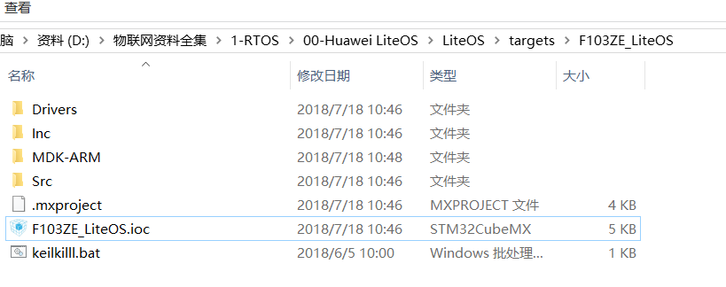
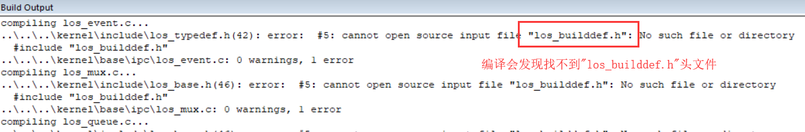

# 意法半导体 STM32 系列

## 打开 STM32Cube 生成的裸机工程

默认的裸机工程如下图所示，会按照代码功能组织好。我们可以执行编译检查工程是否 OK。

## 创建 Middleware/LiteOS 分组，并添加 .c 源文件

如下图增加 LiteOS 源代码：

arch 需要添加 `los_dispatch_keil.S`，`los_hw.c`，`los_hw_tick.c` 和 `los_hwi.c`，这 4 个文件。

::: tip 提示
MDK-ARM 默认添加 .c 源码文件，需要按照如下配置才能看到 .S 汇编文件。

:::

kernel 需要添加的文件比较多：

- los_init.c
- base / core 下面全部 .c 文件
- base / ipc 下面全部 .c 文件
- base / mem / bestfit_little 下面全部 .c 文件
- base / mem / common 下面全部 .c 文件
- base / mem / membox 下面全部 .c 文件
- base / misc 下面全部 .c 文件
- base / om 下面全部 .c 文件
- extended / tickless 下面全部 .c 文件（如果没有使用 tickless，可以不必添加）

::: warning 警告
需要注意的是，LiteOS 提供了 3 套动态内存分配算法，位于 `LiteOS\kernel\base\mem` 目录下，分别是 `bestfit`、`bestfit_little`、`tlsf` 这三套动态内存算法只需要添加其中一套就行了，对于资源有限的芯片，建议选择 `bestfit_little`，上面的示例也是添加了这一套动态分配算法；另外 `LiteOS\kernel\base\mem\membox` 目录下是 LiteOS 提供的静态内存算法，与动态内存算法不冲突，需要添加；`LiteOS\kernel\base\mem\common` 目录的内容需要全部添加
:::

## 配置 C/C++ 源码头文件路径

## 编译代码，处理编译错误

编译会发现如下错误，提示缺少 `los_builddef.h` 文件，这个文件没有包含在源码中，需要从其他示例工程中过来。

我们在 STM32F103RB_NUCLED 发现 `OS_CONFIG` 目录，将该目录拷贝到本地工程中。

也别忘记把 OS_CONFIG 目录配置到头文件路径中

再次编译代码应该就没有告警和错误了。

如果编译后还发现上图中的两个错误，请按照下图显示进行操作。

### 编译无误，OS 移植大功告成

