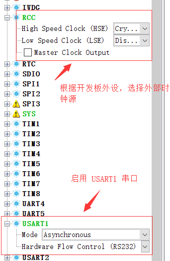
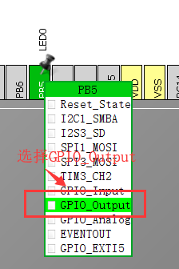
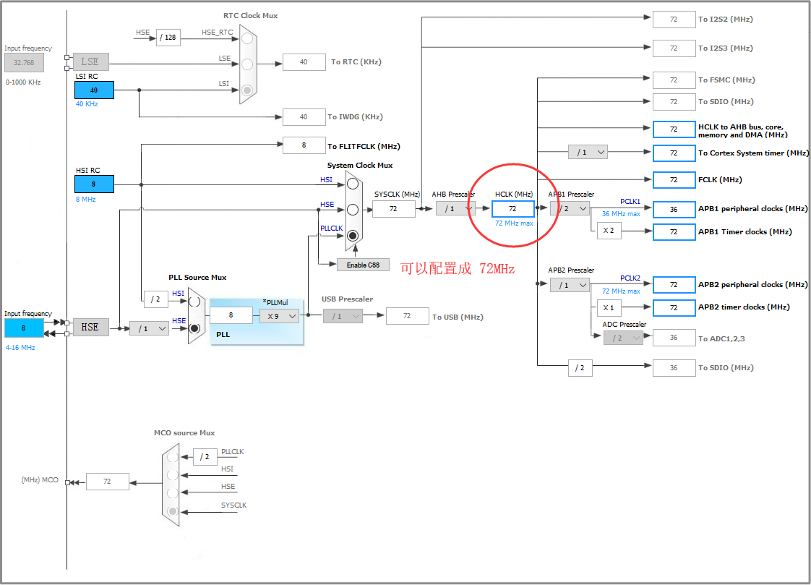
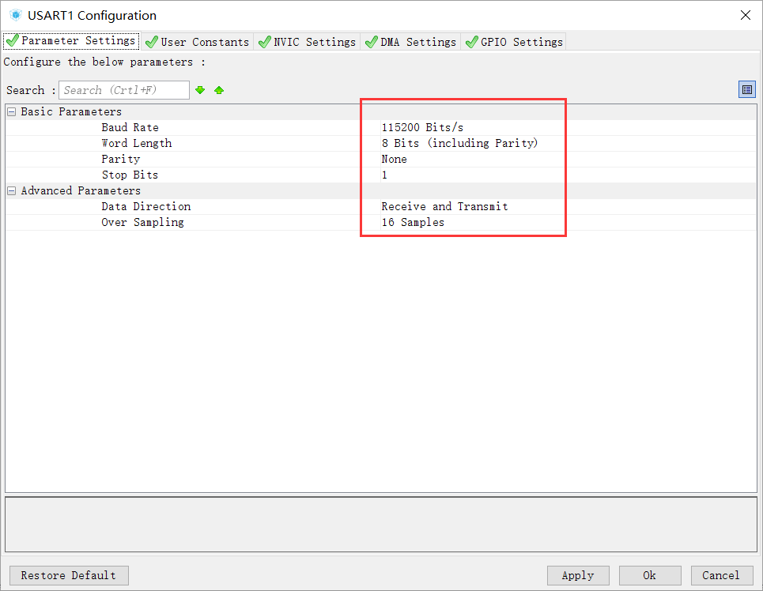
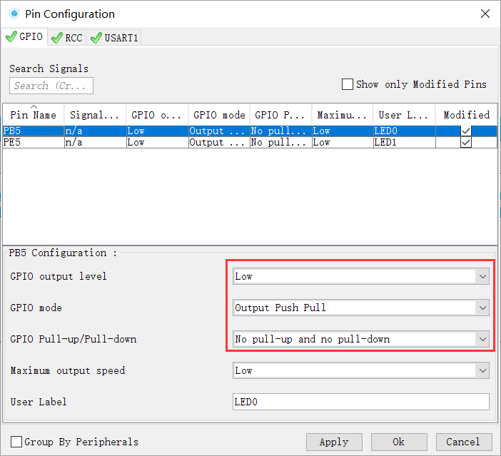
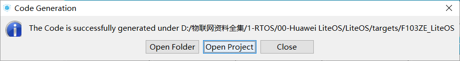

# 意法半导体 STM32 系列

最近几年 ST 官方都在大力推行 STM32CubeMX 图形化开发，鼓励大家从标准库转到 HAL 库上来。随着 STM32CubeMX 快速迭代更新，目前已经支持 STM32 全系列产品，配置和使用都非常方便。因此我们在本教程中用 STM32CubeMX 作为裸机工程的构建工具，一步步指导开发者完成 Huawei LiteOS 的内核移植。

## 安装 STM32CubeMX 并下载芯片对应的软件支持包

STM32Cube 是 ST 提供的一套性能强大的免费开发工具和嵌入式软件模块，能够让开发人
员在 STM32 平台上快速、轻松地开发应用。它包含两个关键部分：

- 图形配置工具 STM32CubeMX。允许用户通过图形化向导来生成 C 语言工程。
- 嵌入式软件包（STM32Cube 库）。包含完整的 HAL 库（STM32 硬件抽象层 API），配套的中间件（包括 RTOS，USB，TCP/IP 和图形），以及一系列完整的例程。

### 软件下载

1. 由于 STM32CubeMX 依赖 Java 运行环境，大家需先到 Java 官网 www.java.com下载最新的 Java 软件包（要求 1.7 版本以上）；

2. STM32CubeMX 可以在 ST 官网 [www.st.com/en/development-tools/stm32cubemx.html](https://www.st.com/en/development-tools/stm32cubemx.html) 下载最新的版本；

::: tip 提示
由于 STM32CubeMX 软件版本更新非常频繁，其新版本创建的工程无法被旧版本软件打开，我们这里就不提供网盘下载，建议大家尽量下载最新版本。
:::

STM32CubeMX 安装起来非常简单，只需要一路 Next 即可完成安装。

接下来我们先启动 STM32CubeMX

在 Help -> 下，选择 `Embedded Software Packages Manager`

选择需要移植的开发板 MCU 对应的芯片系列，点击 `Install Now`，可以启动安装

## 使用 STM32CubeMX 创建适配开发板的裸机工程（MDK-ARM）

要移植 OS，肯定需要一个基础工程，基础工程则是越简单越好。下面我们一步步创建裸机工程。

### 新建一个工程，查找开发板匹配 MCU 型号及规格

### 然后对照开发板原理图，配置引脚信息

我们这里只使能 外部时钟（RCC），2 个 LED和 1 个串口。

::: tip 如何查看原理图？
我们的配套开发板，有2个LED，分别对应 **PB5** 和 **PE5**。大家可根据自己开发板原理图来配置。

:::

按上图所示，分别给 PB5 和 PE5 命名为 LED0 和 LED1。

最终配置完成效果如下：

::: warning 警告

由于 STM32CubeMX 默认配置就可以正常工作了，如果你需要对这几个外设进行专门配置，可以按照下图所示进行调整。

:::

### 配置生成工程参数和路径，生成裸机工程

选择 MDKV5 作为我们的交叉编译工具，同时把导出工程名和路径配置好。

::: tip 提示
为了让导出的裸机工程适配 LiteOS 目录树，建议放置在 target 目录中。

:::

## 向裸机工程添加 Huawei LiteOS 内核源码以及处理编译错误

默认的裸机工程如下图所示，会按照代码功能组织好。我们可以执行编译检查工程是否 OK。

### 向裸机工程创建分组，并添加 .c 源文件

按下图增加 LiteOS 源代码

::: warning 警告
内存
:::

### 配置头文件路径

### 编译工程，提示大量编译 error

编译发现如下错误，提示缺少 `los_builddef.h` 文件，需要从其他工程中拷贝 OS_CONFIG 目录。

将 OS_CONFIG 目录配置到头文件路径中

### 再次编译工程，还剩两个 error

打开 `stm32f1xx_it.c` 文件，将两个函数屏蔽掉

### 编译成功

::: tip 提示
为避免 OS 申请内存异常，需要编辑 `target_config.h`，将内存设置为当前芯片 SRAM 大小。

:::