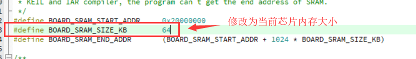

# 意法半导体 STM32 系列

## 向裸机工程添加 Huawei LiteOS 内核源码以及处理编译错误

默认的裸机工程如下图所示，会按照代码功能组织好。我们可以执行编译检查工程是否 OK。

### 向裸机工程创建分组，并添加 .c 源文件

按下图增加 LiteOS 源代码

::: warning 警告
内存
:::

### 配置头文件路径

### 编译工程，提示大量编译 error

编译发现如下错误，提示缺少 `los_builddef.h` 文件，需要从其他工程中拷贝 OS_CONFIG 目录。

将 OS_CONFIG 目录配置到头文件路径中

### 再次编译工程，还剩两个 error

打开 `stm32f1xx_it.c` 文件，将两个函数屏蔽掉

### 编译成功

::: tip 提示
为避免 OS 申请内存异常，需要编辑 `target_config.h`，将内存设置为当前芯片 SRAM 大小。

:::