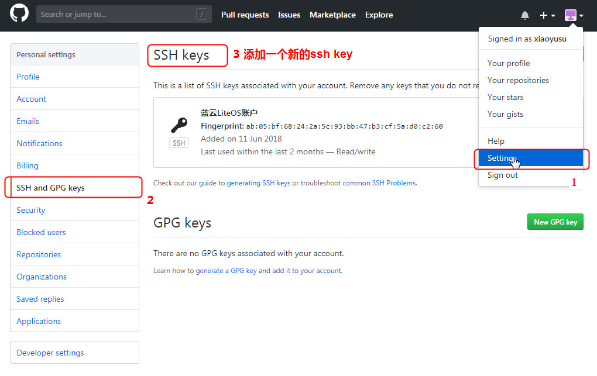
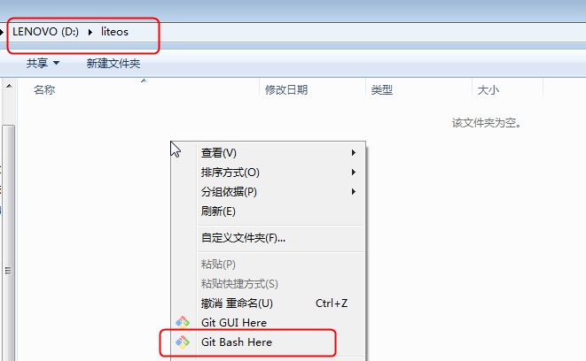
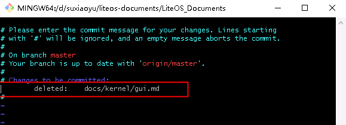
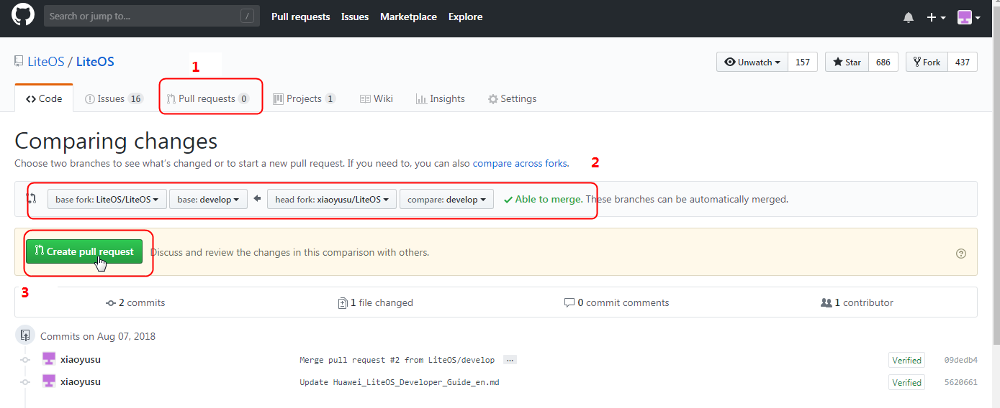

# 贡献流程说明

[[toc]]  

## 下载Git工具  

请至 [git官网](https://git-scm.com/download) 下载   

## 配置SSH Key  

1. 先查看本地是否有公钥

    ```bash  
    $ ls ~/.ssh

    id_rsa id_rsa.pub
    ```  

    如果存在公钥，则返回类似如上的一对文件，一般命名是 `id_rsa` 和 `id_rsa.pub` ，其中有 `.pub` 后缀的文件是公钥，另一个文件则是密钥。如果系统内没有该文件，则需要手动生成：  

    ```bash  
    $ ssh-keygen -t rsa -C "your-email@youremail.com"  //用自己注册GitHub账户的邮箱
    ```  

    输入如上命令便会生成ssh公钥，一般默认存放路径为 `~/.ssh/id_rsa` 

2. 配置github账户的SSH Key    
    
    将 `.pub` 文件中的内容复制出来，粘贴到自己的github账户设置中，即完成配置，对应位置如下：  

      

3. 检验是否配置成功  

    最后在GitBash中输入如下命令，进行验证  

    ```bash   
    $ ssh -T git@github.com
    ```
 
## 配置本地Git账户信息  

 账户信息即用户名和邮箱，注意此处邮箱指的是注册GitHub账户所使用的邮箱，配置以后，后续每次Git提交都会使用该信息：  

 ```bash 
 $ git config --global user.name "你的用户名"   
 $ git config --global user.email "你的邮箱"
 ```  

 可以使用如下命令，查看所有配置信息：

 ```bash   
 $ git config --list
 ```  

## 下载代码到本地

1. fork主仓库代码到自己工程下  
    
    [LiteOS开源代码仓库地址](https://github.com/LiteOS/LiteOS)  

2. 本地新建目录，进入 `git bash` 界面  

      

3. 下载代码  

    从GitHub仓库拉取代码

    ```bash   
    git clone https://github.com/xiaoyusu/LiteOS.git    //自己fork的仓库地址   
    ```  

4. 切换到develop分支  

    :::warning 注意
    clone下来的代码默认是master分支，开发者参与贡献需提交代码到develop分支，因此需要先切换分支到develop。
    :::  

    ```bash  
    git checkout develop
    ```  

## 设置远程仓库地址

1. 设置LiteOS主仓库地址  

    以下以将LiteOS主仓库命名为upstream为例  

    ```bash   
    git remote add upstream https://github.com/LiteOS/LiteOS_Documents.git  
    ```  

2. 设置自己fork的远程仓库地址

    以下以将自己fork的仓库命名为origin为例

    ```bash  
    git remote add upstream https://github.com/"your-branch"/LiteOS_Documents.git  //your-branch为自己的工程名
    ```  

## 提交本地修改到自己仓库  

介绍如何将本地修改提交到到自己fork的远程仓库。

1. 更新本地代码和LiteOS主仓库同步  

    :::tip 注意  
    为保证提交的修改基于库上最新代码，避免冲突，每次提交前必须执行此步。  
    :::  

    ```bash  
    git remote update upstream   //同步主库代码
    git rebase upstream/master   //将最新代码合入本地
    ```  

2. 添加修改  

    ```bash  
    git add .  
    ```  
3. 将修改commit到本地库  

    ```bash  
    git commit .     //commit当前修改
    ```  

    想要commit的修改，删掉所在行最前方的 **`#`** 即可，参考如下  

      

4. 上传修改到自己的远程仓库  

    ```bash  
    git push origin develop:develop  
    ```  

## 提交修改到主仓库  

通过上述步骤，修改已经提交到自己的仓库中，当前只需要将这些修改merge到主仓库上便完成了本次代码的提交，也就是提一个 `Pull Request` ， 将自己仓库develop分支修改的内容，同步到LiteOS主仓库，提交页面也可以再次确认修改差异。  

  

现在就静候LiteOS主仓库管理员review代码吧，验证ok就会将修改合入，恭喜你成为Contributor，感谢你为开源社区做出的贡献！  
