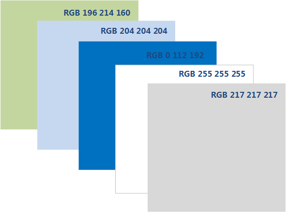

# 写作要求

Huawei LiteOS（以下简称LiteOS）欢迎开发者参与到开源社区的贡献中来，本文主要介绍参与LiteOS文档贡献的写作规范，如果贡献者提交文档的修改建议或需要提交新的文档，请参照此规范。

[[toc]]

## 命名规范

如需提交新的文档，在GitHub上工程代码doc目录下创建新的.md文件，命名需遵循`xxx-xxx.md`格式，根据文档的内容来声明。

比如介绍写作规范的文档，可以命名为`write-standard.md`。

## 内容规范

以简洁、直观地表达所述内容为目的，介绍性文档言简意赅介绍原理、架构、设计思路等，操作类文档写明关键步骤，以便能对其他开发者起到帮助。可以优先使用中文，建议中英文都支持，LiteOS也将持续更新，保证中英文的同步。

### 标题

建议标题层级不超过三级。

### 正文

**操作类文档以移植为例，文档结构可以参考如下**
* 目的（简述操作目的，如移植到哪款型号的单板）
* 软硬件环境准备
* 移植具体步骤
* 结果验证  
具体案例请参考：链接暂时没有======================

**介绍性文档以开发指南某一功能为例，文档结构可以参考如下**
* 概述（概念及原理介绍）
* 功能（支持的接口列表）
* 开发流程（如何使用及相应步骤）
* 编程实例（提供具体代码示例）
* 注意事项
* 其他  
具体案例请参考：链接暂时没有======================

### 图片

图片统一存放到文档同级目录下的pic文件夹中（英文文档对应pic-en），如`LITEOS_DOCUMENTS/docs/quick-start/write-standard.md`中使用的图片，统一放置到`LITEOS_DOCUMENTS/docs/quick-start/pic`目录下，文档中使用相对路径引用图片。图片建议根据内容命名，只用数字序列不利于后续图片的继承。
:::tip 说明
引用方式：  
``  
:::
如果是自制图片，配色请参考如下，格式不限png/jpg/gif...均可，如果是截图或者其他地方引用图片，风格不做限制。




### 表格

在md中可以按照如下形式插入表格。  

**Input**
```
| Tables      | Type          | Note  |
| ----------- |:-------------:| -----:|
| first       | standard      |  None |
| second      | outstanding   |     5 |
| third       | inside        |  with |
```
**Output**
| Tables      | Type          | Note  |
| ----------- |:-------------:| -----:|
| first       | standard      |  None |
| second      | outstanding   |     5 |
| third       | inside        |  with |

### 代码

正文中插入代码段，可以在段落前后加上符号 ``` ，以C语言为例：

**Input**
````  
```c
void default {
  data () {
    return 0;
  }
}
```
````

**Output**
```c
export default {
  data () {
    return {
  }
}
```