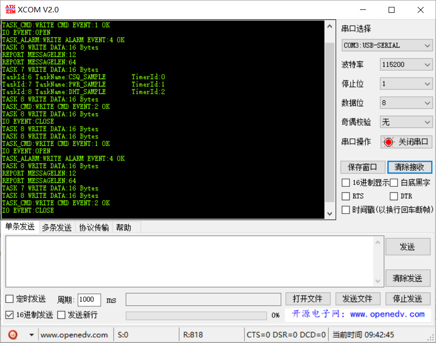

# 烟感报警演示工程（复杂）

## 业务流程

**周期性采集或控制** 在物联网领域是一个十分常见的功能。通常的做法是利用 MCU 中内置的硬件定时器，周期产生定时器中断，并在中断处理函数中使能采集或控制条件。然后在后台进程中触发调用对应的采集任务。但这一方案有以下两个明显缺陷：

### 资源使用

| 任务 | 消息队列 | 软件定时器 | 事件 | 互斥锁 | 信号量 |
| ---- | -------- | ---------- | ---- | ------ | ------ |
| 7    | 1        | 3          | 1    | 2      | 1      |

### 简要说明

1. 根据资源使用情况确认系统配置文件是否满足
2. `Task_CloudCmd` 任务模拟从云端主机接收命令，当接收到相应的命令后，发送响应的 `event` 给 `Task_EventsHandle`;
3. `Task_SmokyAlarm` 任务模拟监测报警传感器，将相应的 `event` 发送给 `Task_EventsHandle`
4. `Task_EventsHandle` 任务处理相关的 `event`，当 `event` 是`IO`，则执行相关的 `IO` 操作（print模拟）；当 `event` 为`alarm`，则上报信息给云主机
5. `Task_Sample`（不止一个）根据自己的采样周期，定期将采样数据写入到采样消息队列
6. `Task_RecvQ` 任务读取采样消息队列中的数据，并缓存到自己的链表中，当设定的时间超时或者接收消息数到达一定量时，则将接收的消息打包，上报给云主机
7. 上报云主机目前使用打印模拟。
8. 不论是打印还是上报，考虑到多任务，已经使用互斥锁处理。（上报的互斥锁，考虑业务因素予以保留）

## 代码解读

[源码浏览](/full_demo.c)

::: tip 提示
代码较多，这里就不进行展示代码和解读
:::

### 在 `main.c` 中添加 demo 入口函数

```c
/* USER CODE BEGIN PFP */
/* Private function prototypes -----------------------------------------------*/
UINT32 Full_Demo(VOID);
/* USER CODE END PFP */
```

```c{7}
  /* USER CODE BEGIN 2 */  
  if (LOS_OK != LOS_KernelInit())
  {
      return LOS_NOK;
  }
  
  Full_Demo();

  LOS_Start();
  /* USER CODE END 2 */
```

## 代码验证

创建 `full_demo.c` 源文件，合入到编译工程


编译通过后，在串口打印出如下信息。

