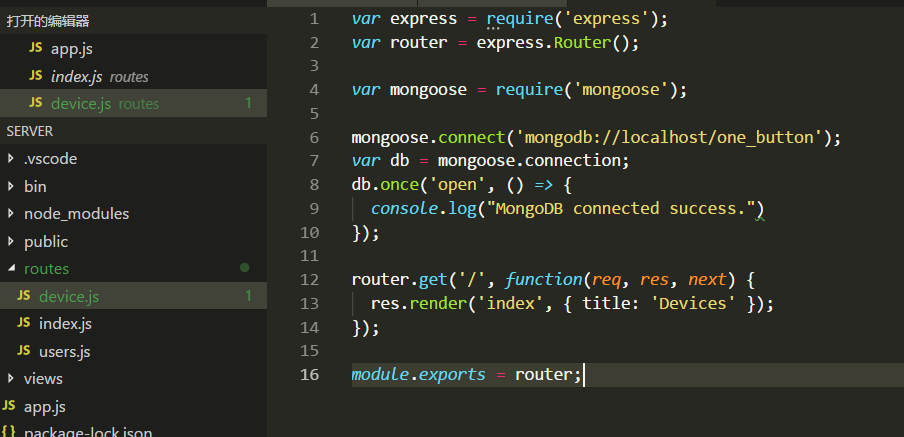
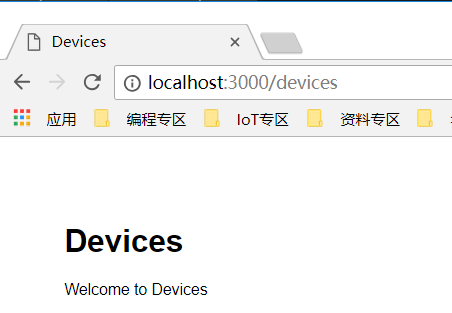

# 步骤7：设计后台 RESTful API 接口，服务绑定到 MongoDB 数据库

## 7.1	Developing a RESTful web server and define the web API for Front-end

After we installed all helpers, we could write the code now. At first, we must understand the progress of between IoT platform and Our Web server. Look at this sequence diagram.

Follow the diagram, we can get design the Restful API for Front-End app

| Methods        | URL           | Description  |
| ------------- |:-------------:| -----:|
| POST      | `http://url/devices?nodeId=xx&nodeName=xx` | Create a new Device |
| DELETE      | `http://url/devices/:id`      |   Delete a Device |
| GET | `http://url/devices`      |    Get all Devices |
| POST | `http://url/devices/bind/:id` | Bind a device to IoT platform |
| DELETE | `http://url/devices/unbind/:id` | Unbind a device to IoT platform |
| GET | `http://url/devices/:id` | Get a History data of the device |

In order to implement the above API, we need access OpenAPIs of the Huawei IoT Platform, in next step we will learn how to use them.

-	Auth (Authentication) https://server:port/iocm/app/sec/v1.1.0/login
-	Registering a Directly Connected Device https://server:port/iocm/app/reg/v1.2.0/devices?appId={appId}
-	Querying the Activation Status of a Device https://server:port/iocm/app/reg/v1.1.0/devices/{deviceId}?appId={appId}
-	Deleting a Directly Connected Device https://server:port/iocm/app/dm/v1.1.0/devices/{deviceId}?appId={appId}
-	Modifying Device Information https://server:port/iocm/app/dm/v1.2.0/devices/{deviceId}?appId={appId}
-	Querying Historical Device Data https://server:port/iocm/app/data/v1.1.0/deviceDataHistory?deviceId={deviceId}

## 7.2	Implementing to connect MongoDB and devices routers framework

1)	Install mongoose module which using visit MongoDB

Open package.json file, you can see mongoose has been auto-configuration.

2)	Open the project and add device.js file in the routes directory

3)	Add mongodb connect code and router code in the device.js

4)	Add two lines code in the app.js which response for load devices router module.

5)	Run “npm start” in server directory, if you see “MongoDB connected success”, it means the server connect MongoDB is OK.

6)	Open Google Chrome and browse http://localhost:3000/devices 

That it is. The web services is working.