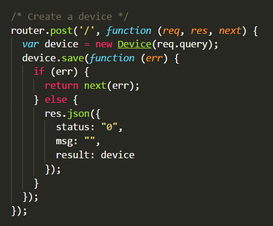
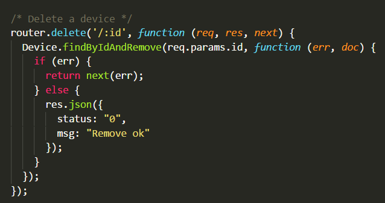
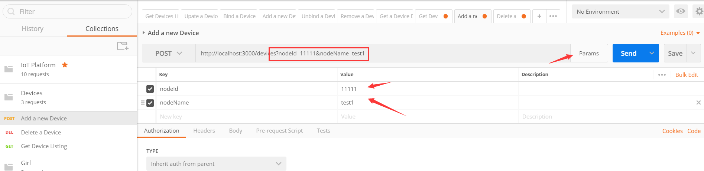
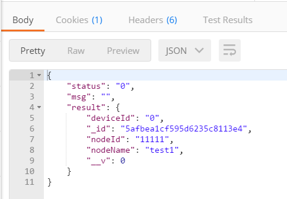
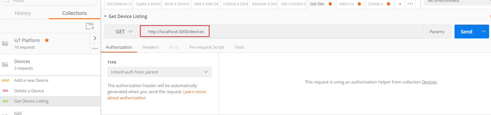
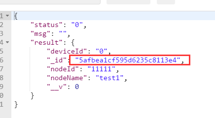

# 步骤8：设计后台 Web 服务设备管理模块，实现设备增删改查功能

## 8.1	Designing device model for device management

Create a device Schema which will be used in Device Model.

There are three fields in the devceSchema, nodeId is IMEI of NB-IoT device, nodeName is a friendly name for this instance. deviceId will be used to connect IoT platform, new one is zero.

## 8.2	Implement Device Management in Back-end services

1)	Implement and test device restful API for Front-end app

| Tables        | Are           | Cool  |
| ------------- |:-------------:| -----:|
| POST     | `http://url/devices?nodeId=xx&nodeName=xx` | Create a new Device |
| DELETE      | `http://url/devices/:id`     |   Delete a Device |
| GET | `http://url/devices`     |  Get all Devices |

-	Create a new Device

-	Delete a Device

-	Get device listing

2)	Using Postman to verity the functions

Request: (create a new device)

Response:

Request: (Get Device Listing)

Response:

Request: (Delete a Device)

Response:

::: tip
In Delete a device url, there is the id which can auto-generate when Creating a new device. You could find it as followed:

:::