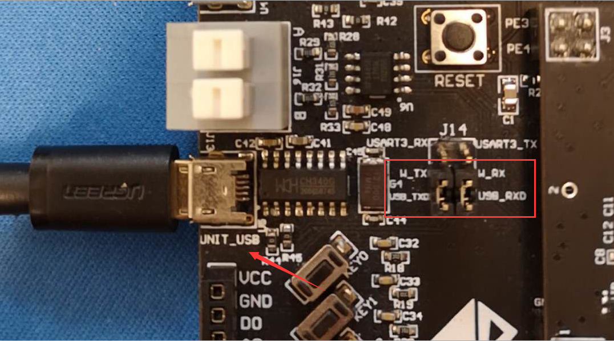
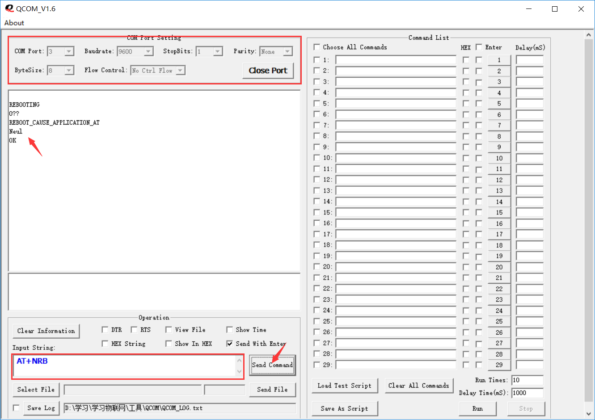

# 步骤1：安装传感器，调试器等外设，对 NB-IoT 开发板进行自检

基于钛比 NB-IoT 开发板开发 NB-IoT 应用，需要以下组件：

1.	ST-Link v2 烧写器 x 1
2.  移远 BC95 NB-IoT 通讯扣板 x 1
2.	OLED 显示屏 x 1
3.	温湿度传感器 DH11 x 1
4.	光敏传感器 x 1
5.	主控板 x 1

本开发板基于STM32F103系列芯片，该芯片具有高性能、低功耗等特点。其内核为ARM 32位Cortex™-M3 CPU，最高72MHZ的主频率，256KB的闪存，80个高速IO口以及丰富的通讯接口，芯片尺寸仅为16X16mm。

::: warning 注意事项
安装 NB-IoT SIM 卡时，需要仔细观察槽内标签开启或方向提示，请务必确保安装到位后，再进行上电操作。常见卡槽有以下两类：

1）卡扣式

2）弹出式

:::

在此教程场景下，我们无需安装外部传感器，只需要使用一个 LED 灯和一个按键 KEY 即可。当你按下标记有 KEY0 按键， LED0 会被点亮。如果你再按一次，LED0 会熄灭。在 IoT 平台上可以看到如下图所示报警状态。

下图则简单展现了消息交互流程，按键触发报警事件，该消息会先到 IoT 平台，然后再通知给北向 Web 应用。

下面，我们开始验证开发板基本功能：

## 开发板自检

1. 下载并安装 CH340 串口转 USB 驱动，连接 Micro-USB 串口线到 `MCU_USB` 接口位置，如下图所示。

如果串口驱动安装无误，可以在*设备管理器*看到 Windows 识别出该设备。

::: danger 重要
请在连接串口线前，关闭电源。连接好后，再重新开启电源。
:::

2. 然后打开 FlyMcu USB刷机工具，按照下图烧写 `horse_race_lamp.hex` 固件

[horse_race_lamp.hex](/horse_race_lamp.hex)

3. 如果烧写成功，您将看到开发板上4个流水灯循环闪烁。

[视频](/horse_race_lamp.mp4)

## 验证 NB-IoT 网络

1)	Change the Jumper Cap J14, and connect UNIT_USB interface.
W_TX <-> USB_TXD
W_RX <-> USB_RXD

2)	Using QCOM and AT Commands to check the NB-IoT connectivity.
Open QCOM COM Port Tools, and input these params following Figure 0 9, Select valid COM Port, Baudrate equls 9600, other param use default value. Click Open Port, you will connect PC to NB-IoT EVB.
And then, write “AT+NRB” command, Click Send Command Button, you will see NB-IoT module will be rebooting. When you can see Neul, OK. It means device is OK.

3)	Let us check the NB-IoT connectivity.
Step by step run these AT commands in the table, you can look around <Quectel_BC95_AT_Commands_Manual_V1.9> in details.

| AT Commands |	Result | Description |
| ----------- | ------ | ----------- |
| AT+CGSN=1   | +CGSN:863703030633395 | Request Product Serial Number Check this number matching your IMEI on your NB-IoT |
| AT+NBAND? | +NBAND:5 | Get Supported Bands Check the NB-IoT bands matching your SIM cards
 |
| AT+CSQ | `+CSQ:16,99` | Get Signal Strength IndicatorIf there is no problem above inspecting, you could check the Singal Strength, the first number is not 99, it means OK.|
| AT+CGPADDR | +CGPADDR:0,10.42.206.127 | Show PDP Addresses If there is IP address return, it means the NB-IoT connectivity is good.|
