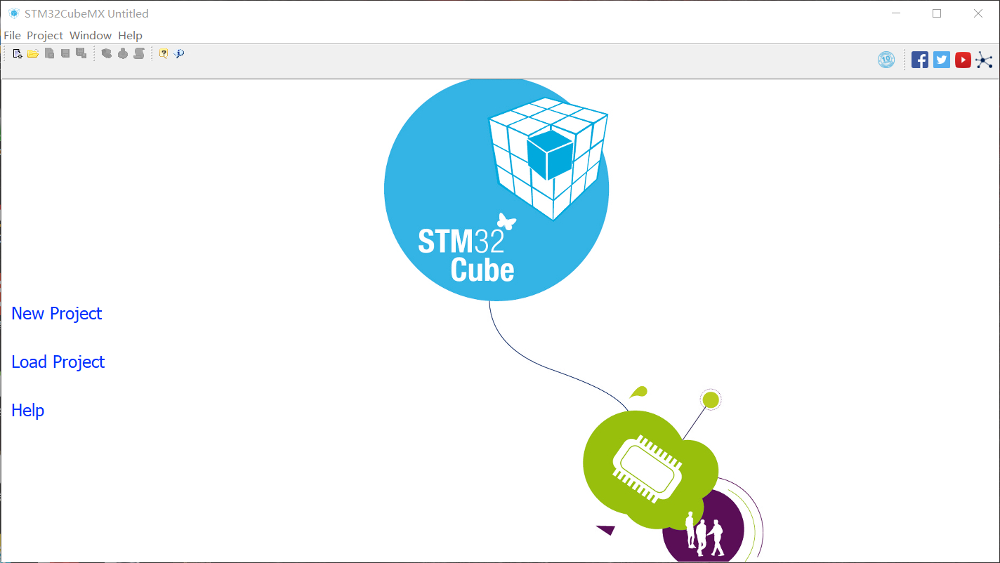
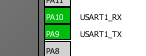
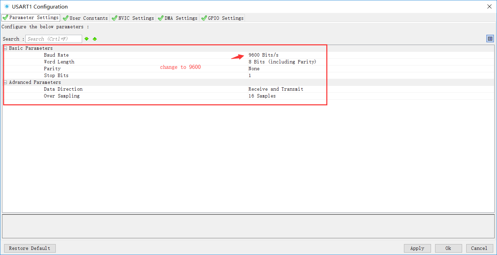
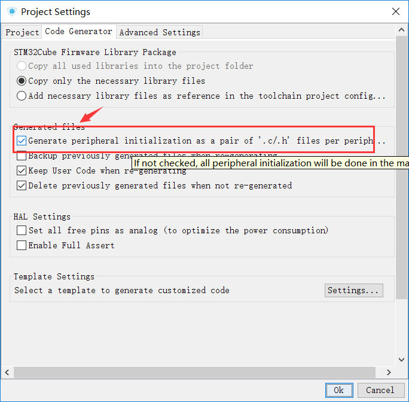
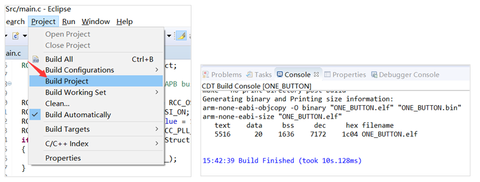
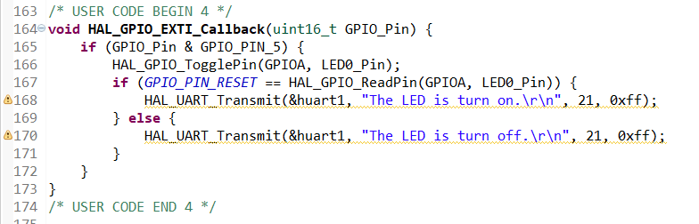

# 步骤2：学习 STM32Cube 工具创建裸机工程，实现按键控制功能

After this step, you could code a One Button embedded application with C language. Don’t worry about program language. As we using two Powerful Advanced Helper of ST, you code no more 20 lines code.

## 2.1	Install STM32CubeMX at first, which help us create a Project

Open STM32CubeMX, you first download the STM32F103VCT6 HAL library that ST provided.

Expands the STM32F1 MCU Packages, and download the latest package. Wait a minute, you get all the resource.

Next, we could new a project, input “STM32F103VC” in search bar, and select STM32F103VCTx item. Double click this item or click the start project button.

Please take a closer look at the configuration item. Open the Datasheet of the development board. We will enable the three Peripherals, including LED0, KEY0, USART1

1.	Left click PA12, select “GPIO_Output” item, and then right click it, named “LED0”

2.	Left PA5, select “GPIO_Input” item, and then right click it, name “KEY0”

3.	Expand the left navigator bar, the find the USART1, set the mode is “Asynchronous”.

The tools will be enable the USART1.

4.	Change to the configuration page, follow me set some params.

Click USART1 item, change Baud Rate equals 9600 Bits/s and enable interrupt item in NVIC settings

Click GPIO item, LED0 is not set, KEY0 change to Pull-In.

5.	That’s all. You select a directory save the project.

Click “Generate source code” button, it automated output the One Button project.

SW4STM32 IDE could be automated opened, the project is prapared. 

::: tip
If you open the SW4STM32 at first, you may be wait a long time, because it will download the cross-compile tools and libraries. There should be no error, when you click the Build Project.
:::

2.2	According to the steps, write a piece of code, and then complete the last works.

Open a `main.c` find `/* USER CODE BEGIN 2 */`, write a line code in function `main()`, which enable LED0 is turn off when the main board was power on.

Find `/* USER CODE BEGIN 4 */`, write a new function, named `HAL_GPIO_EXTI_Callback`, when you click the KEY0, the function will be call. 
`HAL_GPIO_TogglePin()` can control the LED0, and HAL_UART_Transmit() can send a message to PC windows

When you see the QCOM print the contain, it means worked. 

