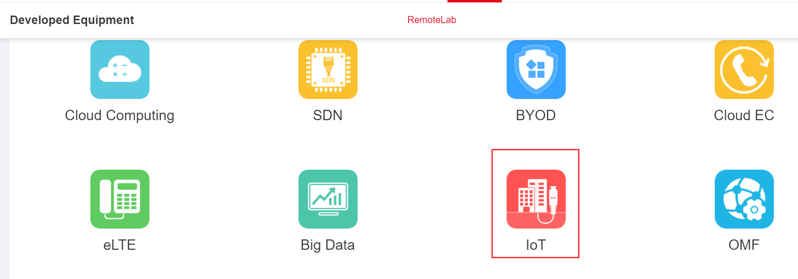
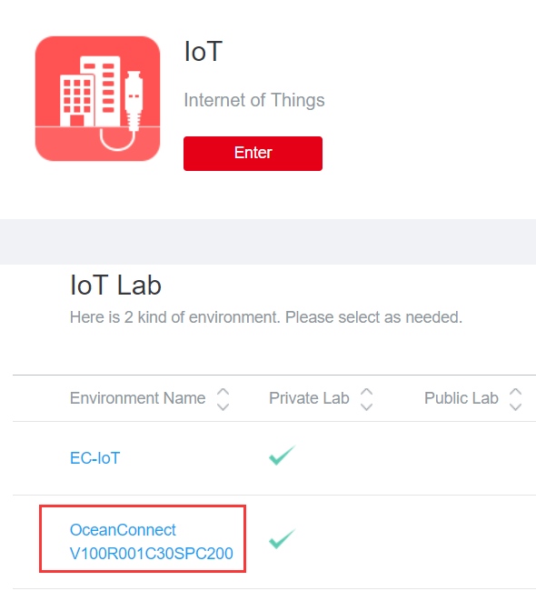
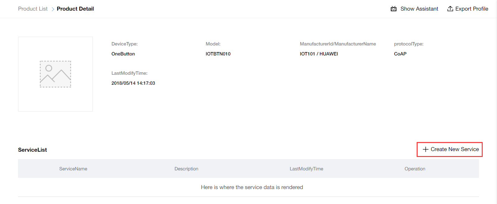
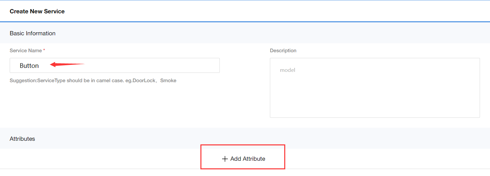
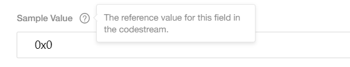
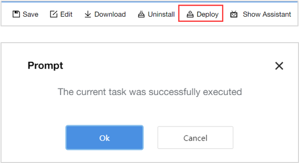
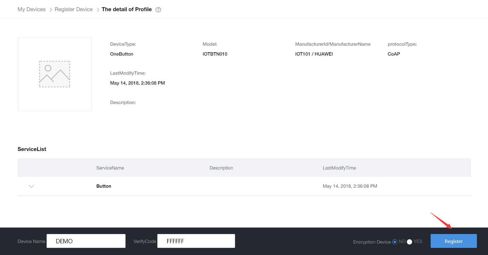
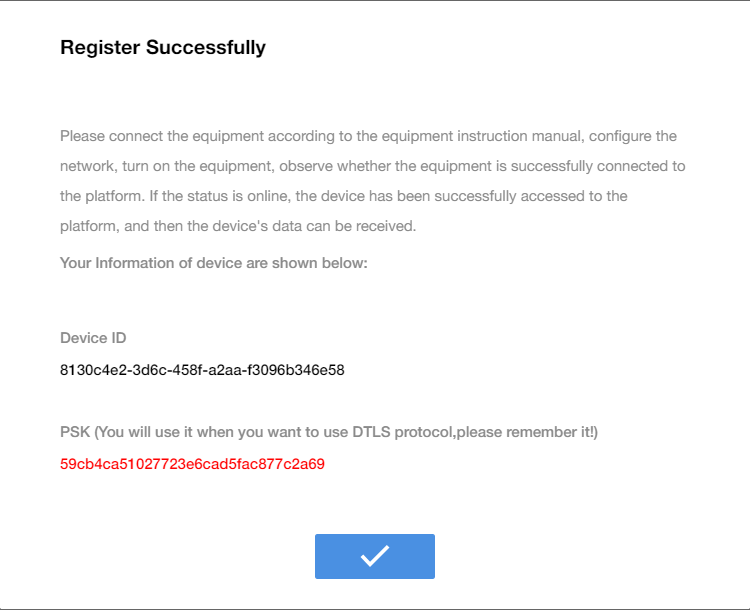

# 步骤3：在华为 IoT 开发者 Portal 上在线开发设备 Profile 和编解码插件

## How to get Huawei OceanConnect IoT Platform account?

Login and register a Huawei Developer in HTTP://DEVELOPER.HUAWEI.COM/ICT/EN/NEWHOME

Select IoT, you will see IoT Lab selection.

For get account, you should fill some application information.

::: tip 小技巧
There may be something wrong in the register page, if you see all Chinese, you can click here to change to English.

:::

You will receive the account as soon like this.

## 3.2	Implement OneButton device profile and codec-plugs development with no code.

Go to the Platform portal url, https://218.4.33.72:8093，Navigate to the “Profile Development” Page, and beginning to create a Profile for our OneButton Product.

After fill some basic product params, we will see the detail page. It use to design product service capabilities, like that Temperature, Connectivity, Alarm, Battery and so on.

To demonstrate the basic operation, We only create one service “Button”

1）	Name serivce “Button”

2）	Add an attribute which represent button switch status.

And then navigator Plug-in Management Page, 

We need two fileds, 1) messageId represent message type; 2) switchStatus equals ON or OFF.

::: tip 注意事项
Address field is a special, you must make sure that the value is unique. Different message has different sample value.

:::

Drag the SwitchStatus attribute bar to the blue box, and make sure connecting to “switchStatus” in the message box as followed.

At this point, you have completed all the development on the portal. Remember we have to deploy codec-plugins in the IoT platform.

##	Verifying product profile and codec-plugins function

Register a simulator, Device Name is “DEMO”, VerifyCode is “FFFFFF”, and confirm it.

You can see the device is registered, and its status is “Not Bind”.

Navigator to the NB-IoT Device Simulator page.

If you find the status of the DEMO device has changed to “Bound”, it means the device is on-line. And then you could send a test message verifying the codec-plugins.
In the plugin development, we create a statusReport message, it has two bytes, one is messageId(default: 0), the other is status. (00: OFF, 01:ON), click send button, go to “My Devices” page.

If you see device HistoryData, it means the codec-plugins it well done.

