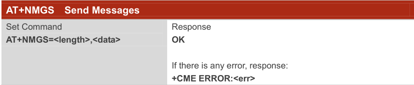

# 步骤4：利用 QCOM 串口工具，AT 指令实现数据上报到 OceanConnect IoT平台

## 4.1	How to create a real device in developer portal

Now, we need to use a real device verify whether the device send data to the IoT platform. Register a new Device again. Fill the IMEI in the VerifyCode blank.


## 4.2	Set some params in the NB-IoT module, and using AT Commands to send data.

1)	Change the Jumper Cap J14, and connect UNIT_USB interface.


2)	Open the QCom Tool, Run AT Commands as followed.

```
AT+CFUN=0
AT+NCDP=218.4.33.72
AT+NCDP?
AT+NRB
```


3)	using AT+NMGS send a test message



`AT+NMGS=2,0001`


::: tip
Two hexadecimal number represent a Byte, you must send data that is smaller than 512 bytes.
:::