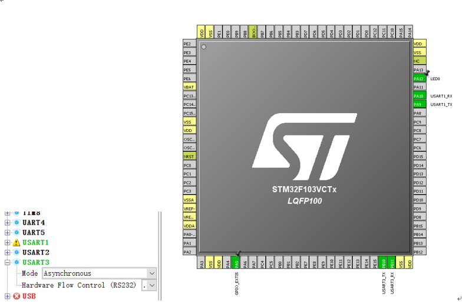
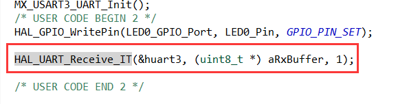
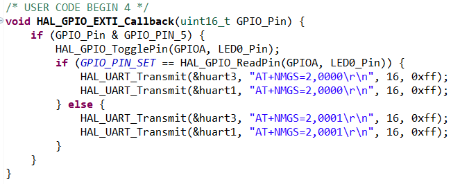

# 步骤5：增强嵌入式应用功能，实现 NB-IoT OneButton 按键功能开发

## 5.1	Configure UART3 which connect NB-IoT module in STM32CubeMX, and output a refresh project base on pre-project.

Output a refresh project.

## 5.2	According to the steps, write a piece of code, and then complete the last works.

1)	create some variable which save the receive message from NB-IoT module.

2)	Using HAL_UART_Receive_IT function receive message.

3)	receive messages and print them to UART1

4)	Rewrite HAL_GPIO_EXTI_Callback, when Button is triggered, send a AT commands to UART3, print them to UART1 at the same time.

5)	Write a new function HAL_UART_RxCpltCallback, which can receive data from UART3 and print them to the UART1

When you see the QCOM print the contain, it means worked.

