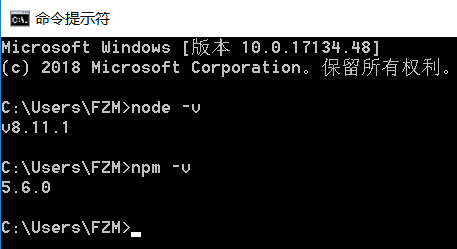
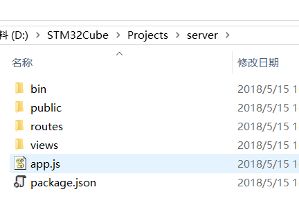
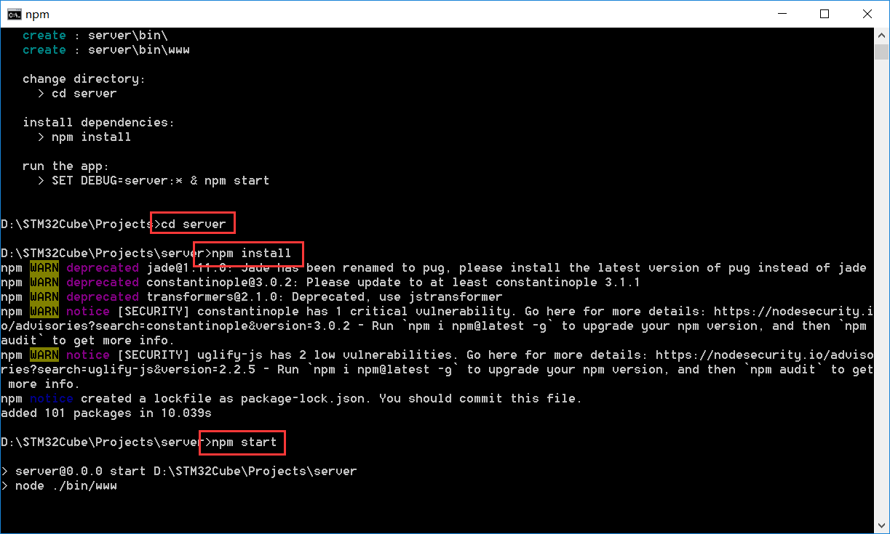
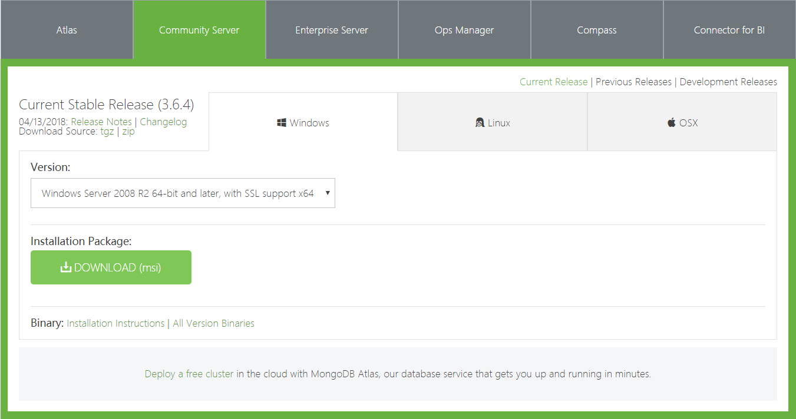
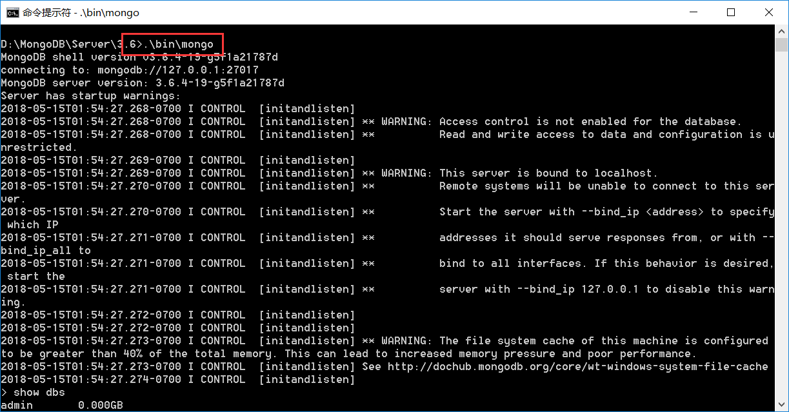
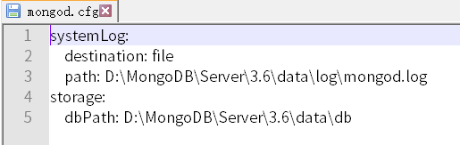
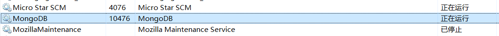

# 步骤6：安装 Node.js，搭建一个带 MongoDB 数据库的简单 Web 服务器

For getting OneButton’s status data from IoT platform, you have to build a web server, referring "Huawei IoT Platform Northbound API Reference". You can select anything language you are familiar with, Java, JavaScript, Python, .NET(C#), Go and so on.

In this guide, we will learn to use JavaScript build a back-end web service.


## 6.1	Installing Node.js and setting up Express

Login https://nodejs.org and download Node.js for your OS. The current demonstration is in the windows environment.



The express is a Fast, unopinionated, minimalist web framework for Node.js, The quickest way to get started with express is to utilize the express-genterator. So we will install express-generator and initialize a template project.

```bash
npm install -g express-generator
express server(your project name)
```




Following the prompt, you can build and run a server, which port is 3000.

```bash
cd server
npm install
npm start
```



Open google chrome and fill http://localhost:3000 , you can see the welcome page.


::: tip
We strongly recommend that you install VS Code for Node.js development. You can down it at https://code.visualstudio.com/

:::

## 6.2	Installing MongoDB and How to run it.

Login https://www.mongodb.com/download-center and download mongodb-win32-x86_64-2008plus-ssl-v3.6-latest-signed.msi, you have to run it on the 64 bit OS.




Go to the installed directory, and create database directory. 

```bash
D:\MongoDB\Server\3.6>mkdir data\db
D:\MongoDB\Server\3.6>bin\mongod.exe --dbpath=data\db
```


Open another windows, goto the installed directory, run “.\bin\mongo”. If you look the print like this, it means the mongodb is working.




::: tip
If you want to install mongoDB for windows service, you can follow this:
1)	Create a configuration text(mongod.cfg) in installed directory.


2)	Run the install service commands as followed
```
D:\MongoDB\Server\3.6\bin\mongod.exe --config "D:\MongoDB\Server\3.6\mongod.cfg" –install
```
3)	Reboot your PC and check the MongoDB services whether worked.

:::
