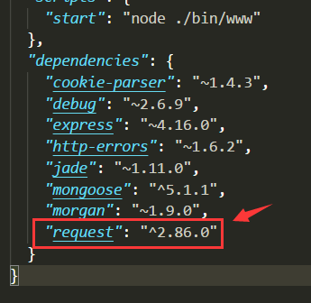
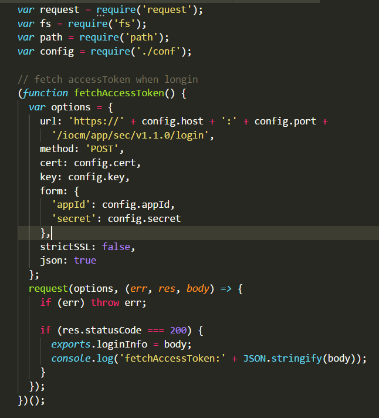
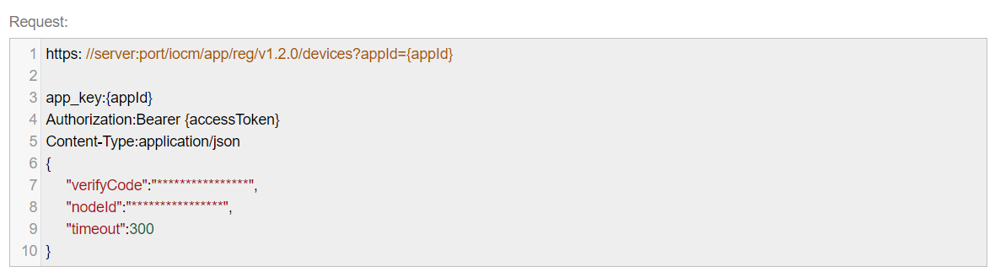
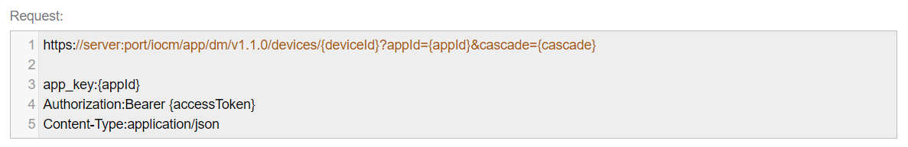
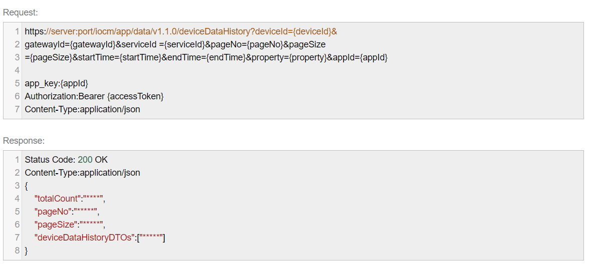
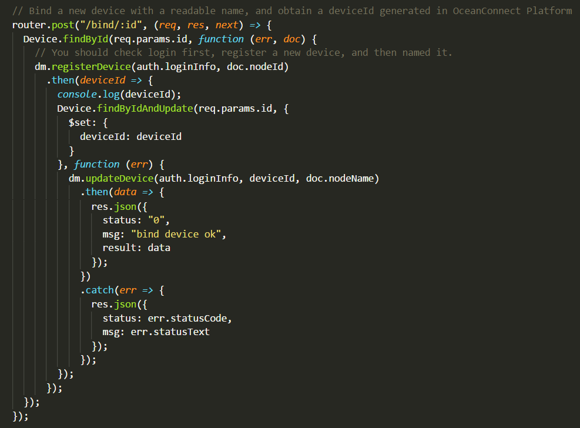
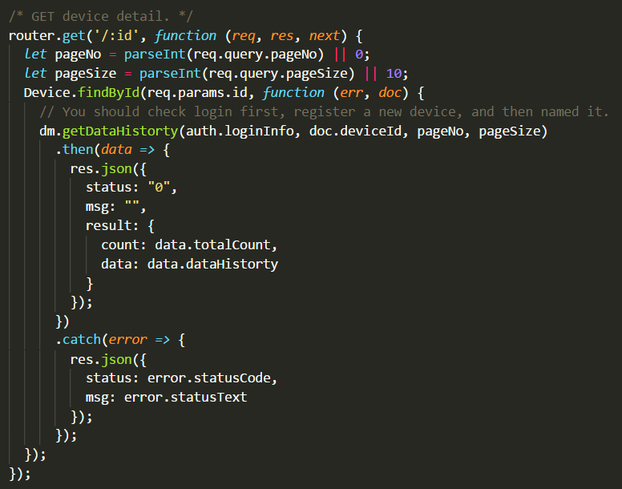
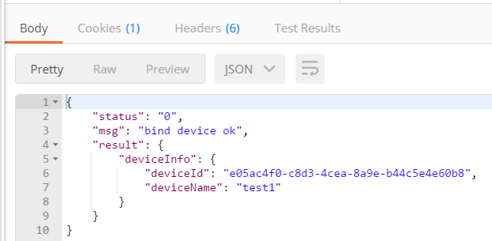

# 步骤9：对接 OceanConnect IoT平台，实现后台 Web 服务全功能

## 9.1	Implementing access to Huawei IoT platform for the access-token

1)	Install request module

2)	Create a directory named iotplatform, and ssl subdirectory of iotplatform

3)	Unzip client.crt and client.key in the ssl directory

4)	Add conf.js for configuration to IoT platform

There are params come from IoT Developer Portal

5)	Add auth.js file, which is used to connect IoT Platform and get accessToken.

When you run “npm start”, you can get the accesToken as followed:

6)	Add dm.js file, which is used to register device.

## 9.2	Implementing bind, unbind device to Huawei IoT platform

1)	Access register device and implementing bind device function

http://developer.huawei.com/ict/en/doc/site-oceanconnect-northbound_api_reference-en/index.html/en-us_topic_0103207034

You can look through this page above and build a request message.

2)	Access delete device and implementing unbind device function

http://developer.huawei.com/ict/en/doc/site-oceanconnect-northbound_api_reference-en/index.html/en-us_topic_0103207003

You can look through this page above and build a request message.

## 9.3	Implementing query history data of device

http://developer.huawei.com/ict/en/doc/site-oceanconnect-northbound_api_reference-en/index.html/en-us_topic_0103207027

You can look through this page above and build a request message.

When we register a new device, the IoT platform don’t know which type you have. So we have to access “modifying device information” openAPI to tell the platform which type you have.

http://developer.huawei.com/ict/en/doc/site-oceanconnect-northbound_api_reference-en/index.html/en-us_topic_0103207033

You can look through this page above and build a request message.

Finally, we finish bind/unbind/query router function.

1)	Implement and test device restful API for Front-end app

| Tables        | Are           | Cool  |
| ------------- |:-------------:| -----:|
| POST     | `http://url/devices/bind/:id` | Bind a device to IoT platform |
| DELETE      | `http://url/devices/unbind/:id`      |   Unbind a device to IoT platform |
| GET | `http://url/devices/:id`      |    Get a History data of the device |

-	Bind a new device

-	Unbind a device

-	Get device history data

2)	Using Postman to verity the functions

::: warning
If you create a new device, there is no data report of the device. So you’d better use the simulator in the developer portal. You could find it as followed:

:::