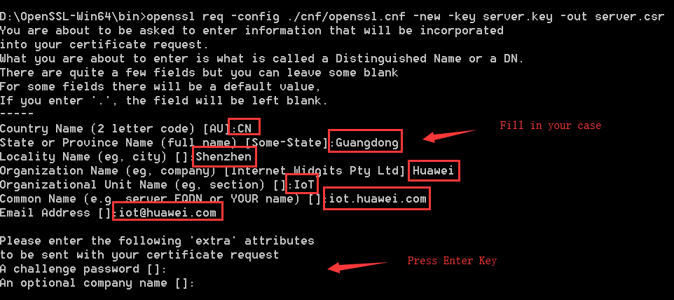
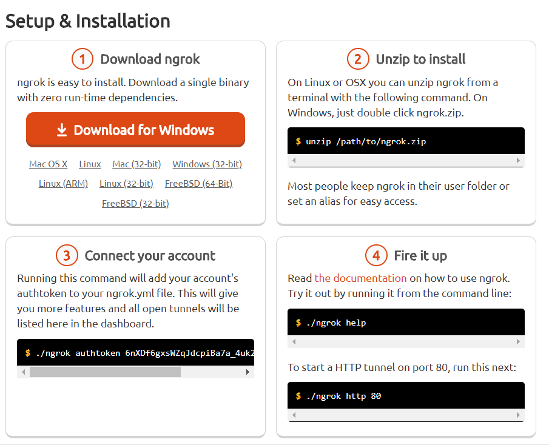
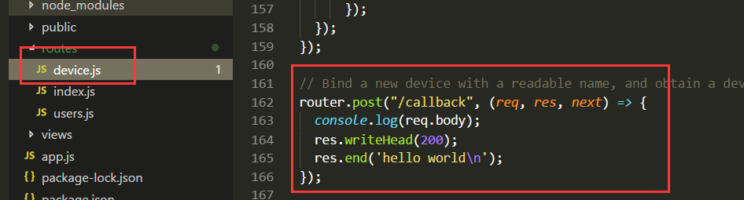

# 步骤10：自制 HTTPS/SSL 证书，实现平台数据订阅/发布功能

In step9, we have finished almost all the code. We can create a device, bind to the IoT platform and query history data. But when device send data to the platform, how does the web app know the button status has been changed?
In this step, we will learn subscribe API.

## 10.1	Make HTTPS/SSL certification files using OpenSSL tools

Installing OpenSSL for you OS

1)	Create private key file

`openssl genrsa -out server.key 1024`

2)	Generating CSR certificate signature through private key

`openssl req -config ./cnf/openssl.cnf -new -key server.key -out server.csr`

3)	Generating certificate files through private keys and certificate signatures

`openssl x509 -req -in server.csr -signkey server.key -out server.crt`

4)	Write a demo https server and verifying certificate files
Copy server.key and server.crt to one temporary directory, copy the a demo https server, and run it(node app.js).

## 10.2	Make localhost server through NAT, let IoT platform can push data.

## 10.3	Implementing Subscribe to IoT platform data

1)	Download nginx stable version in http://nginx.org/ and install it for you OS.

Copy server.crt and server.crt to nginx’sconf directory.

Write these lines to nginx.conf

2)	Setting up the NAT address for your server

3)	Add /callback router in devces.js

4)	Login Huawei IoT Developer Portal, and go to Application Subscription Page

Fill the callback url in the blank, and then system will check it.

5)	When a new data will be sent to IoT platform, it will notify to web service as followed. You also could push message to Front-end with WebSockets.

That it is.