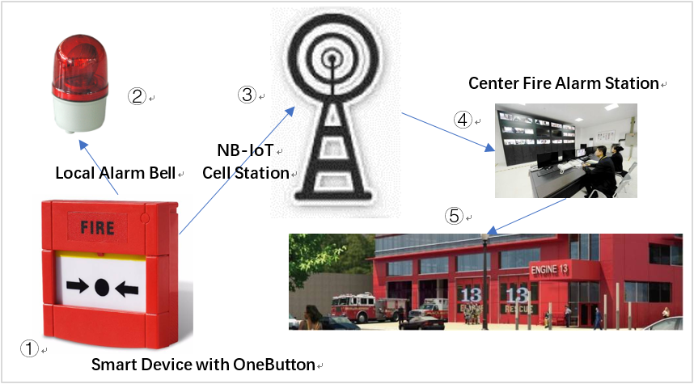

# NB-IoT 手把手教程（含北向应用）<Badge text="beta" type="warn"/>

## 概述

欢迎您阅读华为 IoT 解决方案端到端开发系列教程。

只需 10 步，您就能体验从 NB-IoT 硬件原型开发到云端 IoT Webapp 一整套开发流程。让您在最短的时间理解并掌握华为 IoT 解决方案端到端开发细节。我们将尽可能把开发过程中的关键点展现出来，帮助开发者快速实现自己的 IoT 产品。

完成这套教程，您将实现以下功能：

我们这个场景是模拟消防设置场景，当用户按下报警按钮，会点亮报警灯，同时将报警事件（开/关状态）通过 NB-IoT 网络上报到 IoT 平台，平台会根据订阅事件，通知消防中心。在这个场景中，我们将使用 NB-IoT 开发板模拟开发火警按钮和警报（LED），而消防中心则利用 Node.js 搭建的 Web API 网关进行模拟，具体细节我们会在教程中详细说明，下图是一键式报警场景流程图。

请大家系好安全带，我们马上就要进入 NB-IoT 的世界。

## 你将学到什么

- 首先我会带着大家使用一系列嵌入式开发工具，STM32CubeMX，Keil/Sw4STM32，QCom 串口工具玩转 NB-IoT 开发板。
- 接着我们会进入华为 OceanConnect IoT 平台开发者中心体验线上无码化开发 IoT 应用。
- 最后我还会手把手教会大家基于 Node.js 和 MongoDB 开发出后台 Web API 网关。

## 你要准备什么

在正式学习此套教程之前，请提前安装好如下工具和驱动。为避免篇幅冗长，我这里不会对安装进行讲解。如果各位有遇到安装问题，请自行到百度/谷歌进行搜索，也可发邮件到 [Jeffrey.fu@huawei.com](mailto:Jeffrey.fu@huawei.com) 联系我，我很乐意为大家答疑。

-	[NB-IoT 开发板](https://github.com/LiteOS/LiteOS_Partner_Development_Kits)
-	[ST-Link v2](http://www.st.com/en/development-tools/st-link-v2.html)
-	[CH340 USB to TTL 驱动](http://www.arduined.eu/ch340g-converter-windows-7-driver-download/)
-	[STM32CubeMX 4.25.0](http://www.st.com/en/development-tools/stm32cubemx.html) (需安装 Java 1.7 以上)
-	[SW4STM32 2.4](http://www.ac6-tools.com/downloads/SW4STM32/)
- [Keil MDK-ARM](https://www.keil.com/download/product/)
-	[Node.js 8.11.x](https://nodejs.org/en/download/)
- [MongoDB 3.6.x](http://dl.mongodb.org/dl/win32/x86_64)
-	[Postman 6.0.x](https://www.getpostman.com/apps)
-	[Nginx 1.14.0](http://nginx.org/en/download.html)
-	[OpenSSL 1.1.0](https://www.openssl.org/)

::: tip 开发环境
本教程是基于 Windows 10 64位 进行讲解，理论上 Windows 7/8 64 位系统也可以使用。

为方便大家下载安装，配套工具已上传到百度网盘：

链接：[https://pan.baidu.com/s/1hkg7Fbt8HM5hR6OoEP2AJA](https://pan.baidu.com/s/1hkg7Fbt8HM5hR6OoEP2AJA) 密码：axso
:::

## 开发板选择

目前我们文档已经支持以下 NB-IoT 开发板，每套开发板都各有其特点，如果读者没有配套开发板，可去某宝去搜索购入。如果您已经拥有一套开发板，可以根据开发板类型选择对应的教程。

| 开发板           |  规格  | 教程 |
| ---------------- | --------  | ------- |
| Terabits NB-IoT 开发板| STM32 F103VCT6，配套移远，中国移动 NB-IoT 通讯扣板2块，温湿度，光感传感器若干      | [链接](./01-inspect-terabits-board.md) |
| YiQi NB-IoT 开发板 | STM32 L152CB-A，板载移远 NB-IoT 模组和 ESP8266 WIFI 模组，温度，压力传感器若干           | [链接](./01-inspect-yiqi-evb01-board.md) |
| IoTClub NB-IoT 开发板 | STM32 L431, 板载移远 NB-IoT 模组，OLED显示，温湿度，WiFi，GPS传感器扩展板若干| [链接](./01-inspect-iotclub-m1v3-board.md) |
| 朱老师 NB-IoT 开发板 | STM32 L476, 板载移远 NB-IoT 模组，GPS，光照， OLED等传感器模块 | [链接](./01-inspect-zhulaoshi-nb476-board.md) |