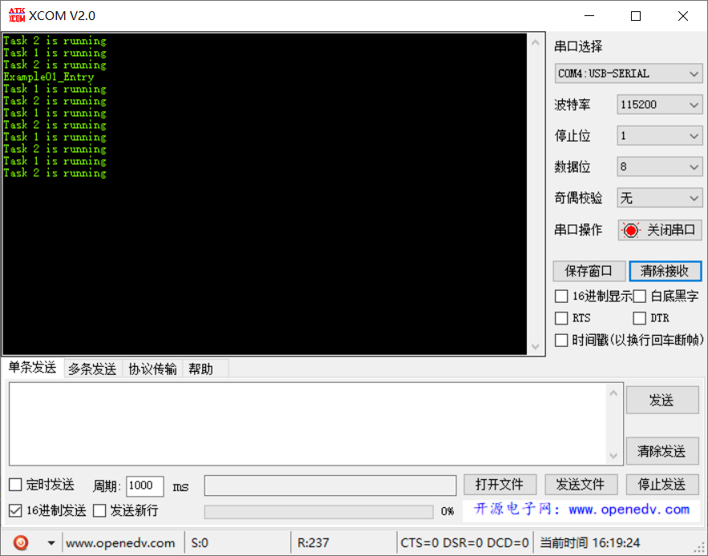

# 范例01（任务创建实验）

RTOS 与前后台进程方案最大的差别就是对多任务的管理，OS 会对多个同等优先级任务平均分配 CPU 时间片。从而达到每个任务在单个 CPU 上实现并行处理的效果。不会因为某个任务长期占用 CPU，而卡住其他任务运行。

## 功能说明

主线程创建两个Task，优先级相同的情况下，Task1和Task2会轮询

::: tip 提示
这里没有使用 LiteOS 内置的时延函数，而是利用 for 循环，是因为 for 循环不会主导进行任务间切换。
:::

## 代码讲解

### 1. 使用 `LOS_TaskCreate` 创建两个任务，任务优先级同为 4；

```c
UINT32 Example01_Entry(VOID) {
    UINT32 uwRet = LOS_OK;
    TSK_INIT_PARAM_S stInitParam = {0};
    
    printf("Example01_Entry\r\n");

    stInitParam.pfnTaskEntry = Example_Task1;
    stInitParam.usTaskPrio = TASK_DEFAULT_PRIO;
    stInitParam.pcName = "Task1";
    stInitParam.uwStackSize = TASK_STK_SIZE;
    uwRet = LOS_TaskCreate(&s_uwTskID1, &stInitParam);
    if (uwRet != LOS_OK) {
        printf("Example_Task1 create Failed!\r\n");
        return LOS_NOK;
    }

    stInitParam.pfnTaskEntry = Example_Task2;
    stInitParam.pcName = "Task2";
    uwRet = LOS_TaskCreate(&s_uwTskID2, &stInitParam);
    if (uwRet != LOS_OK) {
        printf("Example_Task2 create Failed!\r\n");
        return LOS_NOK;
    }

    return uwRet;
}
```

### 2. `Task1` 和 `Task2` 周期性打印字符串

```c
static VOID * Example_Task1(UINT32 uwArg) {
    const CHAR *pcTaskName = "Task 1 is running\r\n";
    UINT32 i;
    for (;;) {
        puts(pcTaskName);
        for (i = 0; i < TASK_LOOP_COUNT; i++) {
            // 占用CPU耗时运行
        }
    }
}

static VOID * Example_Task2(UINT32 uwArg) {
    const CHAR *pcTaskName = "Task 2 is running\r\n";
    UINT32 i;
    for (;;) {
        puts(pcTaskName);
        for (i = 0; i < TASK_LOOP_COUNT; i++) {
            // 占用CPU耗时运行
        }
    }
}
```

## 效果演示

