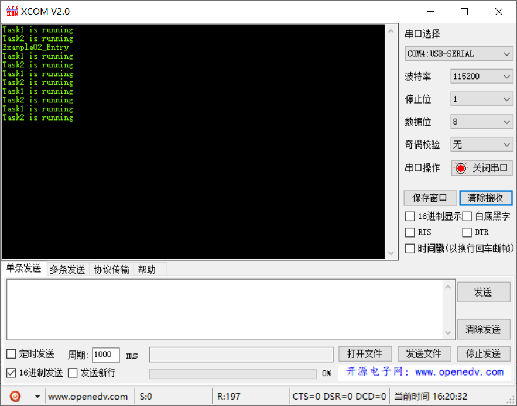

# 范例02（任务参数实验）

很多时候不同任务的处理流程是基本相同的，那么可以复用一套函数模板来进行业务处理。这时候任务参数就能够让调用者区分是何种任务了。

::: warning 警告
切记任务参数默认是 U32 类型，如果需要传递复杂类型，可以将首地址传递进去。
:::

```c{5}
typedef struct tagTskInitParam
{
   TSK_ENTRY_FUNC       pfnTaskEntry; /**< Task entrance function */
   UINT16               usTaskPrio;   /**< Task priority */
   UINT32               uwArg;        /**< Task parameters */
   UINT32               uwStackSize;  /**< Task stack size */
   CHAR                 *pcName;      /**< Task name */
   UINT32               uwResved;     /**< Reserved */
} TSK_INIT_PARAM_S;
```

## 功能说明

基本同[范例01](example01.md)，两个任务复用同一个入口函数。

## 代码讲解

### 1. 使用 `LOS_TaskCreate` 创建两个任务，`uwArg` 设置为字符串常量

```c{11,22}
UINT32 Example02_Entry(VOID) {
    UINT32 uwRet = LOS_OK;
    TSK_INIT_PARAM_S stInitParam = {0};
    
    printf("Example02_Entry\r\n");

    stInitParam.pfnTaskEntry = Example_Task;
    stInitParam.usTaskPrio = TASK_DEFAULT_PRIO;
    stInitParam.pcName = "Task1";
    stInitParam.uwStackSize = TASK_STK_SIZE;
    stInitParam.uwArg = (UINT32)pcTextForTask1;
    uwRet = LOS_TaskCreate(&s_uwTskID1, &stInitParam);
    if (uwRet != LOS_OK) {
        printf("Example_Task1 create Failed!\r\n");
        return LOS_NOK;
    }

    stInitParam.pfnTaskEntry = Example_Task;
    stInitParam.usTaskPrio = TASK_DEFAULT_PRIO;
    stInitParam.pcName = "Task2";
    stInitParam.uwStackSize = TASK_STK_SIZE;
    stInitParam.uwArg = (UINT32)pcTextForTask2;
    uwRet = LOS_TaskCreate(&s_uwTskID2, &stInitParam);
    if (uwRet != LOS_OK) {
        printf("Example_Task2 create Failed!\r\n");
        return LOS_NOK;
    }

    return uwRet;
}
```

2. 两个任务复用同一个执行函数，同时将入参 `uwArg` 字符串打印出来

```c
static VOID * Example_Task(UINT32 uwArg) {
    UINT32 i;
    for (;;) {
        printf("%s\r\n", (const CHAR *)uwArg);
        for (i = 0; i < TASK_LOOP_COUNT; i++) {
            // 占用CPU耗时运行
        }
    }
}
```

## 效果演示

