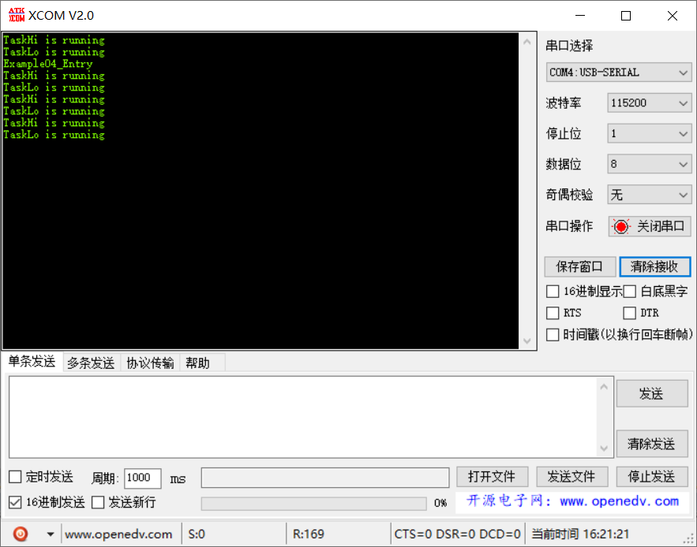

# 范例04（任务延时实验）

为了解决[范例03](example03.md)的问题，将独占 `for` 循环延时，修改为 `LOS_TaskDelay`，该函数会在延时期间释放cpu，让低优先级任务运行。

## 功能说明

为避免高优先级任务一直抢占 cpu，导致低优先级任务无法执行，可以在业务逻辑中，增加延时函数，确保低优先级任务也可以正常执行。

## 代码讲解

### 1. 使用 `LOS_TaskCreate` 创建两个任务，任务优先级分别为 4 和 5；

```c{8,19}
UINT32 Example04_Entry(VOID) {
    UINT32 uwRet = LOS_OK;
    TSK_INIT_PARAM_S stInitParam = {0};
    
    printf("Example04_Entry\r\n");

    stInitParam.pfnTaskEntry = Example_TaskHi;
    stInitParam.usTaskPrio = TASK_PRIO_HI;
    stInitParam.pcName = "TaskHi";
    stInitParam.uwStackSize = TASK_STK_SIZE;
    stInitParam.uwArg = (UINT32)pcTextForTaskHi;
    uwRet = LOS_TaskCreate(&s_uwTskHiID, &stInitParam);
    if (uwRet != LOS_OK) {
        printf("Example_TaskHi create Failed!\r\n");
        return LOS_NOK;
    }

    stInitParam.pfnTaskEntry = Example_TaskLo;
    stInitParam.usTaskPrio = TASK_PRIO_LO;
    stInitParam.pcName = "TaskLo";
    stInitParam.uwStackSize = TASK_STK_SIZE;
    stInitParam.uwArg = (UINT32)pcTextForTaskLo;
    uwRet = LOS_TaskCreate(&s_uwTskLoID, &stInitParam);
    if (uwRet != LOS_OK) {
        printf("Example_TaskLo create Failed!\r\n");
        return LOS_NOK;
    }

    return uwRet;
}
```

### 2. `Task1` 和 `Task2` 周期性打印字符串

```c{4,11}
static VOID * Example_TaskHi(UINT32 uwArg) {
    for (;;) {
        printf("%s\r\n", (const CHAR *)uwArg);
        LOS_TaskDelay(2000);            
    }
}

static VOID * Example_TaskLo(UINT32 uwArg) {
    for (;;) {
        printf("%s\r\n", (const CHAR *)uwArg);
        LOS_TaskDelay(2000);   
    }
}
```

## 效果演示

