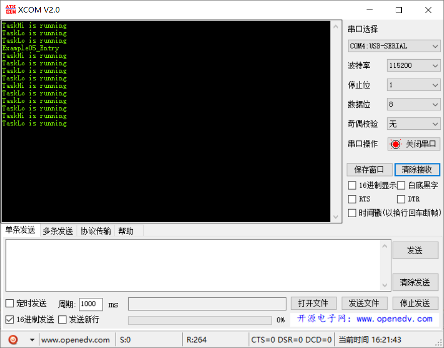

# 范例05（高优先级任务打断实验）

高优先级周期任务可以打断低优先级持续任务（for循环），低优先级只能在高优先级执行 `LOS_TaskDelay` 期间运行。

## 功能说明

低优先级任务持续运行，会被高优先级任务打断，直到高优先级任务调用 `LOS_TaskDelay` 后，才将 CPU 释放出来。

## 代码讲解

### 1. 使用 `LOS_TaskCreate` 创建两个任务，任务优先级分别为 4 和 5；

```c{8,19}
UINT32 Example05_Entry(VOID) {
    UINT32 uwRet = LOS_OK;
    TSK_INIT_PARAM_S stInitParam = {0};
    
    printf("Example05_Entry\r\n");

    stInitParam.pfnTaskEntry = Example_TaskHi;
    stInitParam.usTaskPrio = TASK_PRIO_HI;
    stInitParam.pcName = "TaskHi";
    stInitParam.uwStackSize = TASK_STK_SIZE;
    stInitParam.uwArg = (UINT32)pcTextForTaskHi;
    uwRet = LOS_TaskCreate(&s_uwTskHiID, &stInitParam);
    if (uwRet != LOS_OK) {
        printf("Example_TaskHi create Failed!\r\n");
        return LOS_NOK;
    }

    stInitParam.pfnTaskEntry = Example_TaskLo;
    stInitParam.usTaskPrio = TASK_PRIO_LO;
    stInitParam.pcName = "TaskLo";
    stInitParam.uwStackSize = TASK_STK_SIZE;
    stInitParam.uwArg = (UINT32)pcTextForTaskLo;
    uwRet = LOS_TaskCreate(&s_uwTskLoID, &stInitParam);
    if (uwRet != LOS_OK) {
        printf("Example_TaskLo create Failed!\r\n");
        return LOS_NOK;
    }

    return uwRet;
}
```

### 2. `Task1` 和 `Task2` 周期性打印字符串

```c{4,12}
static VOID * Example_TaskHi(UINT32 uwArg) {
    for (;;) {
        printf("%s\r\n", (const CHAR *)uwArg);
        LOS_TaskDelay(2000);            
    }
}

static VOID * Example_TaskLo(UINT32 uwArg) {
    UINT32 i;
    for (;;) {
        printf("%s\r\n", (const CHAR *)uwArg);
        for (i = 0; i < TASK_LOOP_COUNT; i++) {
            // 占用CPU耗时运行
        }
    }
}
```

## 效果演示

