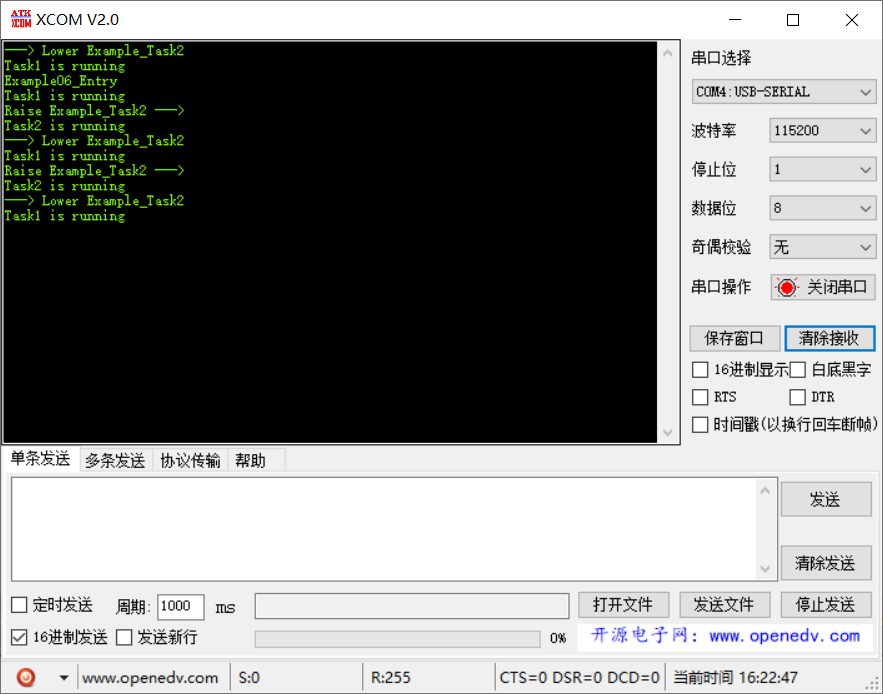

# 范例06（优先级动态调整实验）

`LOS_TaskPriSet/LOS_TaskPriGet` 可以在运行中调整任务优先级

## 功能说明

高优先级任务先执行，然后将低优先级任务级别提升，低优先级任务开始工作，完成后主动将其优先级调低。

## 代码讲解

### 1. 使用 `LOS_TaskCreate` 创建两个任务，任务优先级分别为 4 和 5；

```c
UINT32 Example06_Entry(VOID)
{
    UINT32 uwRet = LOS_OK;
    TSK_INIT_PARAM_S stInitParam = {0};
    
    printf("Example06_Entry\r\n");

    stInitParam.pfnTaskEntry = Example_Task1;
    stInitParam.usTaskPrio = TASK_PRIO_HI;
    stInitParam.pcName = "Task1";
    stInitParam.uwStackSize = TASK_STK_SIZE;
    stInitParam.uwArg = (UINT32)pcTextForTask1;
    uwRet = LOS_TaskCreate(&s_uwTskHiID, &stInitParam);
    if (uwRet != LOS_OK) {
        printf("Example_Task1 create Failed!\r\n");
        return LOS_NOK;
    }

    stInitParam.pfnTaskEntry = Example_Task2;
    stInitParam.usTaskPrio = TASK_PRIO_LO;
    stInitParam.pcName = "Task2";
    stInitParam.uwStackSize = TASK_STK_SIZE;
    stInitParam.uwArg = (UINT32)pcTextForTask2;
    uwRet = LOS_TaskCreate(&s_uwTskLoID, &stInitParam);
    if (uwRet != LOS_OK) {
        printf("Example_Task2 create Failed!\r\n");
        return LOS_NOK;
    }

    return uwRet;
}
```

### 2. `Task1` 和 `Task2` 周期性打印字符串

```c{11,23}
static VOID * Example_Task1(UINT32 uwArg) {
    volatile UINT32 i;
    for (;;) {
        printf("%s\r\n", (const CHAR *)uwArg);   
        for (i = 0; i < TASK_LOOP_COUNT; i++) {
            // 占用CPU耗时运行
        }

        // 将低优先级任务2级别提升
        printf("Raise Example_Task2 --->\r\n");
        LOS_TaskPriSet(s_uwTskLoID, TASK_PRIO_LO - 2);
    }
}

static VOID * Example_Task2(UINT32 uwArg) {
    volatile UINT32 i;
    for (;;) {
        printf("%s\r\n", (const CHAR *)uwArg);
        for (i = 0; i < TASK_LOOP_COUNT; i++) {
            // 占用CPU耗时运行
        }

        UINT16 usTaskPriLo = LOS_TaskPriGet(s_uwTskLoID);

        // 任务2完成后，将其优先级降低
        printf("---> Lower Example_Task2\r\n");
        LOS_CurTaskPriSet(usTaskPriLo + 2);
    }
}
```

## 效果演示

