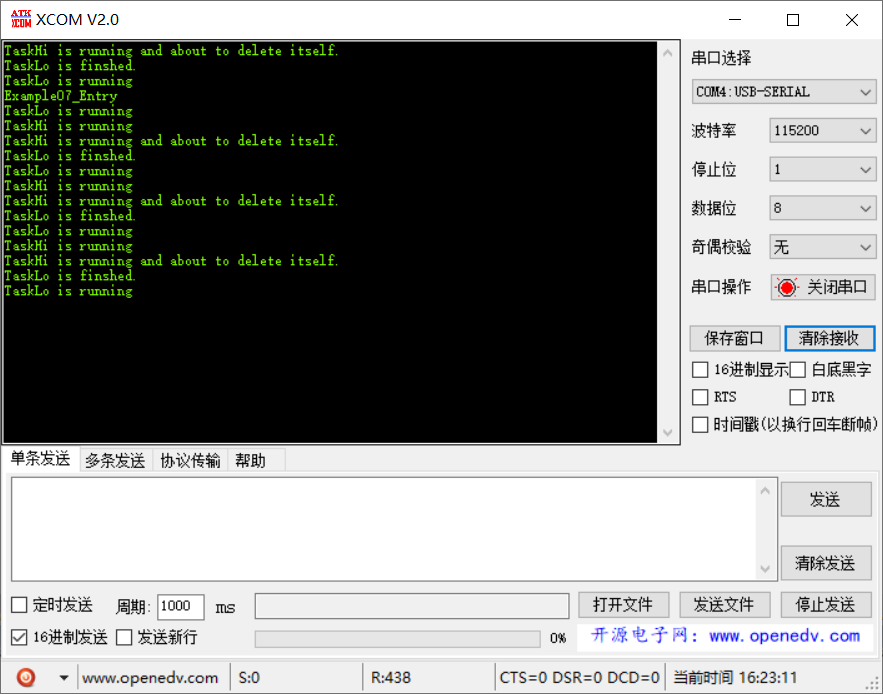

# 范例07（任务中创建和删除实验）

Task1(低)创建Task2(高)，Task2会抢占低优先级Task1，Task2开始执行，完成后会调用vTaskDelete删除自己。Task1重新运行

## 功能说明

## 代码讲解

### 1. 使用 `LOS_TaskCreate` 创建低优先级任务 `TaskLo`；

```c
UINT32 Example07_Entry(VOID) {
    UINT32 uwRet = LOS_OK;
    TSK_INIT_PARAM_S stInitParam = {0};
    
    puts("Example07_Entry\r\n");

    stInitParam.pfnTaskEntry = Example_TaskLo;
    stInitParam.usTaskPrio = TASK_PRIO_LO;
    stInitParam.pcName = "TaskLo";
    stInitParam.uwStackSize = TASK_STK_SIZE;
    stInitParam.uwArg = (UINT32)pcTextForTaskLo;
    uwRet = LOS_TaskCreate(&s_uwTskLoID, &stInitParam);
    if (uwRet != LOS_OK) {
        printf("Example_TaskLo create Failed!\r\n");
        return LOS_NOK;
    }

    return uwRet;
}
```

### 2. `TaskLo` 执行完成创建高优先级任务 `TaskHi`；

```c
static VOID * Example_TaskLo(UINT32 uwArg) {
    UINT32 uwRet = LOS_OK;
    TSK_INIT_PARAM_S stInitParam = {0};

    UINT32 i;
    for (;;) {
        printf("%s\r\n", (const CHAR *)uwArg);
        for (i = 0; i < TASK_LOOP_COUNT; i++) {
            // 占用CPU耗时运行
        }

        // 创建高优先级任务
        stInitParam.pfnTaskEntry = Example_TaskHi;
        stInitParam.usTaskPrio = TASK_PRIO_HI;
        stInitParam.pcName = "TaskHi";
        stInitParam.uwStackSize = TASK_STK_SIZE;
        stInitParam.uwArg = (UINT32)pcTextForTaskHi;
        uwRet = LOS_TaskCreate(&s_uwTskHiID, &stInitParam);
        if (uwRet != LOS_OK) {
            printf("Example_TaskHi create Failed!\r\n");
            return LOS_OK;
        }

        printf("TaskLo is finshed.\r\n");
    }
}
```

### 3. 高优先级任务会抢占低优先级，执行完成后删除自己；
```c
static VOID * Example_TaskHi(UINT32 uwArg) {
    UINT32 i;
    for (;;) {
        printf("%s\r\n", (const CHAR *)uwArg);
        for (i = 0; i < TASK_LOOP_COUNT; i++) {
            // 占用CPU耗时运行
        }

        // 高优先级任务完成后，删除自己
        printf("TaskHi is running and about to delete itself.\r\n");
        LOS_TaskDelete(s_uwTskHiID);
    }
}
```

## 效果演示

