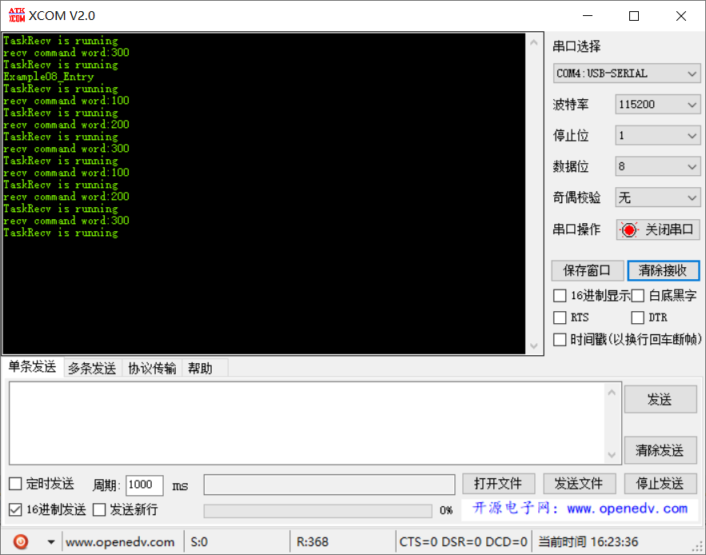

# 范例08（队列写入简单数据实验）

## 功能说明

创建一个最大存放 5 个数字的队列，有 3 个 Task 负责发送不同数据，一个高优先级 Task 负责接收数据，协同实现任务间通讯

## 代码讲解

### 1. 创建一个队列，三个发送任务，一个接收任务

```c{7}
UINT32 Example08_Entry(VOID) {
    UINT32 uwRet = LOS_OK;
    TSK_INIT_PARAM_S stInitParam = {0};
    
    puts("Example08_Entry\r\n");

    uwRet = LOS_QueueCreate(
                "queue",                // 队列名称
                3,                      // 队列大小
                &s_uwQueue,             // 队列ID
                0,                      // 不使用
                sizeof(UINT32)          // 队列消息大小
                );
    if (uwRet != LOS_OK) {
        printf("create queue failure!,error:%x\n", uwRet);
        return LOS_NOK;
    }

    // 创建3个发送任务，1个接收任务
    stInitParam.pfnTaskEntry = Example_TaskSend;
    stInitParam.usTaskPrio = TASK_PRIO_SEND;
    stInitParam.pcName = "TaskSend1";
    stInitParam.uwStackSize = TASK_STK_SIZE;
    stInitParam.uwArg = uwCmdWordForTask1;
    uwRet = LOS_TaskCreate(&s_uwTskLoID, &stInitParam);
    if (uwRet != LOS_OK) {
        printf("Example_TaskSend create Failed!\r\n");
        return LOS_NOK;
    }
    
    stInitParam.pcName = "TaskSend2";
    stInitParam.uwArg = uwCmdWordForTask2;
    uwRet = LOS_TaskCreate(&s_uwTskLoID, &stInitParam);
    if (uwRet != LOS_OK) {
        printf("Example_TaskSend create Failed!\r\n");
        return LOS_NOK;
    }

    stInitParam.pcName = "TaskSend3";
    stInitParam.uwArg = uwCmdWordForTask3;
    uwRet = LOS_TaskCreate(&s_uwTskLoID, &stInitParam);
    if (uwRet != LOS_OK) {
        printf("Example_TaskSend create Failed!\r\n");
        return LOS_NOK;
    }

    stInitParam.pfnTaskEntry = Example_TaskRecv;
    stInitParam.usTaskPrio = TASK_PRIO_RECV;
    stInitParam.pcName = "TaskRecv";
    stInitParam.uwStackSize = TASK_STK_SIZE;
    stInitParam.uwArg = (UINT32)pcTextForTaskRecv;
    uwRet = LOS_TaskCreate(&s_uwTskHiID, &stInitParam);
    if (uwRet != LOS_OK) {
        printf("Example_TaskRecv create Failed!\r\n");
        return LOS_NOK;
    }

    return uwRet;
}
```

### 2. 三个发送任务复用同一函数，入参作为命令字写到队列中

```c{6}
static VOID * Example_TaskSend(UINT32 uwArg) {
    UINT32 uwRet = LOS_OK;
    UINT32 uwValueToSend = uwArg;
    
    for (;;) {
        uwRet = LOS_QueueWriteCopy(s_uwQueue, (VOID*)&uwValueToSend, sizeof(UINT32), 0);
        if (LOS_OK != uwRet) {
            printf("send value failure,error:%x\r\n", uwRet);
        }

        LOS_TaskDelay(2000);
    }
}
```

### 3. 接收任务负责从队列中取出数据并打印命令字
```c{10}
static VOID * Example_TaskRecv(UINT32 uwArg) {
    UINT32 uwRet = LOS_OK;
    UINT32 uwReadbuf = NULL;
    UINT32 uwBufferSize = sizeof(UINT32);
    
    UINT32 i;
    
    for (;;) {        
        printf("%s\r\n", (const CHAR *)uwArg);
        uwRet = LOS_QueueReadCopy(s_uwQueue, (VOID*)&uwReadbuf, &uwBufferSize, LOS_WAIT_FOREVER);
        if (LOS_OK != uwRet) {
            printf("recv value failure,error:%x\r\n", uwRet);
        } else {
            if (uwBufferSize == sizeof(UINT32)) {
                printf("recv command word:%d\r\n", uwReadbuf);
                for (i = 0; i < TASK_LOOP_COUNT; i++) {
                    // 占用CPU耗时运行
                }
            }
        }
    }
}
```

## 效果演示

