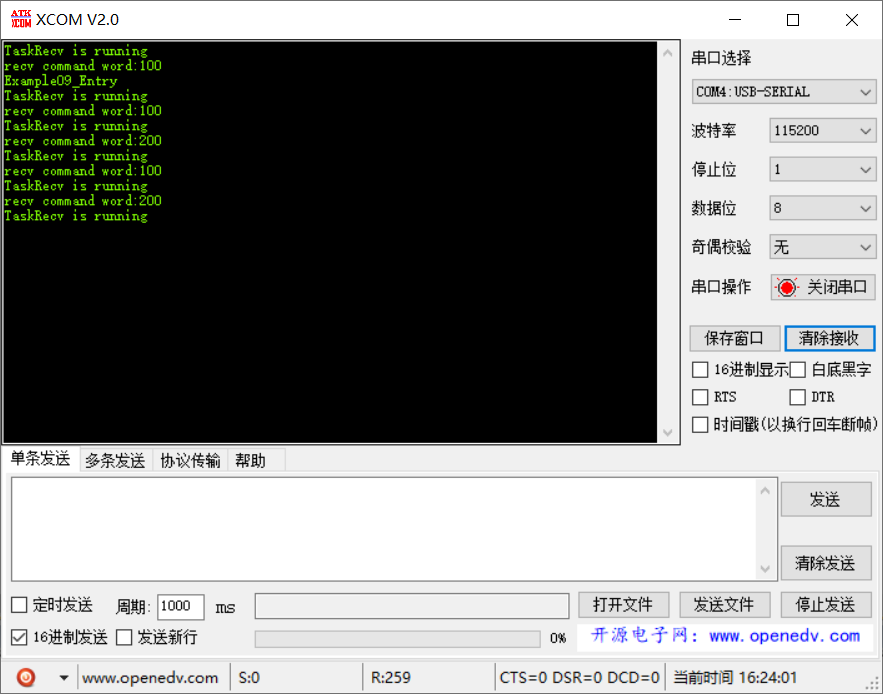

# 范例09（队列写入复杂类型实验）

## 功能说明

利用队列，实现了复杂数据类型（结构体）的多任务间通讯。

```c
typedef enum {
    DT_SEND_1,
    DT_SEND_2,
    DT_BUTT
} DataType;

typedef struct {
    DataType enDataType;
    UINT8 ucValue;
} Data;

static const Data s_StructsToSend[DT_BUTT] =
{
    { DT_SEND_1, 100 },
    { DT_SEND_2, 200 }
};
```

## 代码讲解

### 1. 创建一个队列，两个发送任务，一个接收任务

```c{7}
UINT32 Example09_Entry(VOID) {
    UINT32 uwRet = LOS_OK;
    TSK_INIT_PARAM_S stInitParam = {0};
    
    puts("Example09_Entry\r\n");

    uwRet = LOS_QueueCreate(
                "queue",                // 队列名称
                5,                      // 队列大小
                &s_uwQueue,             // 队列ID
                0,                      // 不使用
                sizeof(UINT32*)         // 队列消息大小
                );
    if (uwRet != LOS_OK) {
        printf("create queue failure!,error:%x\n", uwRet);
        return LOS_NOK;
    }

    // 创建2个发送任务，1个接收任务
    stInitParam.pfnTaskEntry = Example_TaskSend;
    stInitParam.usTaskPrio = TASK_PRIO_SEND;
    stInitParam.pcName = "TaskSend1";
    stInitParam.uwStackSize = TASK_STK_SIZE;
    stInitParam.uwArg = (UINT32)&s_StructsToSend[0];
    uwRet = LOS_TaskCreate(&s_uwTskLoID, &stInitParam);
    if (uwRet != LOS_OK) {
        printf("Example_TaskSend create Failed!\r\n");
        return LOS_NOK;
    }
    
    stInitParam.pcName = "TaskSend2";
    stInitParam.uwArg = (UINT32)&s_StructsToSend[1];
    uwRet = LOS_TaskCreate(&s_uwTskLoID, &stInitParam);
    if (uwRet != LOS_OK) {
        printf("Example_TaskSend create Failed!\r\n");
        return LOS_NOK;
    }

    stInitParam.pfnTaskEntry = Example_TaskRecv;
    stInitParam.usTaskPrio = TASK_PRIO_RECV;
    stInitParam.pcName = "TaskRecv";
    stInitParam.uwStackSize = TASK_STK_SIZE;
    stInitParam.uwArg = (UINT32)pcTextForTaskRecv;
    uwRet = LOS_TaskCreate(&s_uwTskHiID, &stInitParam);
    if (uwRet != LOS_OK) {
        printf("Example_TaskRecv create Failed!\r\n");
        return LOS_NOK;
    }

    return uwRet;
}

```

### 2. 两个发送任务复用同一函数，入参作为结构体地址写到队列中

```c{6}
static VOID * Example_TaskSend(UINT32 uwArg) {
    UINT32 uwRet = LOS_OK;
    
    for (;;) {
        uwRet = LOS_QueueWrite(s_uwQueue, (VOID*)(uwArg), sizeof(UINT32*), 0);
        if (LOS_OK != uwRet) {
            printf("send value failure,error:%x\r\n", uwRet);
        }

        LOS_TaskDelay(2000);
    }
}
```

### 3. 接收任务负责从队列中取出数据并打印命令字
```c{10}
static VOID * Example_TaskRecv(UINT32 uwArg) {
    UINT32 uwRet = LOS_OK;
    UINT32 uwReadbuf;
    UINT32 uwBufferSize = sizeof(UINT32*);
    
    UINT32 i;
    
    for (;;) {        
        printf("%s\r\n", (const CHAR *)uwArg);
        uwRet = LOS_QueueRead(s_uwQueue, (VOID*)&uwReadbuf, uwBufferSize, LOS_WAIT_FOREVER);
        if (LOS_OK != uwRet) {
            printf("recv value failure,error:%x\r\n", uwRet);
        } else {
            Data *p = (VOID*)uwReadbuf;
            if (DT_SEND_1 == p->enDataType) {
                printf("recv command word:%d\r\n", p->ucValue);
                for (i = 0; i < TASK_LOOP_COUNT; i++) {
                    // 占用CPU耗时运行
                }
            } else if (DT_SEND_2 == p->enDataType) {
                printf("recv command word:%d\r\n", p->ucValue);
                for (i = 0; i < TASK_LOOP_COUNT; i++) {
                    // 占用CPU耗时运行
                }
            } else {
                printf("something wrong!\r\n");
            }
        }
    }
}
```

## 效果演示


