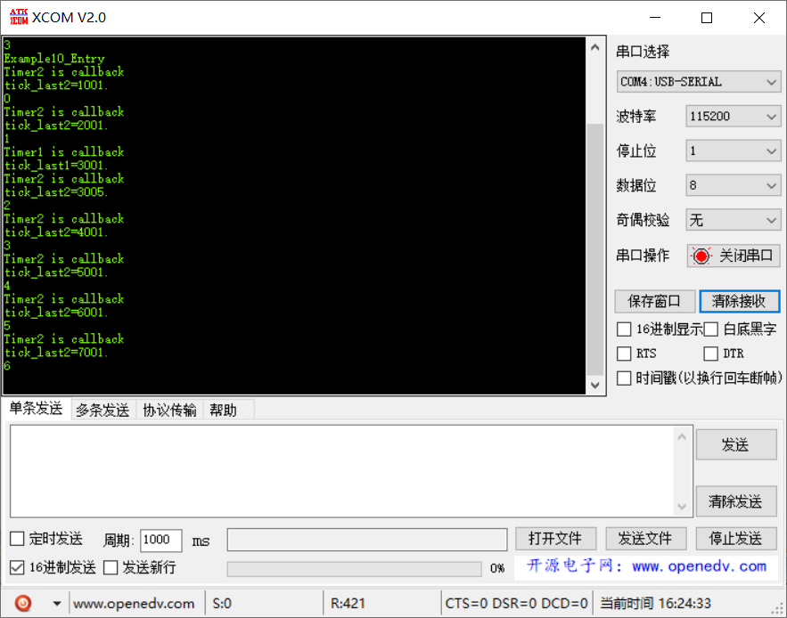

# 范例10（定时器基本应用实验）

定时器应用，创建两种类型定时器，一个是一次性的，一个是周期性的。

## 功能说明

## 代码讲解

### 1. 创建两个软定时器
```c
UINT32 Example10_Entry(VOID) {
    UINT32 uwRet = LOS_OK;
    
    printf("Example10_Entry\r\n");

    uwRet = LOS_SwtmrCreate(
                ONLYONCE_TIMER_VALUE, 
                LOS_SWTMR_MODE_ONCE,
                Timer1_Callback,
                &s_usSwTmrID1,
                (UINT32)pcTextForTimer1
#if (LOSCFG_BASE_CORE_SWTMR_ALIGN == YES)
                , OS_SWTMR_ROUSES_ALLOW,
                OS_SWTMR_ALIGN_SENSITIVE 
#endif
                );
    if(LOS_OK != uwRet)
    {
        printf("create Timer1 failed.\r\n");
        return LOS_NOK;
    }

    uwRet = LOS_SwtmrCreate(
                PERIODIC_TIMER_VALUE, 
                LOS_SWTMR_MODE_PERIOD,
                Timer2_Callback,
                &s_usSwTmrID2,
                (UINT32)pcTextForTimer2
#if (LOSCFG_BASE_CORE_SWTMR_ALIGN == YES)
                , OS_SWTMR_ROUSES_ALLOW,
                OS_SWTMR_ALIGN_SENSITIVE 
#endif
                );
    if(LOS_OK != uwRet)
    {
        printf("create Timer1 failed.\r\n");
        return LOS_NOK;
    }

    uwRet = LOS_SwtmrStart(s_usSwTmrID1);
    if(LOS_OK != uwRet)
    {
        printf("Start Timer1 failed.\r\n");
        return LOS_NOK;
    }

    uwRet = LOS_SwtmrStart(s_usSwTmrID2);
    if(LOS_OK != uwRet)
    {
        printf("Start Timer2 failed.\r\n");
        return LOS_NOK;
    }

    return uwRet;
}
```

### 2. 定时器超时回调函数

```c
static void Timer1_Callback(UINT32 uwArg)
{
    UINT32 tick_last;
    printf("%s\r\n", (const CHAR *)uwArg);

    tick_last = (UINT32)LOS_TickCountGet();
    printf("tick_last1=%lu.\r\n",tick_last);
}

static void Timer2_Callback(UINT32 uwArg)
{
    UINT32 tick_last;
    static UINT32 count;
    printf("%s\r\n", (const CHAR *)uwArg);

    tick_last = (UINT32)LOS_TickCountGet();
    printf("tick_last2=%lu.\r\n",tick_last);

    printf("%d\r\n", count++);
}
```

## 效果演示

