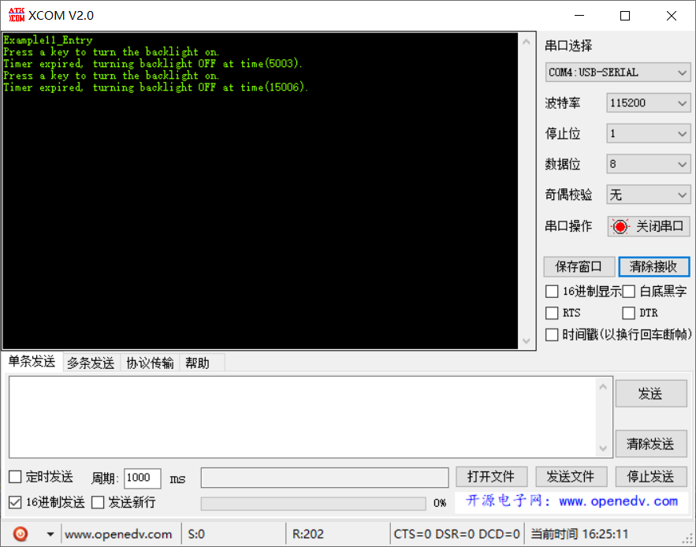

# 范例11（定时器综合应用实验）

## 功能说明

 模拟了一个自动关灯的场景，有个vKeyHitTask负责检测是否开灯，如果开灯会启动一个定时器，5s后自动关闭背景灯（Backlight）

## 代码讲解

### 1. 创建一个模拟开关的任务，周期修改开关状态。同时创建一个软定时器用于将灯关闭。

```c
UINT32 Example11_Entry(VOID) {
    UINT32 uwRet = LOS_OK;
    TSK_INIT_PARAM_S stInitParam = {0};
    
    printf("Example11_Entry\r\n");

    stInitParam.pfnTaskEntry = KeyHit_Task;
    stInitParam.usTaskPrio = TASK_DEFAULT_PRIO;
    stInitParam.pcName = "KeyHit";
    stInitParam.uwStackSize = TASK_STK_SIZE;
    uwRet = LOS_TaskCreate(&s_uwKeyHitTskID, &stInitParam);
    if (uwRet != LOS_OK) {
        printf("KeyHit_Task create Failed!\r\n");
        return LOS_NOK;
    }

    uwRet = LOS_SwtmrCreate(
                BACKLIGHT_TIMER_PERIOD, 
                LOS_SWTMR_MODE_NO_SELFDELETE,
                BacklightTimer_Callback,
                &s_usBacklightSwTmrID,
                NULL
#if (LOSCFG_BASE_CORE_SWTMR_ALIGN == YES)
                , OS_SWTMR_ROUSES_ALLOW,
                OS_SWTMR_ALIGN_SENSITIVE 
#endif
                );
    if(LOS_OK != uwRet)
    {
        printf("create Timer1 failed.\r\n");
        return LOS_NOK;
    }

    return uwRet;
}
```

2. 按键任务负责检测灯开关，但当灯打开后，启动定时器，5s后触发定时器回调函数

```c
static VOID * KeyHit_Task(UINT32 uwArg) {
    UINT32 uwRet = LOS_OK;
    for (;;) {
        printf("Press a key to turn the backlight on.\r\n");
        
        // 如果背景灯关闭，模拟打开背景灯
        if (FALSE == s_SimulatedBacklightOn) {
            s_SimulatedBacklightOn = TRUE;
        }

        // 启动软定时器，5s后触发关闭
        uwRet = LOS_SwtmrStart(s_usBacklightSwTmrID);
        if(LOS_OK != uwRet)
        {
            printf("Start Timer1 failed.\r\n");
            break;
        }
    
        LOS_TaskDelay(10000);            
    }
    
    return LOS_OK;
}
```

3. 定时器触发关闭背景灯

```c
static void BacklightTimer_Callback(UINT32 uwArg) {
    UINT32 tick_last = (UINT32)LOS_TickCountGet();
    
    s_SimulatedBacklightOn = FALSE;
    
    printf("Timer expired, turning backlight OFF at time(%d).\r\n",tick_last);
}
```

## 效果演示

