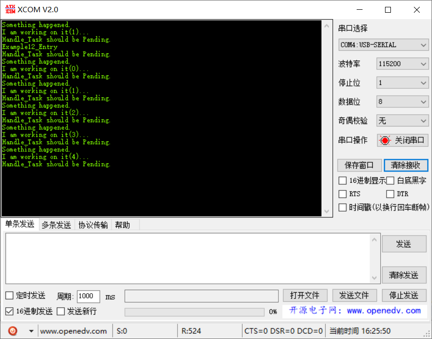

# 范例12（信号量同步功能实验）

## 功能说明

低优先级的周期任务或模拟生产一个中断信号，中断回调函数会设置一个二元信号量，另外一个高优先级任务之前阻塞在二元信号量上，由于中断回调进行了“喂食”，该任务被被立刻触发进行工作。

## 代码讲解

1. 创建一个二进制信号量和两个任务
```c
UINT32 Example12_Entry(VOID) {
    UINT32 uwRet = LOS_OK;
    TSK_INIT_PARAM_S stInitParam = {0};
    
    puts("Example12_Entry\r\n");

    uwRet = LOS_BinarySemCreate(0, &s_uwSemID);
    if (uwRet != LOS_OK) {
        printf("LOS_SemCreate Failed:%x!\r\n", uwRet);
        return LOS_NOK;
    }
    
    stInitParam.pfnTaskEntry = Prod_Task;
    stInitParam.usTaskPrio = TASK_PRIO_PROD;
    stInitParam.pcName = "Task1";
    stInitParam.uwStackSize = TASK_STK_SIZE;
    uwRet = LOS_TaskCreate(&s_uwProdTskID, &stInitParam);
    if (uwRet != LOS_OK) {
        printf("Example_TaskSend create Failed!\r\n");
        return LOS_NOK;
    }

    stInitParam.pfnTaskEntry = Handle_Task;
    stInitParam.usTaskPrio = TASK_PRIO_HAND;
    stInitParam.pcName = "Task2";
    stInitParam.uwStackSize = TASK_STK_SIZE;
    uwRet = LOS_TaskCreate(&s_uwHandleTskID, &stInitParam);
    if (uwRet != LOS_OK) {
        printf("Example_TaskRecv create Failed!\r\n");
        return LOS_NOK;
    }

    return uwRet;
}
```

### 2. 生产任务运行完成后，向信号量“投食”

```c
static VOID * Prod_Task(UINT32 uwArg) {
    UINT32 uwRet = LOS_OK;    
    UINT32 i;
    for (;;) {
        for (i = 0; i < TASK_LOOP_COUNT; i++) {
            // 占用CPU耗时运行
        }
        printf("Something happened.\r\n");
        uwRet = LOS_SemPost(s_uwSemID);
        if (LOS_OK != uwRet) {
            printf("LOS_SemPost failure,error:%x\r\n", uwRet);
        }

        LOS_TaskDelay(1000);
    }
}
```

### 3. 处理任务检测到信号量有数据，立即获取并进行业务逻辑处理

```c
static VOID * Handle_Task(UINT32 uwArg) {
    UINT32 uwRet = LOS_OK;
    static UINT32 count;
    
    for (;;) {        
        printf("Handle_Task should be Pending.\r\n");
        uwRet = LOS_SemPend(s_uwSemID, LOS_WAIT_FOREVER);
        if (LOS_OK == uwRet) {
            printf("I am working on it(%d)...\r\n", count++);
        }
    }
}
```

## 效果演示

