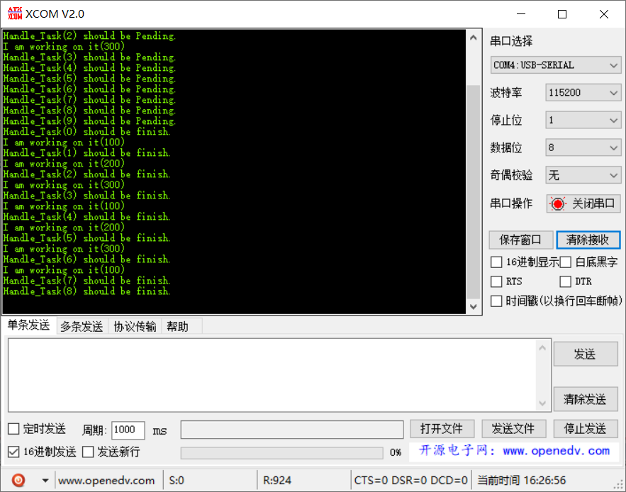

# 范例13（信号量互斥功能实验）

## 功能说明

有3个资源，一口气生产10个Task，Task申请到资源后，处理任务，释放 ，另外的任务继续处理。

```c
typedef struct {
    UINT32 handleID;
    BOOL isUsed;
} ResHandler;

static ResHandler s_stResHandler[RES_COUNT] = {
            { 100, FALSE },
            { 200, FALSE },
            { 300, FALSE }
        };
```

## 代码讲解

### 1. 创建一个多值信号量和一批任务
```c
UINT32 Example13_Entry(VOID) {
    UINT32 uwRet = LOS_OK;
    UINT32 i = NULL;
    TSK_INIT_PARAM_S stInitParam = {0};
    
    puts("Example13_Entry\r\n");

    uwRet = LOS_SemCreate(RES_COUNT, &s_uwSemID);
    if (uwRet != LOS_OK) {
        printf("LOS_SemCreate Failed:%x!\r\n", uwRet);
        return LOS_NOK;
    }
    
    for (i = 0; i < NUM_OF_TASKS; i++) {
        stInitParam.pfnTaskEntry = Handle_Task;
        stInitParam.usTaskPrio = TASK_DEFAULT_PRIO;
        stInitParam.pcName = "Tasks";
        stInitParam.uwStackSize = TASK_STK_SIZE;
        stInitParam.uwArg = i;
        uwRet = LOS_TaskCreate(&s_uwHandleTskID, &stInitParam);
        if (uwRet != LOS_OK) {
            printf("Handle_Task create Failed!\r\n");
            return LOS_NOK;
        }
    }
    return uwRet;
}
```

### 2. 多任务并发，同时只能处理3个资源

```c
static VOID * Handle_Task(UINT32 uwArg) {
    UINT32 uwRet = LOS_OK;
    UINT32 i = NULL;
    
    printf("Handle_Task(%d) should be Pending.\r\n", uwArg);
    uwRet = LOS_SemPend(s_uwSemID, LOS_WAIT_FOREVER);
    if (LOS_OK == uwRet) {        
        for (i = 0; i < RES_COUNT; i++) {
            if (s_stResHandler[i].isUsed == FALSE) {
                s_stResHandler[i].isUsed = TRUE;
                break;
            }
        }
        printf("I am working on it(%d)\r\n", s_stResHandler[i].handleID);
        LOS_TaskDelay(1000);        

        // 1s后处理完成，释放信号量
        s_stResHandler[i].isUsed = FALSE;
        LOS_SemPost(s_uwSemID);
    }
    
    printf("Handle_Task(%d) should be finish.\r\n", uwArg);
    return LOS_OK;
}
```

## 效果演示

