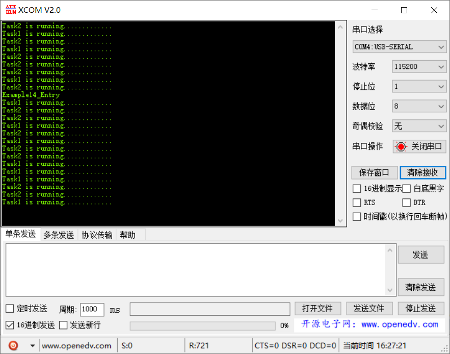

# 范例14（互斥锁打印任务实验）

## 功能说明

多个任务需要打印，由于打印串口资源唯一性，存在抢占。因此需要利用互斥锁对资源进行加锁，打印完成后释放。

## 代码讲解

### 1. 创建两个打印任务

```c
UINT32 Example14_Entry(VOID) {
    UINT32 uwRet = LOS_OK;
    TSK_INIT_PARAM_S stInitParam = {0};
    
    printf("Example14_Entry\r\n");

    stInitParam.pfnTaskEntry = Print_Task;
    stInitParam.usTaskPrio = TASK_DEFAULT_PRIO;
    stInitParam.pcName = "Task1";
    stInitParam.uwStackSize = TASK_STK_SIZE;
    stInitParam.uwArg = (UINT32)pcTextForTask1;
    uwRet = LOS_TaskCreate(&s_uwTskID1, &stInitParam);
    if (uwRet != LOS_OK) {
        printf("Print_Task1 create Failed!\r\n");
        return LOS_NOK;
    }

    stInitParam.pfnTaskEntry = Print_Task;
    stInitParam.usTaskPrio = TASK_DEFAULT_PRIO;
    stInitParam.pcName = "Task2";
    stInitParam.uwStackSize = TASK_STK_SIZE;
    stInitParam.uwArg = (UINT32)pcTextForTask2;
    uwRet = LOS_TaskCreate(&s_uwTskID2, &stInitParam);
    if (uwRet != LOS_OK) {
        printf("Print_Task2 create Failed!\r\n");
        return LOS_NOK;
    }

    return uwRet;
}
```

### 2. 打印任务执行前需要先加锁，执行完成再解锁

```c{4,6}
static VOID * Print_Task(UINT32 uwArg) {    
    for (;;) {
        
        LOS_MuxPend(s_uwPrintMuxID, LOS_WAIT_FOREVER);
        puts((const CHAR *)uwArg);
        LOS_MuxPost(s_uwPrintMuxID);
        
        LOS_TaskDelay(rand() % 500);
    }
}
```

## 效果演示

