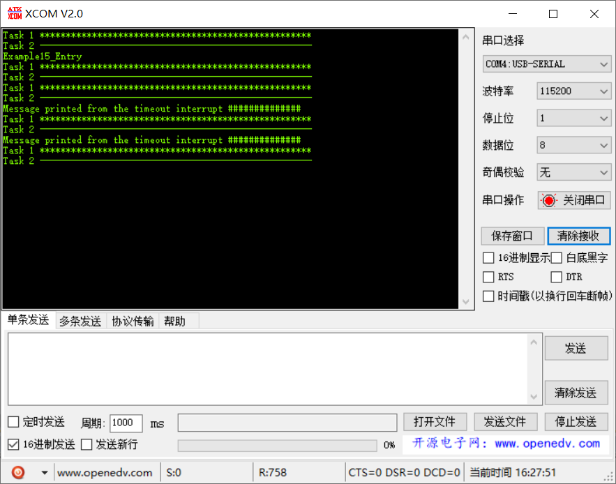

# 范例15（队列，任务，定时器综合实验）

## 功能说明

创建一个打印队列和3个任务，其中两个Task负责写入数据1/2，另外一个用于输出字符串。同时还在Tick任务每触发200次，向打印队列（首部）写入数据3。 

## 代码讲解

### 1. 创建队列、定时器、任务
```c
UINT32 Example15_Entry(VOID) {
    UINT32 uwRet = LOS_OK;
    TSK_INIT_PARAM_S stInitParam = {0};
    
    puts("Example15_Entry\r\n");

    uwRet = LOS_QueueCreate(
                "queue",                // 队列名称
                3,                      // 队列大小
                &s_uwQueueID,             // 队列ID
                0,                      // 不使用
                sizeof(UINT32)          // 队列消息大小
                );
    if (uwRet != LOS_OK) {
        printf("create queue failure!,error:%x\n", uwRet);
        return LOS_NOK;
    }

    uwRet = LOS_SwtmrCreate(
                PERIODIC_TIMER_VALUE, 
                LOS_SWTMR_MODE_PERIOD,
                Timer_Callback,
                &s_usSwTmrID,
                (UINT32)s_pStringsToPrint[2]
#if (LOSCFG_BASE_CORE_SWTMR_ALIGN == YES)
                , OS_SWTMR_ROUSES_ALLOW,
                OS_SWTMR_ALIGN_SENSITIVE 
#endif
                );
    if(LOS_OK != uwRet)
    {
        printf("create Timer failed.\r\n");
        return LOS_NOK;
    }

    stInitParam.pfnTaskEntry = Example_TaskSend;
    stInitParam.usTaskPrio = TASK_PRIO_SEND;
    stInitParam.pcName = "TaskSend1";
    stInitParam.uwStackSize = TASK_STK_SIZE;
    stInitParam.uwArg = (UINT32)s_pStringsToPrint[0];
    uwRet = LOS_TaskCreate(&s_uwTskLoID, &stInitParam);
    if (uwRet != LOS_OK) {
        printf("Example_TaskSend create Failed!\r\n");
        return LOS_NOK;
    }
    
    stInitParam.pcName = "TaskSend2";
    stInitParam.uwArg = (UINT32)s_pStringsToPrint[1];
    uwRet = LOS_TaskCreate(&s_uwTskLoID, &stInitParam);
    if (uwRet != LOS_OK) {
        printf("Example_TaskSend create Failed!\r\n");
        return LOS_NOK;
    }

    stInitParam.pfnTaskEntry = Example_TaskRecv;
    stInitParam.usTaskPrio = TASK_PRIO_RECV;
    stInitParam.pcName = "TaskRecv";
    stInitParam.uwStackSize = TASK_STK_SIZE;
    uwRet = LOS_TaskCreate(&s_uwTskHiID, &stInitParam);
    if (uwRet != LOS_OK) {
        printf("Example_TaskRecv create Failed!\r\n");
        return LOS_NOK;
    }

    uwRet = LOS_SwtmrStart(s_usSwTmrID);
    if(LOS_OK != uwRet)
    {
        printf("Start Timer failed.\r\n");
        return LOS_NOK;
    }


    return uwRet;
}
```

### 2. 发送任务将Task1、Task2字符串发送到队列，接收任务从队列中读取数据

```c
static VOID * Example_TaskRecv(UINT32 uwArg) {
    UINT32 uwRet = LOS_OK;
    UINT32 uwReadbuf = NULL;
    UINT32 uwBufferSize = sizeof(UINT32*);
       
    for (;;) {        
        uwRet = LOS_QueueRead(s_uwQueueID, (VOID*)&uwReadbuf, uwBufferSize, LOS_WAIT_FOREVER);
        if (LOS_OK != uwRet) {
            printf("recv value failure,error:%x\r\n", uwRet);
        } else {
            if (uwBufferSize == sizeof(UINT32)) {
                puts((const CHAR*)uwReadbuf);
            }
        }
    }
}

static VOID * Example_TaskSend(UINT32 uwArg) {
    UINT32 uwRet = LOS_OK;
    
    for (;;) {
        uwRet = LOS_QueueWrite(s_uwQueueID, (VOID*)uwArg, sizeof(UINT32*), 0);
        if (LOS_OK != uwRet) {
            printf("send value failure,error:%x\r\n", uwRet);
        }

        LOS_TaskDelay(2000);
    }
}
```

### 3. 周期定时器回调任务将数据写入到队列头部

```c
static void Timer_Callback(UINT32 uwArg)
{
    UINT32 uwRet = LOS_OK;
    
    uwRet = LOS_QueueWriteHead(s_uwQueueID, (VOID*)uwArg, sizeof(UINT32*), 0);
    if (LOS_OK != uwRet) {
        printf("send value failure,error:%x\r\n", uwRet);
    }

}
```

## 效果演示

