# 制作编解码插件

[[toc]]

## 进入插件开发界面

- 在产品开发中，创建产品后，点击“编解码插件开发”。
- 在进行插件开发前，需要先完成Profile定义，详见 [跟我学制作Profile](./profile_online.md)。

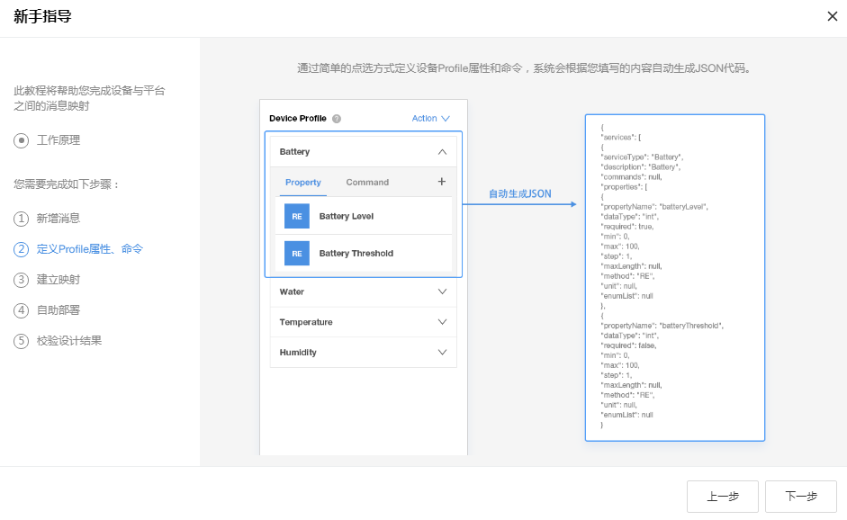

## 新手指引

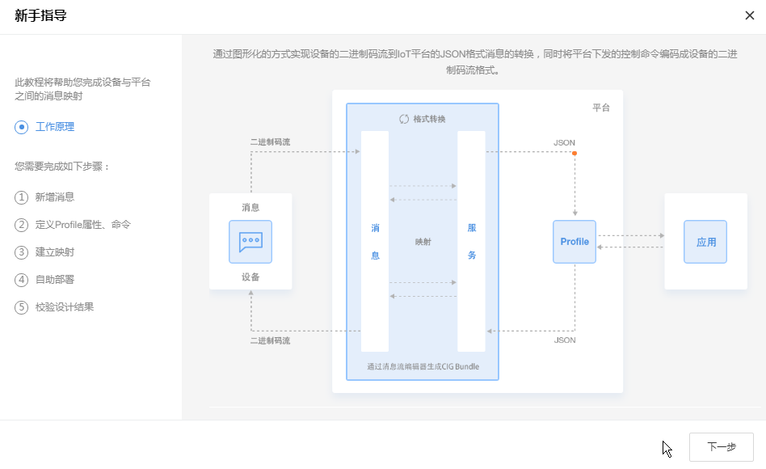  

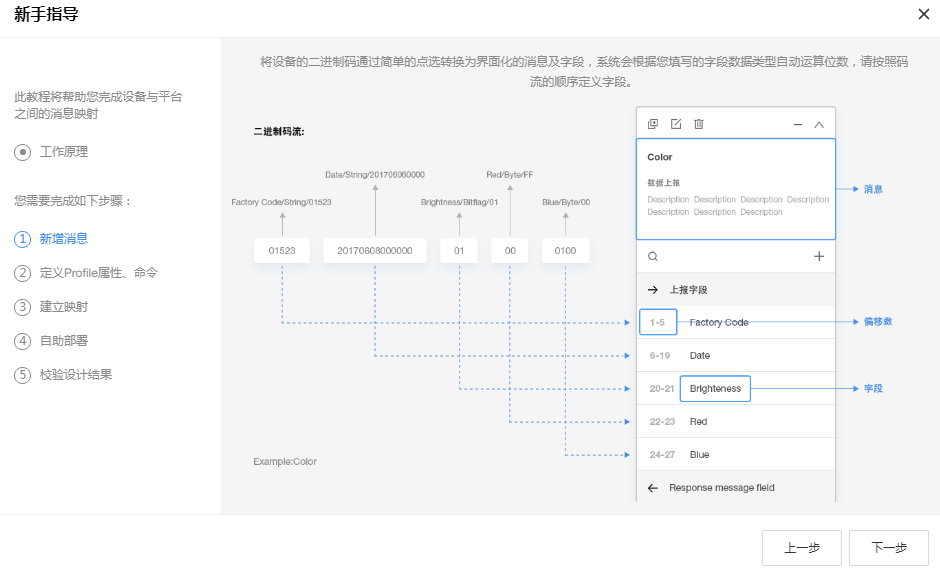  

  

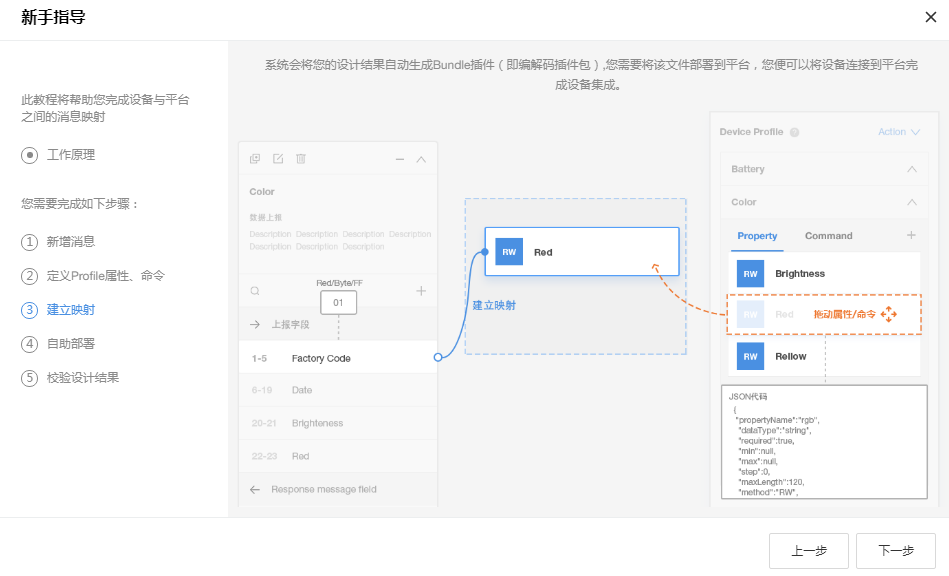  

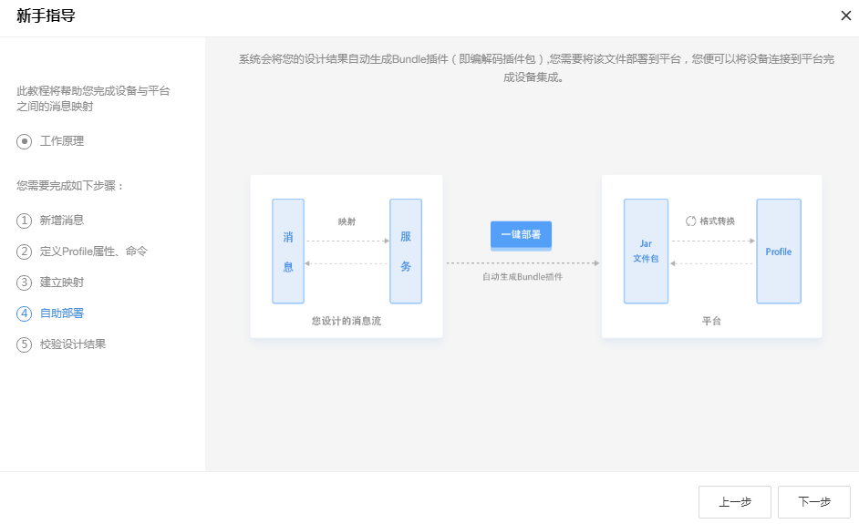  

  

## 新增消息

  

## 数据上报

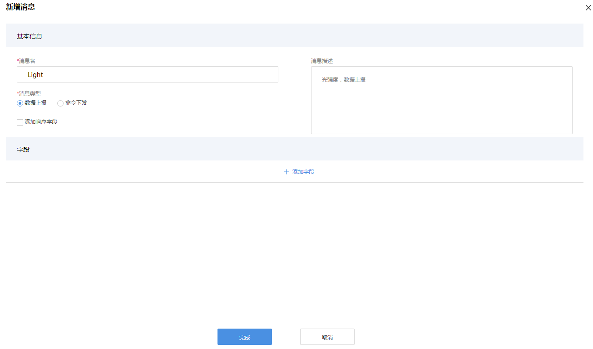 

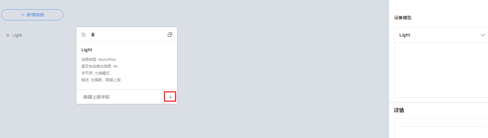  

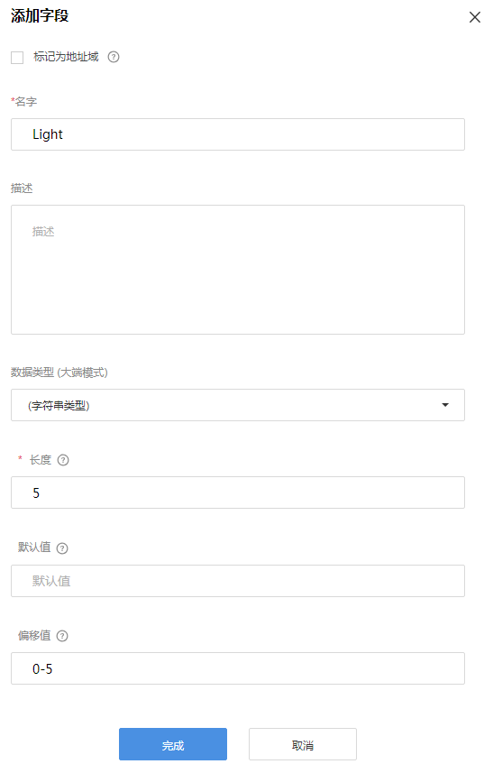  

## 数据上报映射Profile

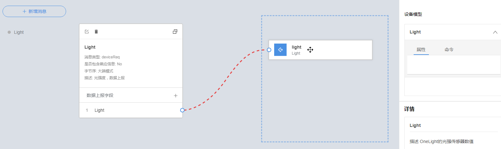  

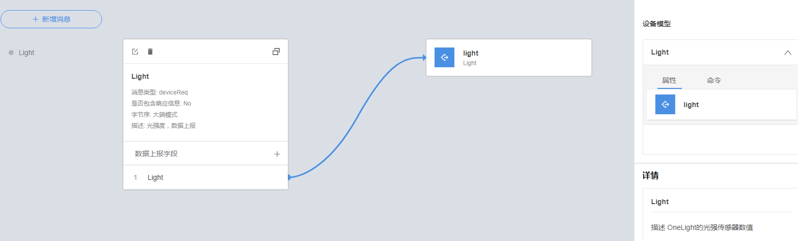  

## 命令下发

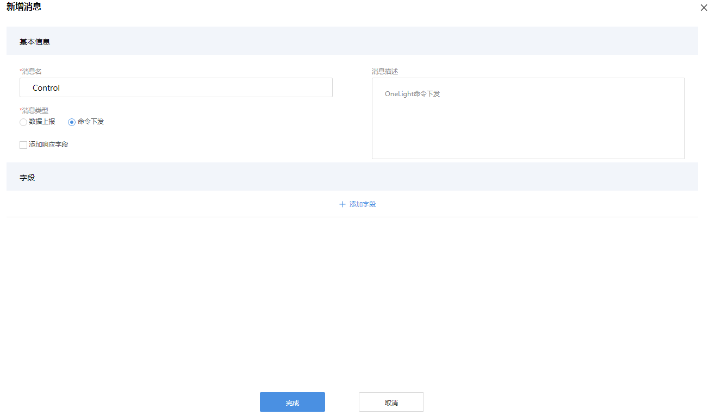  

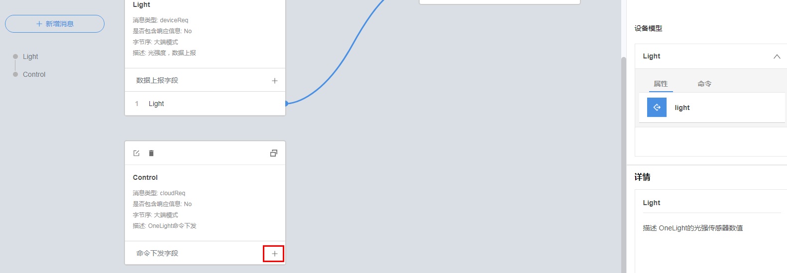

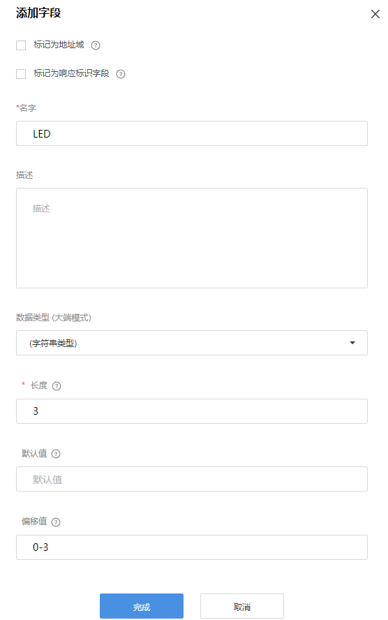  

## 命令下发映射Profile

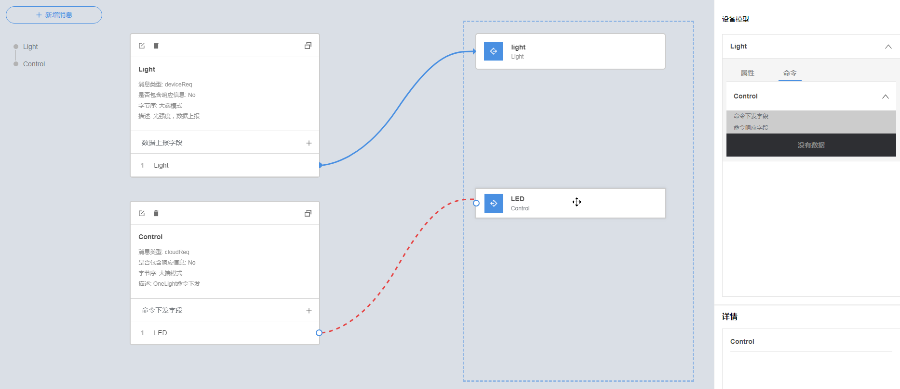  

## 保存插件

  

## 部署插件

  

## 完成在线制作编解码插件

  

  
