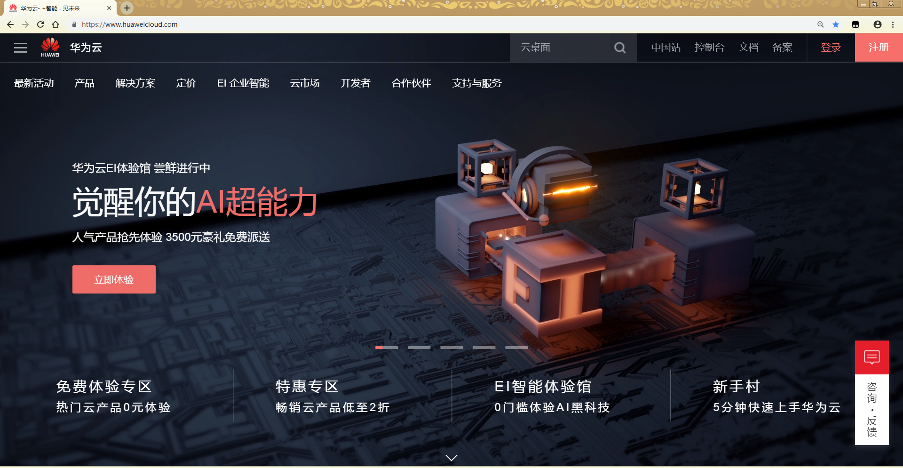
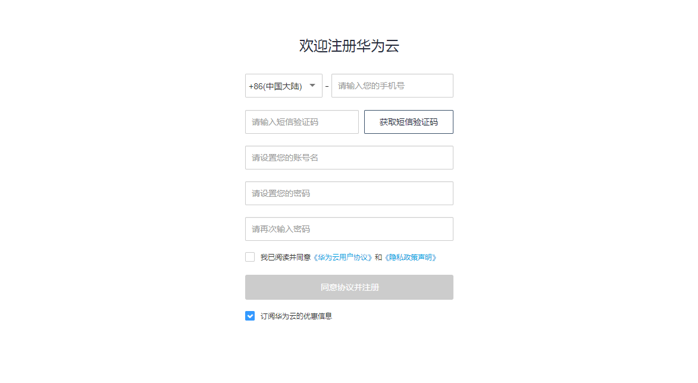
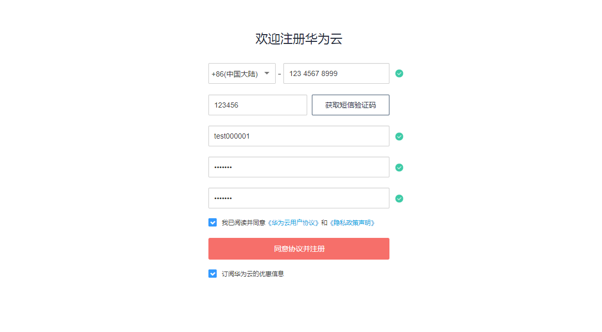
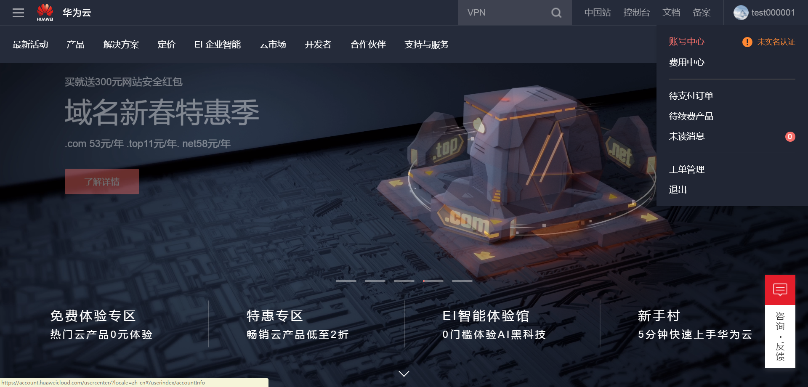
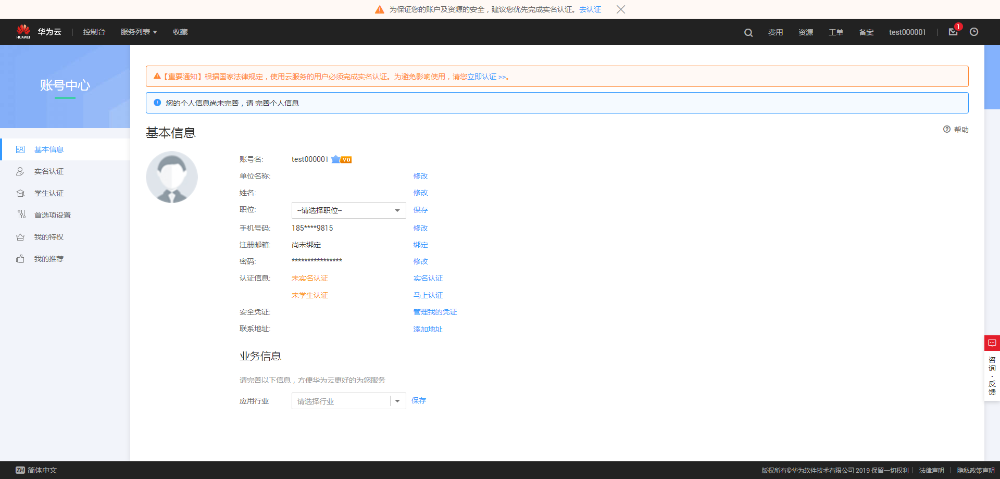
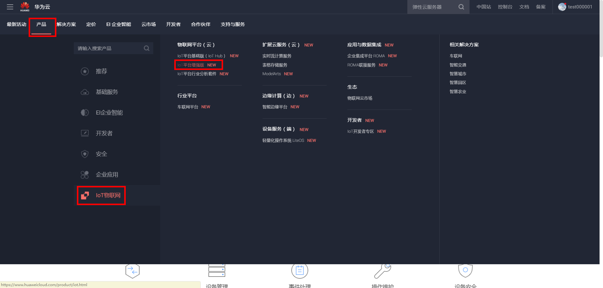
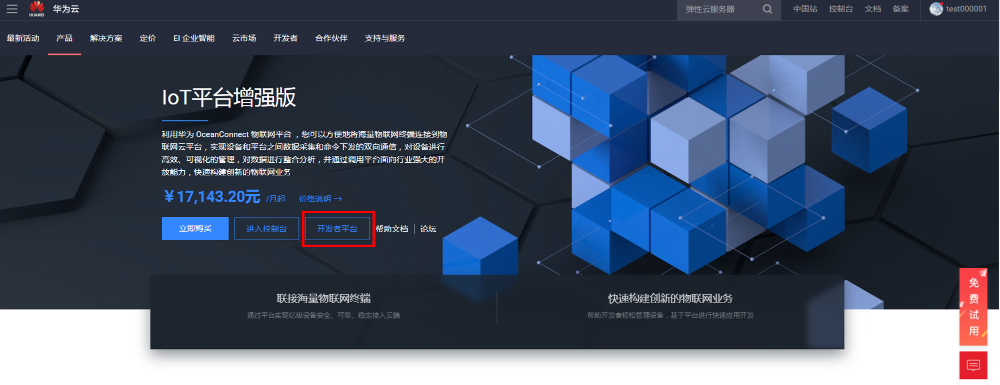

## 获取账号步骤

* [1.注册华为云账号](#1)
* [2.完成实名认证](#2)
* [3.进入ＯceanConnect平台](#3)

<h3 id="1">1.注册华为云账号</h3>

	浏览器：chrome 【推荐】

- 点击链接 [https://www.huaweicloud.com/](https://www.huaweicloud.com/) 进入华为云官网。



- 点击右上角，注册。



- 完善个人信息。




- 完成注册。

<h3 id="2">2.完成实名认证</h3>

- 右上角选择```账号中心```，并进行实名认证。






- 在实名认证过程中若遇到问题，参见[https://support.huaweicloud.com/usermanual-account/zh-cn_topic_0071343161.html](https://support.huaweicloud.com/usermanual-account/zh-cn_topic_0071343161.html)。

<h3 id="3">3.进入ＯceanConnect平台</h3>

- 回到华为云官网，在```产品```中选择```IoT物联网```，并在右侧选择```物联网平台（云）```下面的```IoT平台增强版```。



- 进入```开发者平台```，即可开始云上开发。```开发者平台```供开发者免费使用。


