# 运行LiteOS onelight demo

[[toc]]


## 获取源代码

	链接：https://pan.baidu.com/s/1qdbxR2MlUxfDI01bX4q27g
	密码：dbfe
	::: warning 注意
    下载源代码后，需安装MDK523，安装STLINK驱动，安装CH340驱动等。  
    :::  

## Huawei LiteOS目录介绍

```C
.
├── arch
│   ├── arm
│   └── msp430
├── build
│   └── Makefile
├── components
│   ├── connectivity
│   ├── fs
│   ├── lib
│   ├── log
│   ├── net
│   ├── ota
│   └── security
├── demos
│   ├── agenttiny_lwm2m
│   ├── agenttiny_mqtt
│   ├── dtls_server
│   ├── fs
│   ├── kernel
│   └── nbiot_without_atiny
├── doc
│   ├── Huawei_LiteOS_Developer_Guide_en.md
│   ├── Huawei_LiteOS_Developer_Guide_zh.md
│   ├── Huawei_LiteOS_SDK_Developer_Guide.md
│   ├── LiteOS_Code_Info.md
│   ├── LiteOS_Commit_Message.md
│   ├── LiteOS_Contribute_Guide_GitGUI.md
│   ├── LiteOS_Supported_board_list.md
│   └── meta
├── include
│   ├── at_device
│   ├── at_frame
│   ├── atiny_error.h
│   ├── atiny_lwm2m
│   ├── atiny_mqtt
│   ├── fs
│   ├── log
│   ├── nb_iot
│   ├── osdepends
│   ├── ota
│   ├── sal
│   └── sota
├── kernel
│   ├── base
│   ├── extended
│   ├── include
│   ├── los_init.c
│   └── Makefile
├── LICENSE
├── osdepends
│   └── liteos
├── README.md
├── targets
│   ├── STM32L431CBxx_EVB_L1_Light
└── tests
    ├── cmockery
    ├── test_agenttiny
    ├── test_main.c
    ├── test_sota
    └── test_suit

```

## 开发板硬件连接

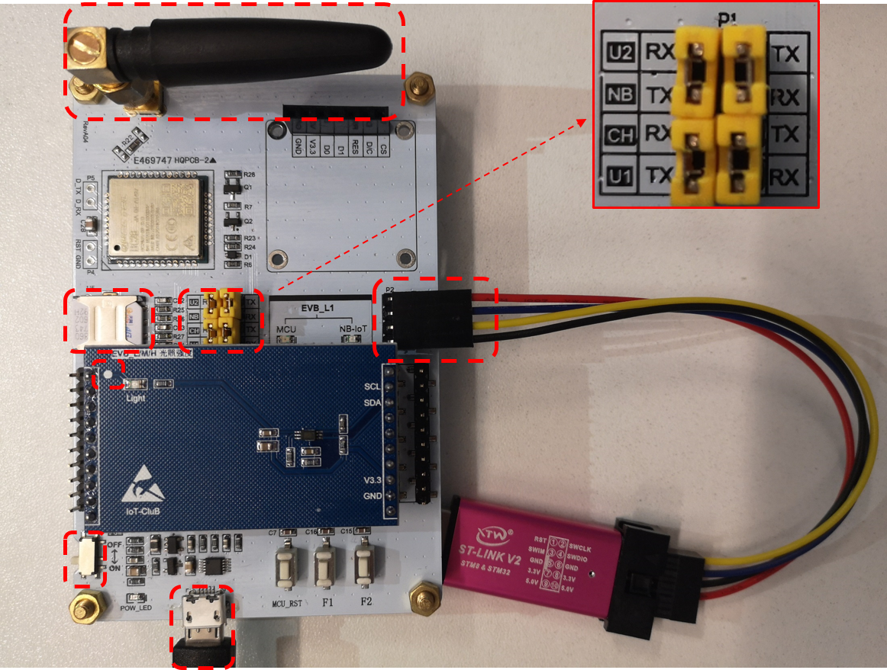

- 注意P1短接端子的短接方式。

## 打开MDK523项目

- 进入targets\STM32L431CBxx_EVB_L1_Light\MDK-ARM，打开STM32L431CBxx.uvprojx

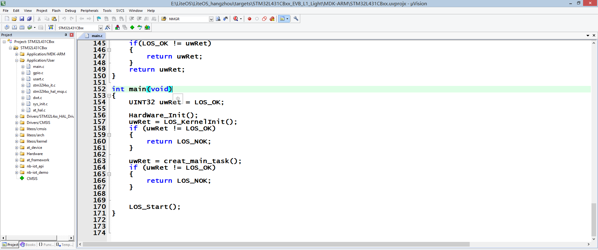

## 编译工程

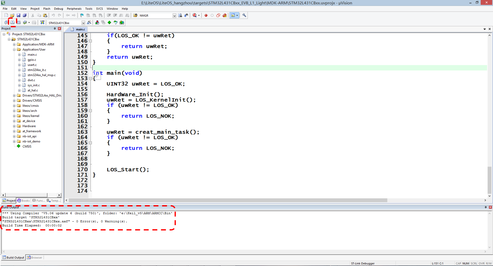

## 下载运行

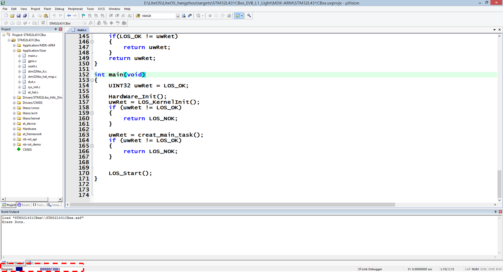

- 【注意】下面的工程设置参数。

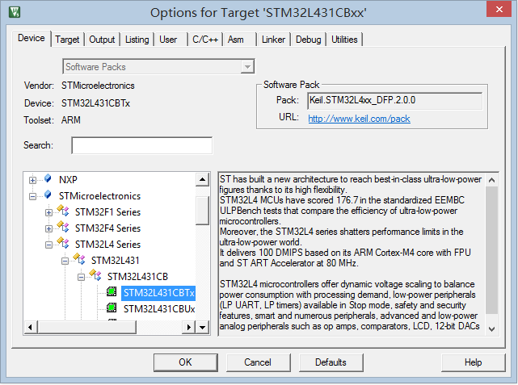

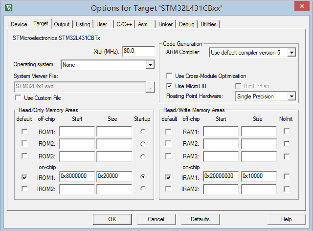

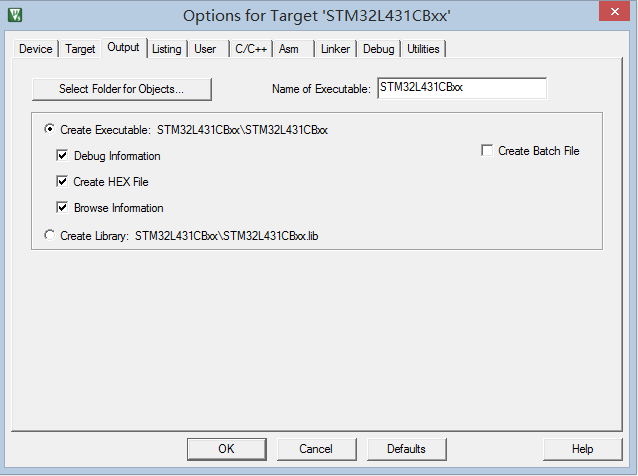

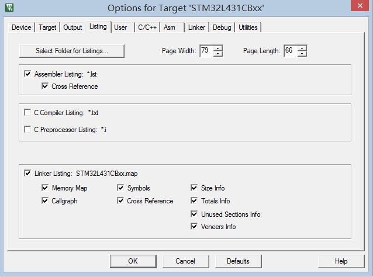

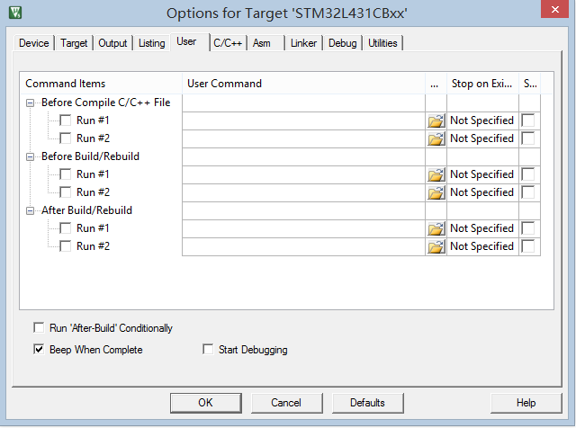

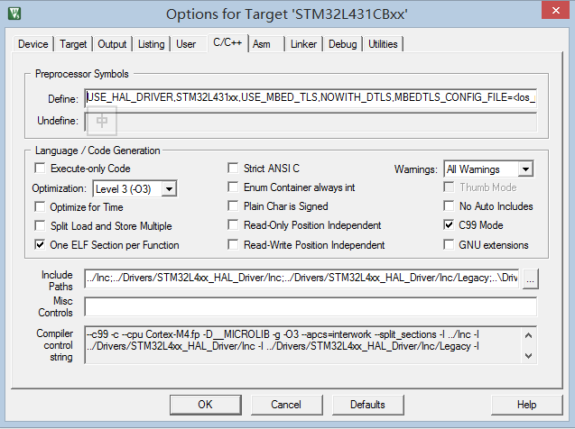

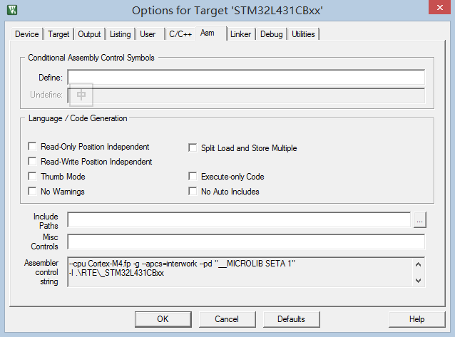


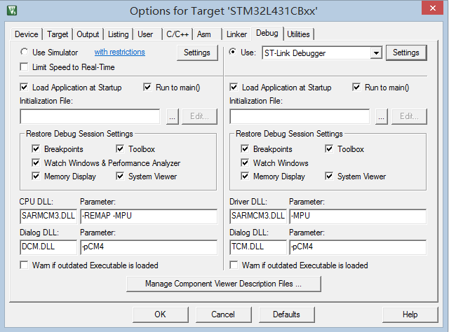

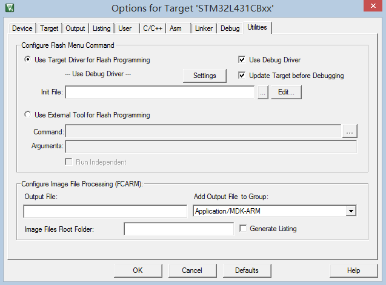

## LOG打印输出

- 先登陆OceanConnect平台。

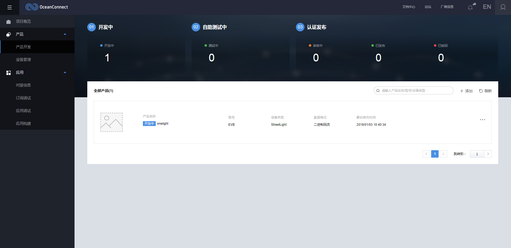

::: warning 注意
此时串口调试助手，已经开始打印输出的LOG信息。串口波特率要选择115200，因为串口日志是通过USART1来打印的，而程序中将USART1的波特率设为了115200。对应的数据可以在OC平台上查看。  
:::  

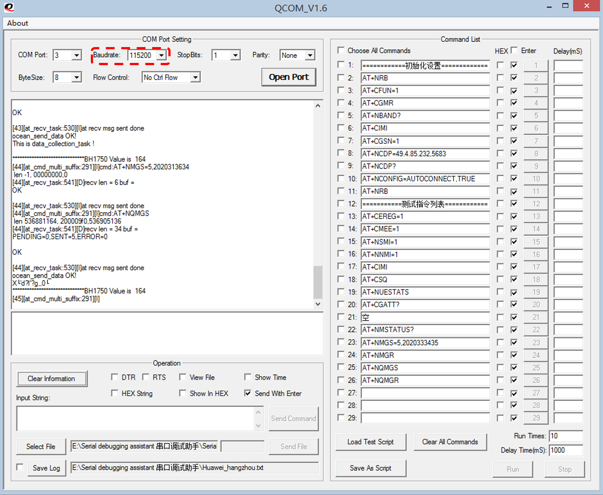

## 查看OceanConnect平台数据

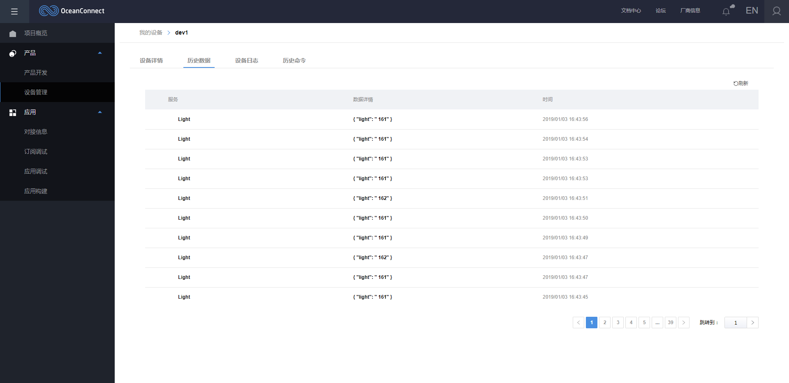

## OceanConnect下发命令

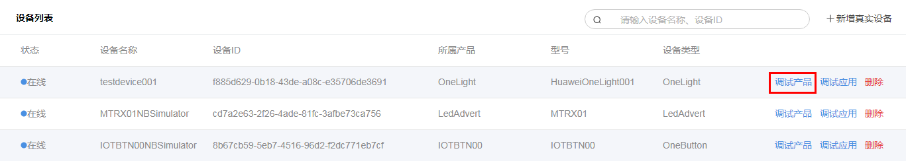

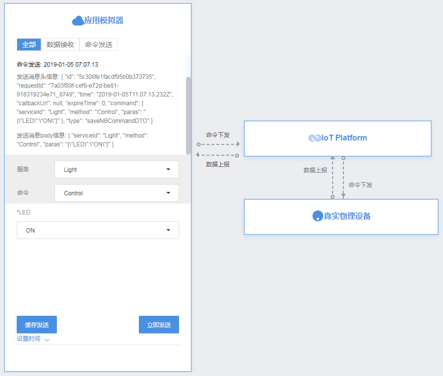


- 至此，完成LiteOS调测OneLight。


