# 运行LiteOS OneLight Demo（基于OpenCPU开发板）

[[toc]]

## 获取源代码

链接：[下载源码包](https://pan.baidu.com/s/1qdbxR2MlUxfDI01bX4q27g)  
密码：dbfe    

::: warning 注意
运行前需要安装运行环境，详见openCPU开发环境安装指导。  
:::  

## 开发板硬件连接

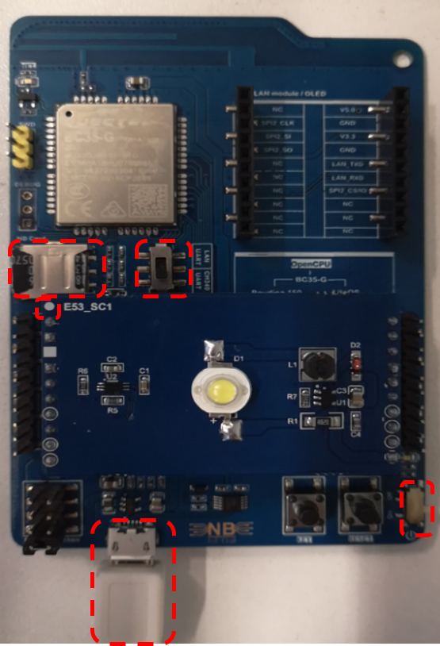

::: warning 注意
SIM卡槽旁边的开关拨到CH340/UART一侧。  
:::  

## 生成固件文件

在BC35-G_OpenCPU_Hi1_SDK_V1.0文件夹中，双击命令提示符：

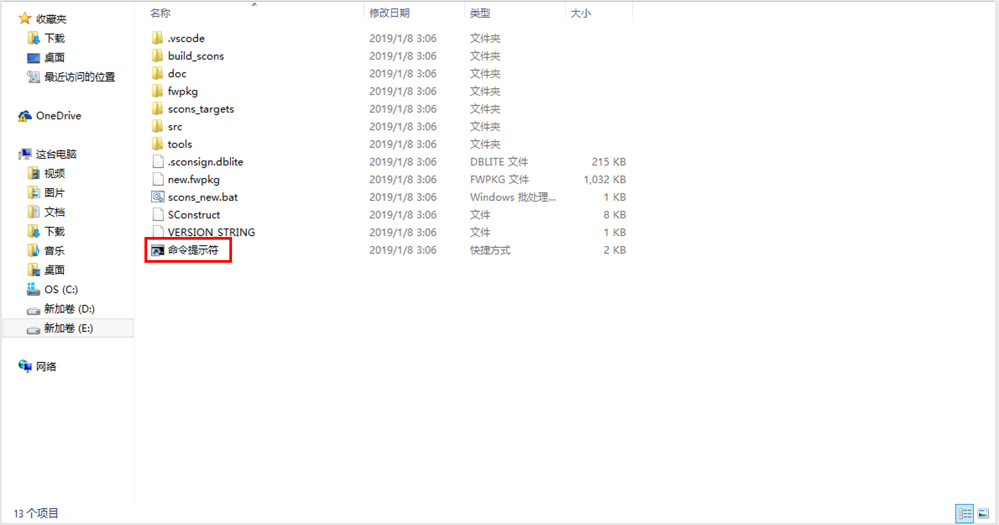

输入命令`scons_new.bat`：

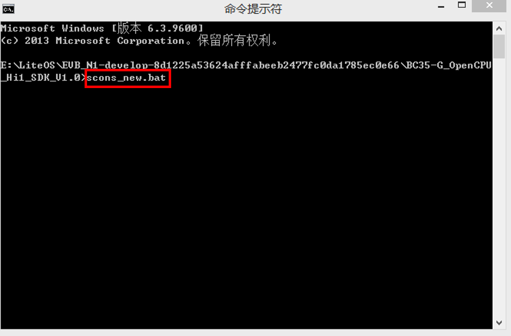

若得到下图结果，则说明编译成功，并得到固件文件`new.fwpkg`：

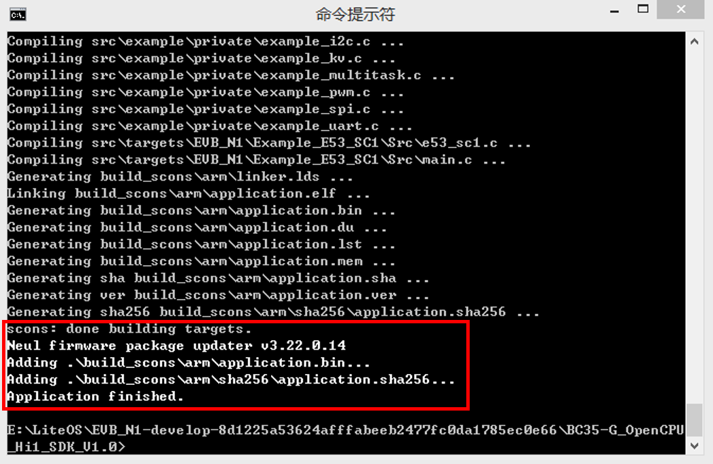

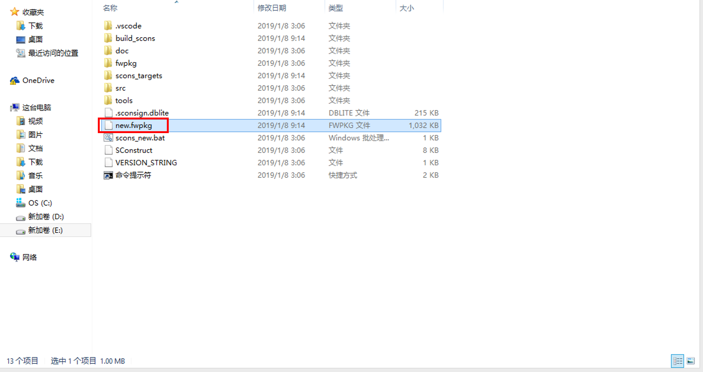

## 烧录固件到openCPU开发板

打开UEUpdaterUI，并进行相关设置：

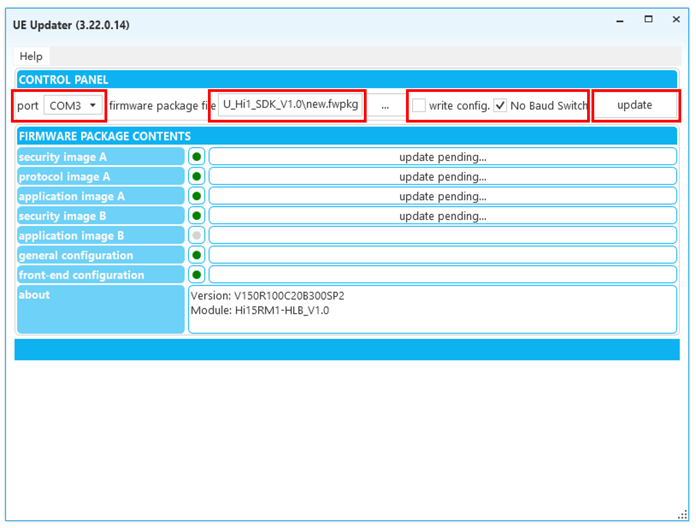

::: warning 注意
请根据自己的情况选择串口号，`firmware package file`请选择上一步中生成的固件，不勾选`write config`，勾选`No Baud Switch`，并点击`update`。  
:::  

若出现下图提示，请按下`RESET`按键，重启openCPU开发板：

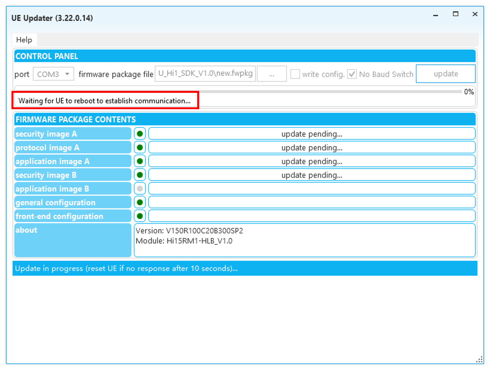

当所有项目完成后，固件烧录完成：

## 运行openCPU onelight demo

关闭UEUpdaterUI，登陆OceanConnect，打开串口调试工具。此时在串口调试工具上，已经可以看到LOG信息：

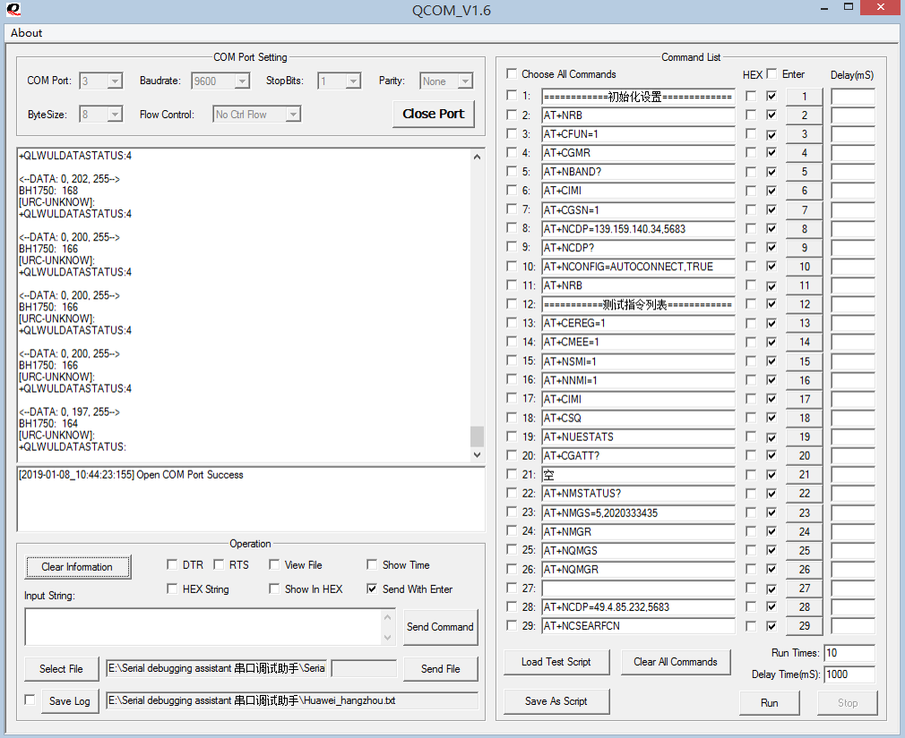

同时在OceanConnect平台上，也可以看到设备上报的数据：

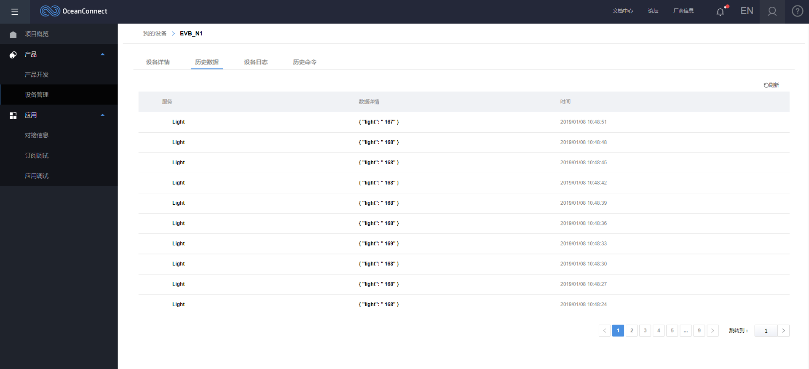

## OceanConnect下发命令

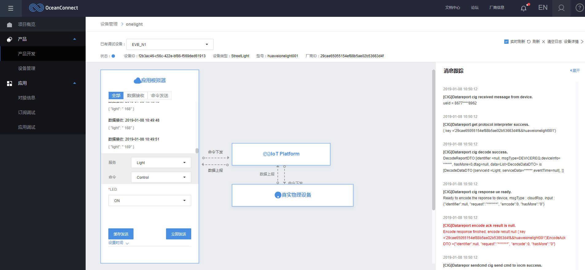

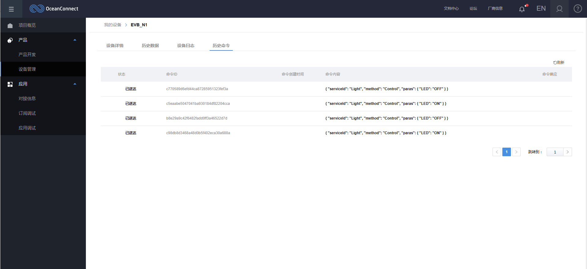

在设备上可以看到小灯被点亮。

- 至此，完成在openCPU开发板上运行LiteOS onelight demo。
