# 制作Profile

[[toc]]

## 登陆OceanConnect平台

浏览器：chrome （推荐）  

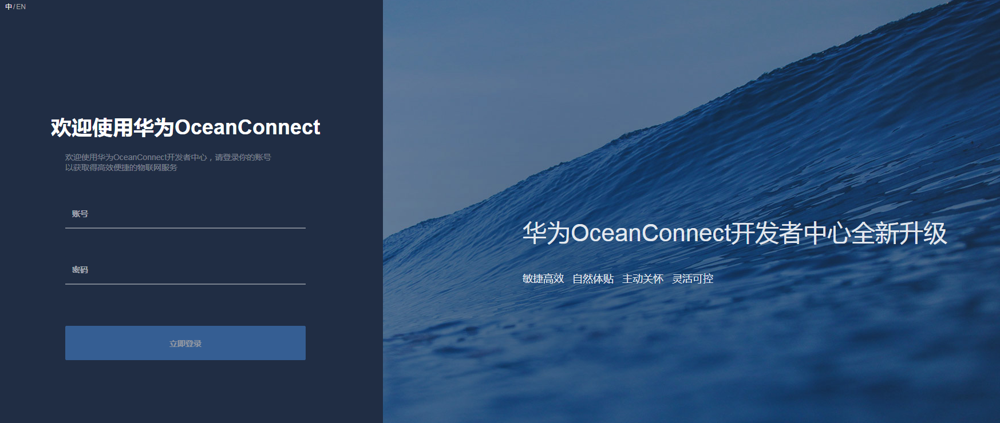

- 在制作Profile前需要先创建项目，如果已经创建，则跳过此步骤，直接点击进入项目。
- 登录开发中心，在开发中心首页，点击“创建项目”。

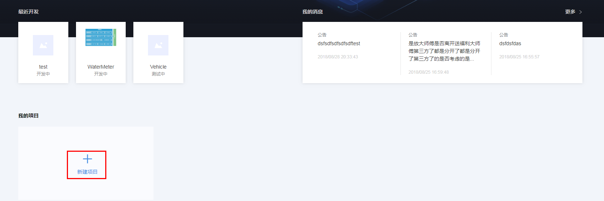

- 填写“项目名称”、“所属行业”、“描述”等项目信息后，点击“创建”。项目创建成功后，系统返回“应用ID”和“应用秘钥”。在应用对接物联网平台时需要这两个参数，请妥善保存。

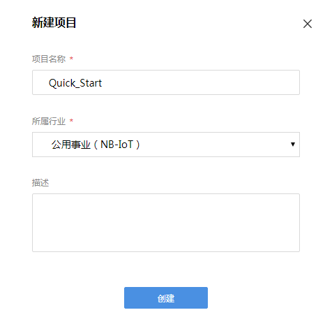
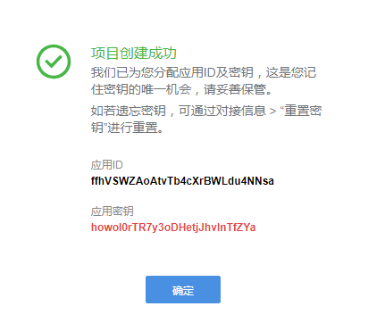
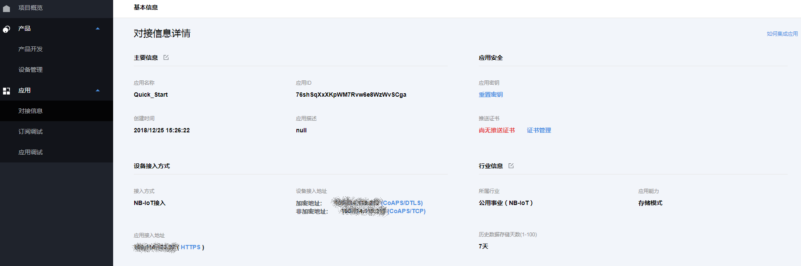

## 创建全新产品

- 在制作Profile前需要先创建产品，如果已经创建，则跳过此步骤，直接点击进入产品。
- 选择新创建的项目，进入项目空间后，选择“产品开发”，点击“新建产品”。

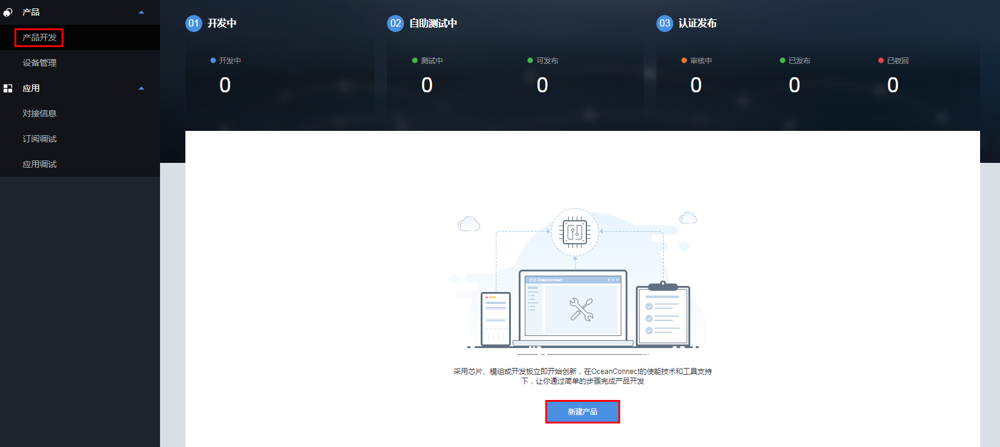

- 在创建产品界面，选择“自定义产品”，并点击“自定义产品”。

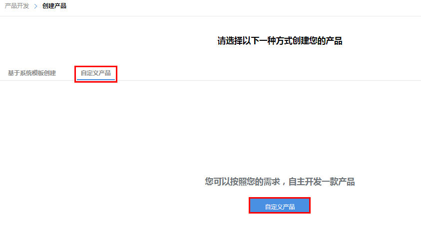

- 系统弹出设置产品信息界面，填写各项参数后，点击“创建”。
- 设备型号、厂商ID、厂商名称，可以自行定义，但请保证唯一性。可以参赛序号为后缀，例如：HuaweiOneLightxxx（xxx为数字序号）。
- 厂商ID由系统自动填充，无需手动填写。

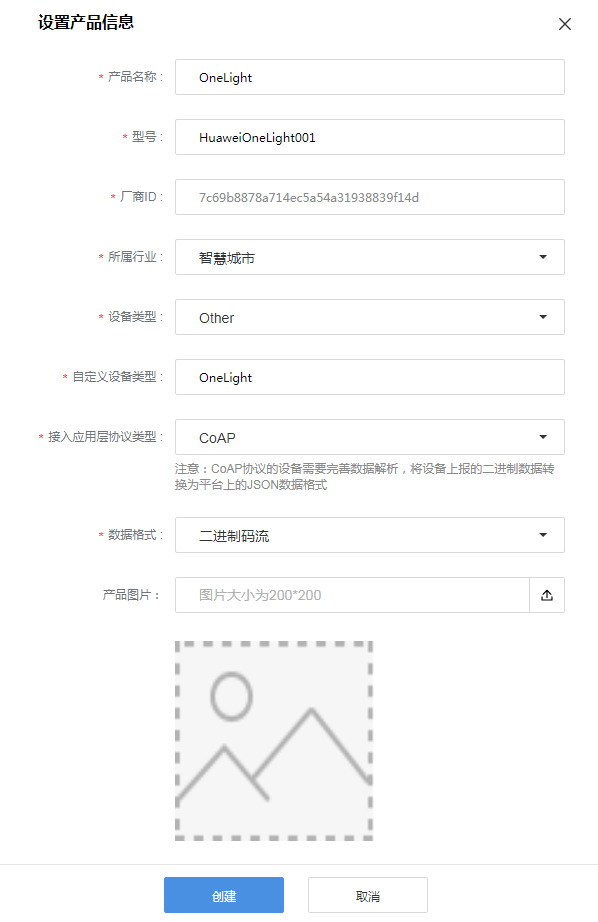

## 新建服务

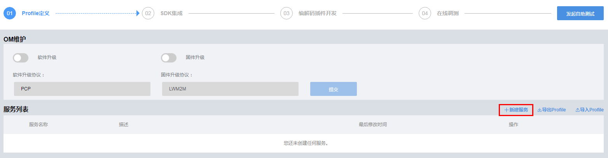
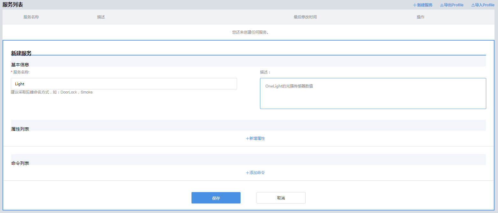

## 新增属性

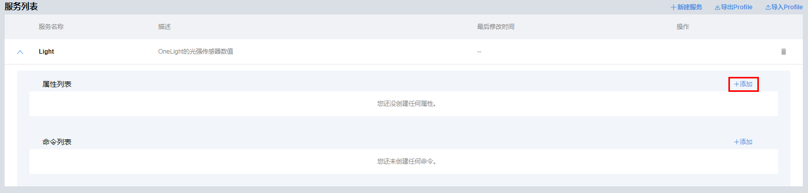
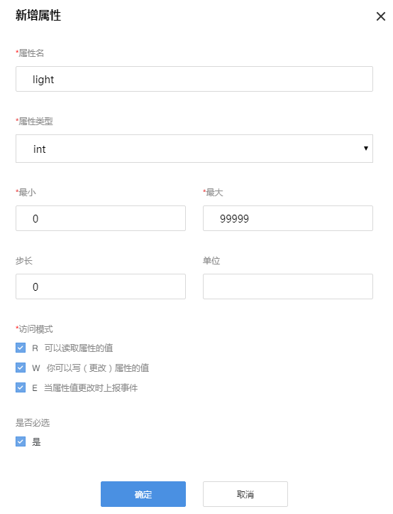

## 新增命令

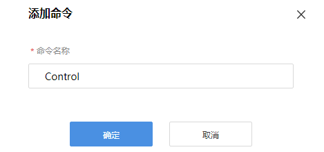
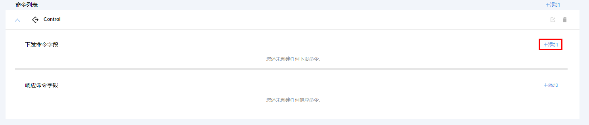
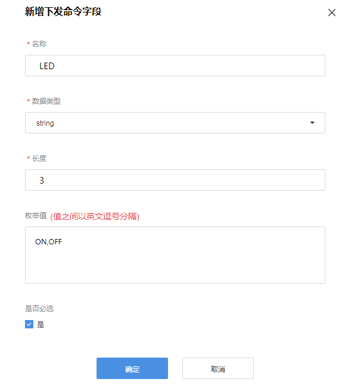

## 导出该产品Profile

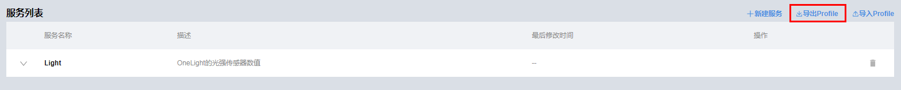
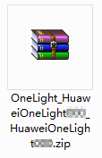

- 至此，完成Profile的制作。

